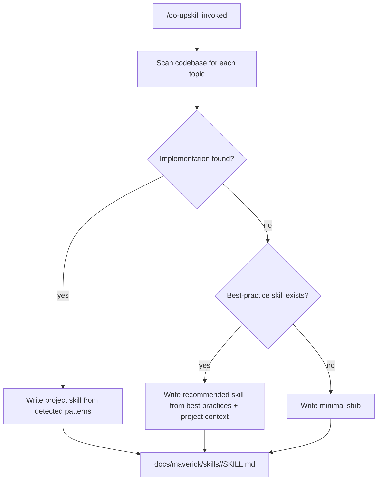
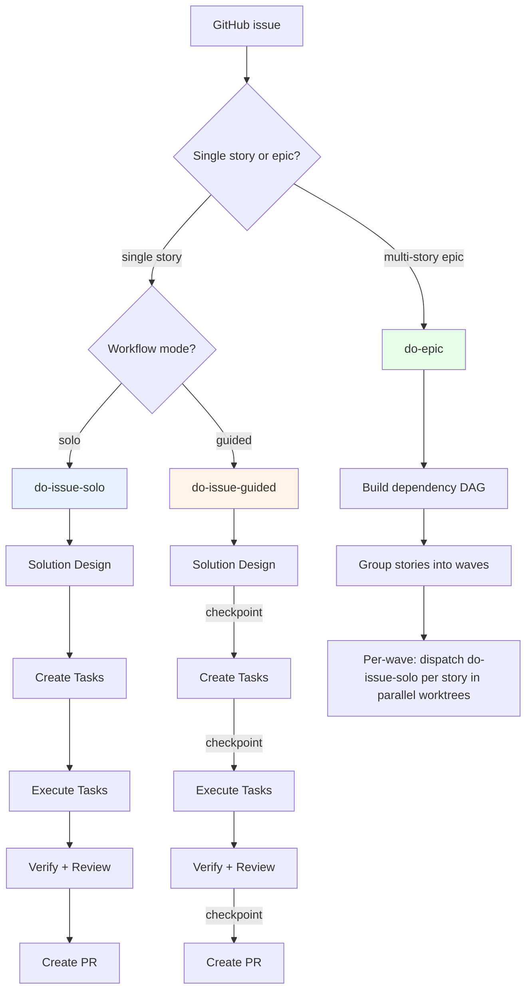

# Architecture

## Skills

Skills are markdown files with YAML frontmatter that load into the LLM's context window. They provide machine-readable guidance — dense, factual, and actionable.

| Category            | Skills                                                                                                                                                                                                          | Purpose                                                        |
| ------------------- | --------------------------------------------------------------------------------------------------------------------------------------------------------------------------------------------------------------- | -------------------------------------------------------------- |
| **Best Practices**  | logging, alerting, observability, linting, unit-testing, integration-testing, error-handling, application-security, code-review, api-design, accessibility, database-management, dependency-management, documentation, environment-management, infrastructure-as-code, solutions-design, source-control, task-tracking, versioning | Define standards for each practice area                        |
| **Workflow**        | do-issue-solo, do-issue-guided, do-epic, mav-create-solution-design, mav-create-tasks                                                                                                                          | Orchestrate multi-step development workflows                   |
| **Execution**       | mav-plan-execution, mav-local-verification                                                                                                                                                                     | Control how tasks are executed and verified                    |
| **Git & GitHub**    | mav-git-workflow, mav-github-issue-workflow                                                                                                                                                                    | Define branching, commit, and issue interaction patterns       |
| **CI/CD Platforms** | mav-bp-cicd, mav-bp-cicd-github, mav-bp-cicd-gitlab, mav-bp-cicd-azure, mav-bp-cicd-bitbucket                                                                                                                | Platform-agnostic standards and platform-specific monitoring   |
| **Governance**      | mav-scope-boundaries, mav-claude-code-recovery, mav-systematic-debugging                                                                                                                                      | Define hard limits and resilience patterns                     |
| **Project Setup**   | do-upskill, do-maverick-alignment, do-tech-docs, do-pullrequest-review                                                                                                                                         | Generate project skills, audit codebases, manage documentation |

### The Upskill System

Best-practice skills define universal standards. But every project is different - different languages, frameworks, libraries, and conventions. The **upskill** system bridges this gap:

- Scans the codebase for each topic defined in `skills/do-upskill/topics.json`
- If an implementation exists (e.g., Pino logger configured), documents exactly what's there
- If no implementation exists but a best-practice skill is available, generates a **recommended** implementation tailored to the project's stack
- Project skills are version-controlled and editable - the team can review and adjust recommendations

Default topics scanned: logging, alerting, observability, unit-testing, integration-testing, linting, error-handling, application-security, code-review, api-design, accessibility, database-management, dependency-management, documentation, environment-management, infrastructure-as-code, solutions-design, source-control, task-tracking, versioning, CI/CD.

### Agents

Agents are autonomous workers that run in isolated context windows. They verify code quality without human involvement.

| Agent                       | Purpose                                                      | When it runs                            |
| --------------------------- | ------------------------------------------------------------ | --------------------------------------- |
| **Code Reviewer**           | Two-stage review: spec compliance, then code quality (correctness, test coverage, maintainability — security is out of scope, handled by do-cybersecurity-review) | Against the open PR after pre-push gates |
| **Issue Analyst**           | Reads a GitHub issue, explores the codebase, produces a solution design | At the start of issue-driven workflows  |
| **GitHub Issue Planner**    | Takes a solution design and produces an ordered task list    | After solution design for GitHub issues |
| **Session Reviewer**        | Reviews session activity and git diffs for quality issues    | After development sessions              |
| **Maverick**                | Handles Maverick plugin and CLI management                   | During plugin installation and setup    |
| **Tech Docs Writer**        | Generate technical documentation with Mermaid diagrams       | Pre-push, dispatched by the docs review phase |

Agents reference skills for domain knowledge but operate independently - they don't share the main session's context window.

### Workflow Entry Points

Maverick provides three GitHub-issue-driven workflows. All development originates from a GitHub issue — the issue is the durable, multi-instance-safe coordination point.

| Workflow            | Human involvement                                     | Use case                                                                      |
| ------------------- | ----------------------------------------------------- | ----------------------------------------------------------------------------- |
| **do-issue-solo**   | None until PR review                                  | Unattended development on a single GitHub issue                               |
| **do-issue-guided** | Checkpoints at design, plan, review, and completion   | Supervised development - human validates approach at key decision points      |
| **do-epic**         | None per story; user reviews ejected PRs only         | Multi-story epic with DAG-scheduled parallel execution                        |

All three workflows share the per-story phases: solution design → create tasks → execution → verification → PR creation. `do-epic` adds a wave-scheduling layer on top, dispatching `do-issue-solo` per story under each wave's worktrees. The `mav-create-tasks` skill decomposes a solution design into discrete tasks — posted as a checklist comment for fewer than 5 tasks, or as GitHub sub-issues with dependency ordering for 5 or more.
