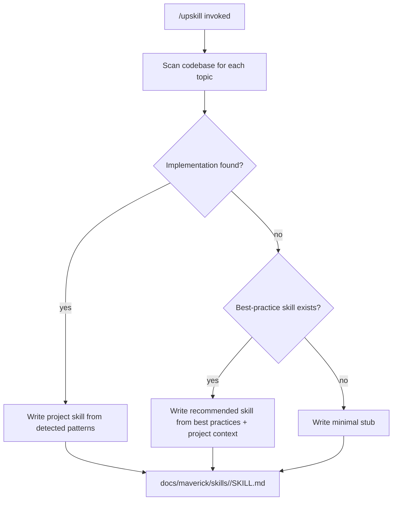
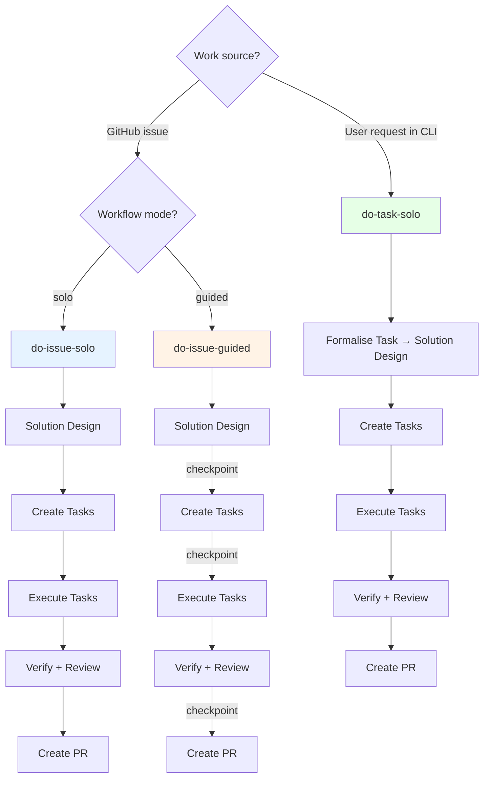

# Architecture

## Skills

Skills are markdown files with YAML frontmatter that load into the LLM's context window. They provide machine-readable guidance — dense, factual, and actionable.

| Category            | Skills                                                                             | Purpose                                                        |
| ------------------- | ---------------------------------------------------------------------------------- | -------------------------------------------------------------- |
| **Best Practices**  | logging, alerting, linting, unit-testing, cicd                                     | Define standards for each practice area                        |
| **Workflow**        | do-issue-solo, do-issue-guided, do-task-solo, create-solution-design, create-tasks | Orchestrate multi-step development workflows                   |
| **Execution**       | mav-plan-execution, mav-local-verification, subagents                              | Control how tasks are executed and verified                    |
| **Git & GitHub**    | mav-git-workflow, mav-github-issue-workflow                                        | Define branching, commit, and issue interaction patterns       |
| **CI/CD Platforms** | mav-bp-cicd-github, mav-bp-cicd-gitlab, mav-bp-cicd-azure                         | Platform-specific pipeline monitoring                          |
| **Governance**      | mav-scope-boundaries, mav-claude-code-recovery, mav-systematic-debugging           | Define hard limits and resilience patterns                     |
| **Project Setup**   | upskill, maverick-alignment, tech-docs, pullrequest-review                         | Generate project skills, audit codebases, manage documentation |

### The Upskill System

Best-practice skills define universal standards. But every project is different - different languages, frameworks, libraries, and conventions. The **upskill** system bridges this gap:

- Scans the codebase for each topic defined in `skills/upskill/topics.json`
- If an implementation exists (e.g., Pino logger configured), documents exactly what's there
- If no implementation exists but a best-practice skill is available, generates a **recommended** implementation tailored to the project's stack
- Project skills are version-controlled and editable - the team can review and adjust recommendations

Default topics scanned: logging, alerting, unit-testing, integration-testing, linting, CI/CD.

### Agents

Agents are autonomous workers that run in isolated context windows. They verify code quality without human involvement.

| Agent                | Purpose                                                   | When it runs                            |
| -------------------- | --------------------------------------------------------- | --------------------------------------- |
| **Code Reviewer**    | Two-stage review: spec compliance, then code quality      | After implementation steps or before PR |
| **Backend Tester**   | Write and verify backend tests (Vitest, Fastify)          | After business logic implementation     |
| **Frontend Tester**  | Write and verify frontend tests (Vitest, Playwright, RTL) | After component implementation          |
| **Tech Docs Writer** | Generate technical documentation with Mermaid diagrams    | After significant architecture changes  |

Agents reference skills for domain knowledge but operate independently - they don't share the main session's context window.

### Workflow Entry Points

Maverick provides three primary workflows. Two are GitHub issue-driven, one is local task-driven:

| Workflow            | Human involvement                                     | Use case                                                                      |
| ------------------- | ----------------------------------------------------- | ----------------------------------------------------------------------------- |
| **do-issue-solo**   | None until PR review                                  | Unattended development - LLM works autonomously from a GitHub issue           |
| **do-issue-guided** | Checkpoints at design, plan, review, and completion   | Supervised development - human validates approach at key decision points      |
| **do-task-solo**    | Initial request only, then none until PR review       | Local autonomous development - user describes the task in the CLI, no GitHub issue required |

All three workflows follow the same phases: solution design → create tasks → execution → verification → PR creation. The `create-tasks` skill decomposes a solution design into discrete tasks — posted as a checklist comment for fewer than 5 tasks, or as GitHub sub-issues with dependency ordering for 5 or more. The differences between workflows are where work originates and where human checkpoints occur.

**do-task-solo** stores all artifacts locally under `.maverick/do-task/<TASK-ID>/` (task description, design, tasks, completion) instead of GitHub issue comments. Task documents are committed to version control; only the state file is gitignored.
