# Issue-driven Autonomous Workflow

## When This Runs

This is the end-to-end flow Maverick executes when work is requested via a GitHub issue and run autonomously by `do-issue-solo` — either standalone (a single story) or under `do-epic` (a multi-story epic decomposed into a dependency DAG).

The same per-story execution path is used in both cases. Epics add a planning stage and a wave-based dispatch loop; everything downstream of "pick a story" is identical. The flow is designed to be:

- **Multi-instance safe** — multiple Claude Code instances can act on the same epic concurrently without stepping on each other. All claim, lease, block, and state data is written to GitHub so any instance can read another's progress.
- **Crash-safe** — if a machine dies mid-flow, leases expire and another instance can take over without losing committed work. GitHub is the source of truth; local files are a derivable cache.
- **Binary at the review gate** — `agent-code-reviewer` either passes (auto-merge) or fails (eject to human). There is no fix-and-re-review loop.

All Maverick development work originates from a GitHub issue. There is no local-file-only workflow.

## The Workflow

```mermaid
flowchart TD
    Start([GitHub issue exists])

    %% ─────────────── Coordination ───────────────
    subgraph COORD[Coordination — claim and crash safety]
        direction TB
        COLD[Cold-start: hydrate state from GitHub<br/>DAG, epic-state, claims, blocks, open PRs]
        BLOCKED{Issue carries<br/>blocked-by label?}
        ABORT_BLOCKED([Abort: needs human resolution])
        TAKEN{Already claimed by<br/>another instance?}
        ABORT_TAKEN([Abort: in progress elsewhere])
        CLAIM[Atomic claim<br/>label + lease comment + heartbeat]

        COLD --> BLOCKED
        BLOCKED -- Yes --> ABORT_BLOCKED
        BLOCKED -- No --> TAKEN
        TAKEN -- Valid lease held --> ABORT_TAKEN
        TAKEN -- No / lease expired --> CLAIM
    end

    Start --> COLD
    CLAIM --> ANALYSE

    %% ─────────────── Pre-development ───────────────
    subgraph DESIGN[Pre-development — understand and decompose]
        direction TB
        ANALYSE[mav-create-solution-design]
        DECOMPOSE[mav-create-tasks]
        SHAPE{Epic or<br/>single story?}

        ANALYSE --> DECOMPOSE --> SHAPE
    end

    SHAPE -- Single story --> SOLO_WT[Create one worktree off develop]
    SHAPE -- Epic --> DAG

    %% ─────────────── Epic planning ───────────────
    subgraph EPIC_PLAN[Epic planning — only when epic]
        direction TB
        DAG[Build dependency DAG<br/>persist as maverick-dag comment]
        WAVES[Group stories into execution waves]
        STATE[Initialise epic-state<br/>mirror to maverick-state comment]

        DAG --> WAVES --> STATE
    end

    STATE --> SELECT

    %% ─────────────── Wave loop ───────────────
    subgraph WAVE_LOOP[Wave dispatch — epic path]
        direction TB
        SELECT[Select next wave<br/>exclude blocked-by stories]
        WT_PER_STORY[One git worktree per unblocked story]
        DISPATCH{Parallel<br/>subagents allowed?}
        PAR[Dispatch one subagent per worktree<br/>concurrent per-story flows]
        SER[Process worktrees serially]

        SELECT --> WT_PER_STORY --> DISPATCH
        DISPATCH -- Yes --> PAR
        DISPATCH -- No --> SER
    end

    PAR --> REVERIFY
    SER --> REVERIFY
    SOLO_WT --> REVERIFY

    %% ─────────────── Per-story flow (do-issue-solo) ───────────────
    subgraph STORY[Per-story execution — do-issue-solo]
        direction TB
        REVERIFY{Claim still held<br/>and not blocked?}
        STACKED{Sibling PR<br/>open and unmerged?}
        BR_DEV[Branch from develop]
        BR_SIBLING[Branch from sibling PR<br/>stacked PR]
        TASK[Implement next task]
        VERIFY[Local verify<br/>lint, typecheck, tests]
        OK{Pass?}
        DEBUG[Diagnose root cause<br/>per mav-systematic-debugging]
        COMMIT[Conventional commit + push<br/>per-task durability]
        MORE{More tasks?}
        FULL[Run full verification suite]
        DOCS_REVIEW[Mandatory: dispatch agent-tech-docs-writer<br/>update mode against the diff]
        SEC_REVIEW[Mandatory: dispatch do-cybersecurity-review<br/>update mode — diff + impact set]
        SEC_VERDICT{Security verdict?}
        BLOCKING_HALT[Halt, surface findings, route<br/>back to implementation]
        RETARGET{Stacked branch:<br/>sibling base merged?}
        RT[Retarget PR base to develop]
        CI_PUSH[Pre-push verification, push final state]
        CI_WAIT[Monitor CI per mav-bp-cicd]
        CI_OK{CI passes?}
        CI_FIX[Read failure logs, fix locally]
        OPEN_PR[Open PR ready-for-review]

        REVERIFY -- No --> ABORT_STORY([Abort story, release worktree])
        REVERIFY -- Yes --> STACKED
        STACKED -- Yes --> BR_SIBLING
        STACKED -- No --> BR_DEV
        BR_DEV --> TASK
        BR_SIBLING --> TASK
        TASK --> VERIFY --> OK
        OK -- No --> DEBUG --> TASK
        OK -- Yes --> COMMIT --> MORE
        MORE -- Yes --> TASK
        MORE -- No --> FULL --> DOCS_REVIEW
        DOCS_REVIEW --> SEC_REVIEW --> SEC_VERDICT
        SEC_VERDICT -- BLOCKING --> BLOCKING_HALT --> TASK
        SEC_VERDICT -- PASS or FINDINGS --> RETARGET
        RETARGET -- Yes --> RT --> CI_PUSH
        RETARGET -- No --> CI_PUSH
        CI_PUSH --> CI_WAIT --> CI_OK
        CI_OK -- No --> CI_FIX --> CI_PUSH
        CI_OK -- Yes --> OPEN_PR
    end

    OPEN_PR --> REVIEW

    %% ─────────────── Code review — binary gate ───────────────
    REVIEW[**HARD GATE** — agent-code-reviewer<br/>spec compliance, then code quality]
    VERDICT{Verdict?}
    REVIEW --> VERDICT

    %% ─── Approve path ───
    VERDICT -- PASS --> APPROVE[maverick-bot posts gh pr review --approve<br/>auditable agent-reviewed trail]
    APPROVE --> AUTOMERGE[Auto-merge PR<br/>squash to develop]
    AUTOMERGE --> RELEASE[Release claim on this story]
    RELEASE --> EPIC_OK{Story belongs<br/>to an epic?}

    EPIC_OK -- No --> END([END])
    EPIC_OK -- Yes --> WAVE_DONE{All stories<br/>in wave resolved?}
    WAVE_DONE -- No --> REVERIFY
    WAVE_DONE -- Yes --> NEXT_WAVE{More waves<br/>and not all blocked?}
    NEXT_WAVE -- Yes --> SELECT
    NEXT_WAVE -- No --> END

    %% ─── Eject path ───
    VERDICT -- FAIL --> EJECT[Apply maverick-needs-human label<br/>request human review on PR<br/>release claim]
    EJECT --> EPIC_FAIL{Story belongs<br/>to an epic?}
    EPIC_FAIL -- No --> END
    EPIC_FAIL -- Yes --> PROPAGATE[Propagate block to all transitive descendants<br/>walk the DAG, label each blocked-by]
    PROPAGATE --> CANCEL[Cancel any in-flight subagents<br/>on now-blocked stories]
    CANCEL --> WAVE_DONE
```

## Phase Walkthrough

### Coordination

Before any work begins, the workflow hydrates its view of the world from GitHub — the DAG comment on the parent epic (if any), the rolling state snapshot, every claim and lease comment, every `blocked-by` label. Local files are treated as a stale cache.

The issue is then claimed atomically: a `claude-in-progress` label, an assignee, and a lease comment with an instance id and expiry timestamp. The lease is refreshed by a heartbeat at a short interval (1–2 min) with a short TTL (5–10 min) so machine death is detected quickly. If another instance already holds a valid lease, the workflow aborts cleanly without modifying the issue. If the lease is stale, the new instance posts a takeover comment and proceeds.

### Pre-development

The issue is read by `mav-create-solution-design` to produce a structured design, then `mav-create-tasks` decomposes it. If the resulting work is small enough for one branch and PR it stays a single story; if it's large it becomes an epic with child stories created as separate GitHub issues.

### Epic planning

For epics only: cross-story dependencies and shared-file collisions are analysed into a dependency DAG, persisted to the epic issue as a pinned `maverick-dag` JSON comment. Stories are grouped into execution waves — siblings without shared dependencies share a wave. Epic state (merged / in-flight / blocked per story) is initialised and mirrored to a rolling `maverick-state` JSON comment so any instance can read current truth from GitHub.

### Wave dispatch

For each wave: stories carrying `blocked-by` labels are filtered out, a worktree is created per surviving story off `develop`, and execution dispatches either in parallel (one subagent per worktree) or serially. The same per-story flow runs in each worktree.

For a standalone story (non-epic) the flow is the same minus the wave layer — a single worktree, a single per-story flow, no wave coordination.

### Per-story flow (`do-issue-solo`)

This is the core loop and is identical for epic-driven and standalone work:

1. **Re-verify the claim.** A late `blocked-by` propagation from a sibling ejection or an expired lease aborts the story before any push.
2. **Branch.** From `develop` for an independent story; from a sibling branch when the story depends on a sibling whose PR is open but not yet merged (stacked PR pattern).
3. **Implement task by task.** Each task: implement → local verification (lint, typecheck, tests) → conventional commit referencing the issue → **push immediately**. Pushing per task is a durability checkpoint — if the machine dies between tasks, the work survives.
4. **Wrap up.** After the last task: full verification, then two mandatory pre-push reviews (always run, no skip path):
   - **Documentation review** dispatches `agent-tech-docs-writer` in `update` mode against the diff — updates stale docs and creates new ones for new components. "No changes required" is a valid outcome but is recorded explicitly.
   - **Cybersecurity review** dispatches `do-cybersecurity-review` in `update` mode against the diff. Reviews the changed code AND the code that could be impacted by it (callers, importers, dependents — bounded to one or two hops). Returns PASS / FINDINGS / BLOCKING. **BLOCKING halts the workflow** and routes the user back to implementation; FINDINGS are folded into the PR description so the human reviewer and `agent-code-reviewer` see them; PASS is recorded as `Security review: no concerns.`
   - Then: stacked-PR retarget guard if applicable, final push, CI monitoring, PR opens ready-for-review.

### Code review — binary gate

`agent-code-reviewer` runs in two stages against the open PR: **spec compliance** (does this implement what the issue actually asked for?) then **code quality** (correctness, test coverage of changed behaviour, scope discipline, maintainability). Security is explicitly *not* part of this gate — it is handled by the pre-push `do-cybersecurity-review` (Phase 7) and findings are already in the PR body by the time the agent reviews. The verdict is **PASS** or **FAIL** — there is no "approve with suggestions" middle ground.

- **PASS** → `maverick-bot` posts `gh pr review --approve` with the verdict, and the PR auto-merges (`gh pr merge --auto --squash`). The claim is released.
- **FAIL** → the PR is ejected: a `maverick-needs-human` label is applied to the issue and PR, the review is posted as a comment, and the claim is released. The agent does **not** attempt to fix and retry.

### Block propagation (epic path only)

When a story in an epic is ejected, every transitive descendant in the DAG is labelled `blocked-by:#<ejected-story>`. Any in-flight subagent working on a now-blocked story has its claim released and its work discarded — that work would have been built on a foundation that's not landing. A propagation marker (`maverick-bprop:#N`) is written before the walk and cleared after, so a crash mid-walk is resumable without leaving partial blocks.

### Termination

- **Standalone story:** PASS → merged → done. FAIL → ejected → done.
- **Epic:** the wave loop continues until every wave is resolved (every story either merged or ejected). If all remaining waves are blocked by ejections, the epic halts and reports blockers to the user.

## Key Invariants

| Invariant                                              | Why it matters                                                                           |
| ------------------------------------------------------ | ---------------------------------------------------------------------------------------- |
| GitHub is the source of truth                          | Any instance can recover full state by reading the epic issue's comments and labels      |
| Lease + heartbeat with short TTL                       | Machine death is detected within minutes, not hours; another instance can take over      |
| Push after every task                                  | Work survives machine death at task granularity, not story granularity                   |
| Code review is binary and the only merge gate           | No silent low-quality merges; rejection routes to human, not back to the agent           |
| Block propagation is idempotent and resumable          | A crash mid-walk leaves a marker; the next instance resumes the walk without duplication |
| Re-verify claim and block label before each push       | Late-arriving block propagations are honoured without orphaning a doomed branch          |
