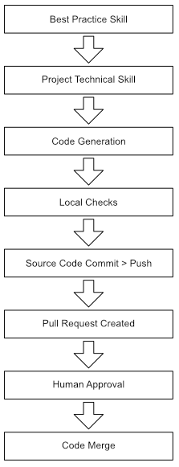

## Overview

Maverick is a Claude Code plugin and local application that enables autonomous AI-driven software development while enforcing quality, security, and operational best practices.

It provides skills, agents, and hooks that constrain and guide LLM behaviour - making unattended development safe and reliable.

## The Problem Maverick Solves

LLMs generate code fast but dont come with any concept of quality, best practice or constraint. Claude Code will happily agree to build the worlds worst idea, with a smile, because without guardrails:

- **No operational awareness** - LLMs don't add structured logging, alerting, or monitoring unless explicitly told to. Production code becomes undiagnosable.
- **No security reasoning** - LLMs reproduce vulnerable patterns from training data. SQL injection, XSS, and secrets exposure go unnoticed. It wont make any effort to ensure cybersecurity is maintined.
- **No testing discipline** - LLMs write working code and you can think youve got a product. Until it runs anywhere except on your machine because its filled with bugs you cant see. Without tests, those bugs ship.
- **No workflow discipline** - LLMs commit to main, skip CI, ignore conventions, and produce untraceable changes. If you ask an LLM to create a large ammount of changes ina single attempt it will try and you'll regret it. Large tasks need structured decomposition into manageable sub-tasks with clear dependency ordering.
- **No self-review** - LLMs don't question their own output. Code that looks correct may miss requirements or violate project conventions.

These risks multiply enourmously in unattended development when no human is watching the LLM work. There is no developer catching issues in real-time, no reviewer glancing at the diff, no operator noticing silent failures. Every quality gap becomes a production risk.

## How Maverick Solves It

Maverick is comprised of three parts:

### Claude Code Plugin: Best practice

Maverick comes with Claude Code skills that defines how to write quality code. These are not detailed technical skills, they are the why and how of software development practices. These skills are part of the plugin and get loaded into Claude Code.

There are also a few technical skills that are so common, they have been predefined in the plugin.

### Claude Code Plugin: Skills creation

Because every codebase is unique, there is no way to ship defined skills that are needed to enable Claude Code. So Maverick builds them when it is initialised in a project.

- First it looks to see if you have them already, and uses yours if they are there.
- If it cant find any, it reads your codebase and builds technical skills that match your tech stack and align with its best practice skills
- These become part of your code and you can change them as required

### Issue-driven autonomous workflow

When work is requested via a GitHub issue, Maverick runs an end-to-end flow that takes the issue from intake through implementation, review, and merge without human steering. The same per-story execution path runs whether the issue is a single story or one of many in an epic — epics layer DAG-based dependency analysis and wave dispatch on top of the same per-story flow, so worktrees can run in parallel without collision.

The workflow is multi-instance safe (multiple Claude Code instances coordinate via GitHub-stored claim and lease state) and crash-safe (work is pushed per task; another instance can take over if a machine dies). Code review is a binary gate — the agent reviewer either approves and the PR auto-merges, or rejects and the PR is ejected to human handling.

See [do-issue-workflow.md](do-issue-workflow.md) for the full diagram and a phase-by-phase walkthrough.

### Infrastructure for remote Claude Code instances

Running Claude Code locally works well for interactive development but does not scale when you need to complete multiple features or bug fixes concurrently.

Maverick resolves this by deploying Claude Code workers to AWS. The infrastructure is managed via CloudFormation stacks, deployed either through the CLI (`maverick infra deploy`) or by uploading the standalone templates from `infra/` directly to the AWS Console. Workers are triggered by labelling GitHub issues, which fires a webhook that writes work items to DynamoDB. An EC2 instance polls the table and processes items autonomously.

This is more involved than many users require and is not necessary to use Maverick. The plugin works on your local machine without any cloud infrastructure.

See [claude-code-workers.md](claude-code-workers.md) for full details.

## Why Each Practice Area Is Central

Every practice area in maverick exists because it addresses a specific failure mode of LLM-generated code. These failures are things the tech industry has learned through decades of watching humans crate the same mistake, that now get automated by unconstrained LLM's.

None are optional - they form an interlocking system where each practice reinforces the others.

| Practice                                                     | Failure mode it prevents                            | Why unattended development needs it                                          |
| ------------------------------------------------------------ | --------------------------------------------------- | ---------------------------------------------------------------------------- |
| [Logging](standards-and-practices/logging-standards.md)      | Silent failures, undiagnosable production issues    | No human watching logs - structured logging enables automated diagnosis      |
| [Alerting](standards-and-practices/alerting-standards.md)    | Errors swallowed silently, nobody notified          | No human monitoring - alerts are the only way failures reach operations      |
| Observability                                                | Invisible performance degradation, missing SLOs     | Metrics, tracing, and health checks complete the operational picture         |
| [Testing](standards-and-practices/comprehensive-testing.md)  | Subtle bugs in plausible-looking code               | Tests ARE the human - automated verification that code actually works        |
| Linting                                                      | Style drift, inconsistency, detectable bugs         | Automated consistency enforcement without human style policing               |
| Error Handling                                               | Swallowed errors, missing retries, cascade failures | LLMs skip error paths - enforced patterns prevent silent data loss           |
| [CI/CD](standards-and-practices/cicd.md)                     | Broken builds, untested code reaching main          | Last line of defence - catches what local verification misses                |
| [Git Workflow](git-workflow.md)                              | Untraceable changes, broken main branch             | Audit trail and reversibility - every change linked to an issue via PR       |
| Source Control                                               | Missing repos, leaked secrets, poor hygiene         | Foundational requirement - no repo means no traceability                     |
| [Code Review](standards-and-practices/code-review.md)        | Requirement mismatches, convention violations       | Autonomous reviewer catches what the generating LLM missed                   |
| [Security](standards-and-practices/security-review.md)       | OWASP vulnerabilities, exposed secrets              | LLMs reproduce vulnerable patterns - review catches them before merge        |
| API Design                                                   | Inconsistent contracts, breaking changes            | LLMs generate ad-hoc APIs - standards enforce consistency                    |
| Accessibility                                                | Unusable interfaces, WCAG violations                | LLMs skip a11y unless constrained - automated checks enforce compliance      |
| Database Management                                          | Schema drift, missing migrations, data loss         | LLMs modify schemas without considering migration safety                     |
| Dependency Management                                        | Vulnerable deps, licence violations, bloat          | LLMs add packages freely - review enforces minimal, secure dependencies      |
| Documentation                                                | Stale docs, undocumented systems                    | LLMs don't update docs unless required - enforced freshness prevents rot     |
| Environment Management                                       | Works-on-my-machine, onboarding friction            | Reproducible environments prevent environment-specific failures              |
| Infrastructure as Code                                       | Snowflake servers, unreproducible infra             | IaC ensures infrastructure is versioned and reviewable like application code |
| Solutions Design                                             | Coding without thinking, requirement mismatches     | Design-before-code forces structured reasoning about approach                |
| Task Tracking                                                | Untraceable work, lost context                      | Every code change must link to a tracked task for auditability               |
| Versioning                                                   | Breaking changes without notice, changelog drift    | SemVer and changelogs ensure consumers can adopt changes safely              |
| [Scope Boundaries](scope-boundaries.md)                      | Infrastructure damage, data loss                    | Hard limits prevent catastrophic actions even when they seem logical         |
| [LLM Containment](llm-containment.md)                        | Instruction bypass, production access               | Defence-in-depth ensures constraints hold even when instructions fail        |
| [Error Recovery](claude-code-error-handling-and-recovery.md) | Lost work, inconsistent state after crashes         | Sessions will fail - recovery prevents starting from scratch                 |

Maverick encodes best practices as machine-readable artefacts that the LLM must follow. Three mechanisms work together:

| Mechanism  | Role                                                            | Example                                                                                                                            |
| ---------- | --------------------------------------------------------------- | ---------------------------------------------------------------------------------------------------------------------------------- |
| **Skills** | Define what good looks like - standards, conventions, workflows | `mav-bp-logging` defines log levels and structured format                                                                          |
| **Agents** | Verify compliance autonomously - review, test, document         | `code-reviewer` catches spec gaps, missing tests, and quality issues; `do-cybersecurity-review` catches security issues separately |
| **Hooks**  | Enforce rules automatically at tool-call boundaries             | Block commits to protected branches, prevent secret exposure                                                                       |

### The Enforcement Chain

Every practice area follows the same enforcement pattern:



Each link in this chain catches different classes of issues:

- **Best-practice skill** - prevents the LLM from using anti-patterns (e.g., console.log instead of structured logger)
- **Project skill** - ensures the LLM uses the project's specific technology (e.g., Pino with CloudWatch transport)
- **Local verification** - catches syntax errors, lint failures, and test failures before push
- **CI pipeline** - catches environment-specific issues, dependency problems, cross-platform failures
- **Pre-push security review** - `do-cybersecurity-review` runs in update mode against the diff and impact set; BLOCKING findings halt the push, FINDINGS are folded into the PR body
- **Agent code review** - catches spec violations, missing tests, scope drift, maintainability problems (security is handled by the pre-push gate above, not here)
- **Human review** - final gate for production-bound code

## Project Structure

```
maverick/
├── skills/                     # Machine-readable guidance (44 skills)
│   ├── mav-bp-*/               # Universal best-practice standards (20 skills)
│   ├── mav-bp-cicd-*/          # Platform-specific CI/CD skills
│   ├── do-issue-*/             # GitHub issue workflow entry points
│   ├── do-task-*/              # Local task workflow entry points
│   ├── do-upskill/             # Project skill generation
│   └── ...                     # Execution, governance, debugging
├── agents/                     # Autonomous workers (7 agents)
│   ├── agent-code-reviewer.md
│   ├── agent-issue-analyst.md
│   ├── agent-github-issue-planner.md
│   ├── agent-task-planner.md
│   ├── agent-session-reviewer.md
│   ├── agent-maverick.md
│   └── agent-tech-docs-writer.md
├── hooks/                      # Tool-call enforcement rules
├── docs/                       # Philosophy and rationale (this directory)
├── scripts/                    # Developer tooling (release, validation)
├── cli/                        # Maverick CLI (init, cloud, worker)
└── .claude-plugin/             # Plugin manifest
```

## Design Decisions

- **Skills over prompts**: Skills are version-controlled, reviewable, and composable. System prompts are monolithic and opaque. Skills can be updated independently and loaded selectively.
- **Best-practice + project split**: Universal standards change slowly. Project implementations change frequently. Separating them means updating a project's logging library doesn't require changing the logging standard.
- **Upskill generates, humans review**: The upskill system generates recommended implementations automatically, but writes them as version-controlled files with `status: recommended`. The team reviews and adopts on their own schedule.
- **Agents over inline checks**: Code review in a separate context window avoids the "marking your own homework" problem. The reviewer agent has no memory of writing the code.
- **Solo + guided workflows**: Some teams trust unattended operation. Others want human checkpoints. Both use the same underlying phases - the difference is where approval gates sit.
- **GitHub-only intake**: Every Maverick development workflow originates from a GitHub issue. The issue is the durable, multi-instance-safe coordination point — claim, lease, DAG, and state all live as labels and comments. There is no local-file-only path; trying to do autonomous work without a GitHub issue would lose the audit trail and the multi-instance coordination guarantees.
- **Platform-agnostic best practices**: CI/CD, logging, alerting, and testing standards are platform-agnostic. Platform-specific skills (GitHub Actions, GitLab CI, Azure DevOps) implement the standards for each platform.
