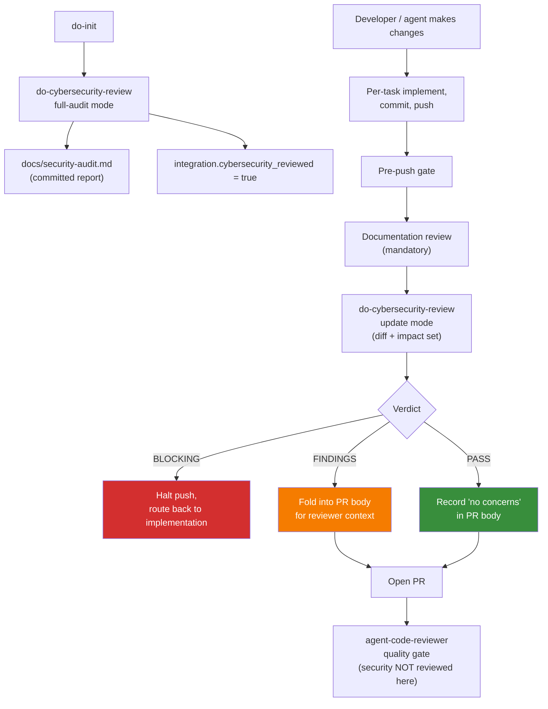

# Security Review

Security review is the practice of systematically identifying vulnerabilities in code before it reaches production. For LLM-generated code, security review is not optional -- it is the primary mechanism for catching an entire class of defects that the LLM is structurally incapable of detecting in its own output.

LLMs generate code by pattern matching against training data. A significant portion of publicly available source code contains security vulnerabilities. The LLM does not distinguish between secure and insecure patterns. It reproduces whatever pattern is statistically likely given the prompt. This means LLM-generated code has a baseline probability of introducing exploitable vulnerabilities even when the task has nothing to do with security.

## Why Security Review Is Critical for LLM Code

### LLMs reproduce vulnerable patterns from training data

LLMs are trained on billions of lines of code from public repositories, Stack Overflow answers, blog posts, and documentation. Much of this code contains:

- SQL queries constructed via string concatenation
- User input passed directly to shell commands
- Hardcoded credentials and API keys
- Missing input validation on API endpoints
- Insecure deserialisation of untrusted data
- Cross-site scripting vulnerabilities in template rendering
- Broken authentication and session management

The LLM does not flag these patterns as dangerous. It reproduces them because they are statistically common in its training data. The more common a vulnerable pattern is in public code, the more likely the LLM is to generate it.

### LLMs do not reason about attack surfaces

A human security engineer considers:

- Who are the adversaries?
- What assets are they targeting?
- What are the entry points into the system?
- What is the trust boundary between components?

An LLM has no concept of adversaries, trust boundaries, or attack motivation. It generates code that is functionally correct -- it does what the task asked for -- without considering how that code might be exploited. Security review fills this gap by applying threat-aware analysis that the LLM cannot perform.

### A single vulnerability can compromise an entire system

One SQL injection in LLM-generated code can expose an entire database. One hardcoded credential committed to a public repository can grant attackers access to production infrastructure. One missing authentication check on an API endpoint can expose all user data. The asymmetry between the effort to introduce a vulnerability (zero, for an LLM) and the impact of exploitation (potentially catastrophic) makes security review non-negotiable.

### Without review, nobody catches it

In attended development, a human developer might notice a suspicious pattern during coding. In code review, a colleague might flag an insecure approach. In unattended LLM development, neither of these checkpoints exists unless explicitly implemented. Maverick's security review process ensures that every piece of LLM-generated code passes through automated and human security checks before reaching production.

## How Maverick Enforces Security Review

Security review in Maverick is owned by a single skill — `do-cybersecurity-review` — that runs in two contexts. Code review is deliberately *not* a security gate; the agent code reviewer's scope is correctness, test coverage, and spec compliance, with security explicitly out of scope (see code-review.md).

**Where security review runs:**

- **At adoption time** (`do-init` → `do-cybersecurity-review` full-audit mode). Audits the whole codebase across eight categories (secret exposure, dependency hygiene, auth/authz, input validation, transport/headers, data at rest, logging/monitoring, container/IaC) and writes a findings report to `docs/security-audit.md`. Flips the `cybersecurity_reviewed` integration flag.
- **Before every PR** (do-issue-solo Phase 7 / do-issue-guided Phase 8 → `do-cybersecurity-review` update mode). Scoped to changed lines plus the impact set (callers, importers, dependents — bounded to one or two hops). Returns a structured verdict.

**Verdict semantics:**

| Verdict | Meaning | Workflow effect |
| --- | --- | --- |
| **PASS** | No concerns surfaced. | Records `Security review: no concerns.` in the PR body. PR opens normally. |
| **FINDINGS** | One or more medium/high items. | Findings are appended to the PR body so the reviewer sees them with full context. PR opens; the items become tracked work. |
| **BLOCKING** | One or more critical items (committed secret, auth bypass introduced, etc.). | Push is halted. The user must address the findings (back to implementation), then re-run the gate. The PR cannot open until the verdict is non-BLOCKING. |

**Other enforcement contributing to security:**

- **`mav-scope-boundaries` skill** prevents the LLM from modifying auth systems, credential stores, or security middleware without explicit issue authorisation. Acts as a structural guardrail before any review can happen.
- **CI pipelines** that the project ships (SAST, dependency audit, secrets scan) supplement the skill-driven gate. `do-cybersecurity-review` is the agent-side review; project CI is the codified-tools-side review. Both fire on every PR.
- **Human reviewer** provides final approval after the agent verdicts.

The split between code review and security review is deliberate. Code review checks whether the code does what was asked correctly and is well-tested; security review checks whether the change introduces or exposes vulnerabilities. Folding them into one agent both blurs ownership and makes the PR-level review either too broad to be useful or too narrow to catch everything. Keeping them separate gives each gate a clear, falsifiable contract.

## OWASP Top 10 — LLM Risk Lens

The standards for what each OWASP category means and how to defend against it live in `mav-bp-application-security` (loaded automatically into every Maverick session). This doc adds the LLM-specific lens: where each risk is most likely to surface in LLM-generated code, and which of the eight `do-cybersecurity-review` categories catches it.

| OWASP Category                     | LLM Risk Level | Why LLMs are prone to this                                                                             | Caught by `do-cybersecurity-review` category |
| ---------------------------------- | -------------- | ------------------------------------------------------------------------------------------------------ | ------------------------------------------- |
| **A01: Broken Access Control**     | High           | LLMs implement the happy path; they rarely add authorisation checks unless prompted                    | Authentication / authorisation              |
| **A02: Cryptographic Failures**    | High           | LLMs use outdated or weak cryptographic algorithms from training data (MD5, SHA1, ECB mode)            | Authentication / authorisation; Data at rest |
| **A03: Injection**                 | Critical       | String concatenation for SQL/commands is the most common pattern in training data                      | Input validation / output encoding          |
| **A04: Insecure Design**           | High           | LLMs implement what was asked, not what should have been asked; they do not challenge requirements     | Surfaces across categories; primarily auth + input validation |
| **A05: Security Misconfiguration** | Medium         | LLMs copy configuration patterns without understanding their security implications                     | Transport / headers / CORS; Container / IaC |
| **A06: Vulnerable Components**     | Medium         | LLMs suggest packages they have seen frequently, not packages that are currently maintained or patched | Dependency hygiene                          |
| **A07: Auth Failures**             | High           | Session management, token handling, and password policies require security reasoning LLMs lack         | Authentication / authorisation              |
| **A08: Data Integrity Failures**   | Medium         | LLMs do not verify the integrity of data from external sources or CI/CD pipelines                      | Input validation; Container / IaC           |
| **A09: Logging Failures**          | High           | LLMs under-log security events and over-log sensitive data; both are security failures                 | Logging, monitoring, rate-limiting          |
| **A10: SSRF**                      | Medium         | LLMs pass URLs from user input to server-side HTTP clients without validation                          | Input validation / output encoding          |

`do-cybersecurity-review` covers all ten OWASP categories across its eight audit categories. The agent code reviewer does not — its scope is correctness, test coverage, and spec compliance. Human reviewers should pay particular attention to A01, A03, and A07 as these are the categories where LLM-generated code is most likely to be vulnerable; the verdict from `do-cybersecurity-review` (already folded into the PR body by the time review starts) flags these explicitly.

## Per-category enforcement

Each of the eight `do-cybersecurity-review` categories has the same shape: the BP skill defines the standard, the audit skill applies it. Listed here as a quick cross-reference; do not duplicate the standard's content in this doc.

| `do-cybersecurity-review` category | What it audits                                                                                | Defer to (standard)                       |
| ---------------------------------- | --------------------------------------------------------------------------------------------- | ----------------------------------------- |
| Secret exposure                    | Committed credentials, tokens, private keys, `.env` content (also via git history)            | `mav-bp-application-security` — Secrets Management |
| Dependency hygiene                 | Lock file presence, vulnerability scanning, pinned versions, supply-chain red flags            | `mav-bp-dependency-management`            |
| Authentication / authorisation     | Hashing algorithm, session management, route protection, admin gating                          | `mav-bp-application-security` — Authentication and Authorisation |
| Input validation / output encoding | Schema validation at boundaries, template auto-escape, parameterised SQL, safe file/command   | `mav-bp-application-security` — Input Validation, Injection Prevention |
| Transport / headers / CORS         | HTTPS enforcement, baseline security headers, scoped CORS                                      | `mav-bp-application-security` — Security Headers and CSP |
| Data at rest, logging redaction    | Encryption of sensitive data, logs not leaking PII or auth headers                             | `mav-bp-application-security`; `mav-bp-logging` |
| Logging / monitoring / rate-limit  | Auth-failure logging, brute-force detection, rate-limit on login / password-reset / signup     | `mav-bp-logging`; `mav-bp-alerting`       |
| Container / infrastructure         | Non-root containers, pinned base images, `.dockerignore`, bucket policies                      | `mav-bp-infrastructure-as-code`           |

This separation means the security review skill stays small — it grows by editing the audit categories' detection heuristics, not by re-litigating the standard each time.

### LLM-specific notes

A handful of patterns are worth calling out because they're driven by LLM-specific failure modes rather than general security guidance:

- **Test fixtures with production-like secrets.** LLMs generate test data that looks "realistic" — including credentials. The secret-exposure category specifically scans test directories for high-entropy strings that match credential patterns.
- **Typosquats in dependency suggestions.** LLMs suggest popular packages by frequency, not currency. The dependency-hygiene category checks dependency manifests against known-typosquat lists where tooling is available; otherwise it flags any newly-added dependency for human verification.
- **Crypto reimplementation.** LLMs will write SHA1 or MD5 password hashing if asked for "a hash". `mav-bp-application-security` forbids custom crypto; the auth/authz audit category flags any non-vetted crypto invocation as BLOCKING.
- **Auth bypass via partial-route protection.** LLMs implement happy-path auth on the route they're asked about and miss sibling routes. The auth/authz audit category does an impact-set walk in update mode (per the skill's contract) — if a middleware is changed, every protected route is re-checked.

## Escalation: When the Verdict Is BLOCKING

`do-cybersecurity-review` returns one of three verdicts. **BLOCKING** is the escalation signal — the agent has decided the PR cannot land safely as-is and the workflow halts pre-push. The user must address the items before retrying.

Triggers for BLOCKING (non-exhaustive):

- A real secret committed to the diff (not a placeholder, not a test fixture pattern that's clearly fake)
- An auth bypass introduced by the diff (e.g., a route now reachable without the middleware that protected it before)
- A dependency added that has a known critical CVE
- Custom cryptographic code (the LLM must never implement custom crypto; refer to `mav-bp-application-security`)
- Removal of an existing security control without explicit issue authorisation (handled in concert with `mav-scope-boundaries`)

When BLOCKING fires, the workflow:

1. Halts pre-push. The PR does not open.
2. Surfaces the findings verbatim to the user.
3. Routes work back to implementation. The user fixes the items by going through the per-task implement → test → commit → push loop again.
4. Re-runs `do-cybersecurity-review` against the new diff.
5. Only proceeds to PR-open once the verdict is non-BLOCKING.

For findings that the agent cannot resolve (e.g., requires architectural change, security domain expertise beyond the model, or a dependency upgrade with breaking changes), escalate to a human via a GitHub issue:

1. Create an issue with the `security` and `bug` labels.
2. Include the OWASP category and the `do-cybersecurity-review` category.
3. Include the file and line where the finding was raised. Do not include exploit details in the public issue body.
4. If the finding was BLOCKING, note the urgency in the title and link the parent PR (which remains in draft until the issue is resolved).

## Interaction with Other Controls

Security review operates alongside Maverick's other containment and quality mechanisms. Each control has a specific scope; they do not overlap.

- **`mav-scope-boundaries`** (scope-boundaries.md) prevents the LLM from modifying auth systems, credential stores, or security middleware without explicit issue authorisation. This is a structural guardrail before review even runs — many security risks are prevented by simply not letting the LLM touch the relevant code.
- **LLM containment** (llm-containment.md) ensures that even if the LLM generates vulnerable code, it cannot deploy that code to production or access production data.
- **Code review** (code-review.md) is a quality gate, not a security gate. The agent code reviewer checks correctness, test coverage, and spec compliance; security is **out of scope** for this stage. By the time a PR reaches code review, `do-cybersecurity-review`'s verdict is already in the PR body. Human reviewers may reference it for context but do not re-derive security findings.
- **CI/CD** (cicd.md) is the codified-tooling layer (SAST, dependency-vulnerability scans, secrets scanners). It complements the agent-driven review — the agent does heuristic, impact-aware reasoning over the diff; CI runs deterministic tools over the whole repo. Both fire on every PR; neither replaces the other.

The split is deliberate. Containment prevents the LLM from accessing systems it should not touch. Security review (in `do-cybersecurity-review`) prevents the LLM from introducing vulnerabilities in the systems it is allowed to touch. Code review checks whether the work meets the spec and is well-tested. CI runs the rule-based tools that don't need LLM judgement. Each control has a falsifiable contract; together they form the layered defence.
