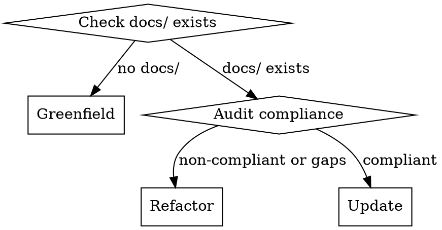

**Depends on:** tech-docs, mav-scope-boundaries

# Documentation Workflow

Create, restructure, or update technical documentation. Operates in three modes depending on the current state of the project's documentation.

## Task Detection

If `$ARGUMENTS` specifies a mode (`greenfield`, `refactor`, or `update`), use it. Otherwise auto-detect:

1. If `docs/` does not exist or contains no technical documentation -> **Greenfield**
2. If `docs/` exists, audit against tech-docs standards. If documents are non-compliant or significant gaps exist -> **Refactor**
3. If documentation is compliant and the task is scoped to recent changes -> **Update**

## Greenfield Mode

Start from scratch for an undocumented project.

### 0. Detect Repository Type

Determine whether the project is a mono-repo or single-repo per the tech-docs skill (mono-repo indicators: `workspaces` in `package.json`, `pnpm-workspace.yaml`, `lerna.json`, `Cargo.toml` with `[workspace]`, `go.work`, multiple `pyproject.toml` files, `nx.json`, `rush.json`). This controls documentation placement.

### 1. Explore the Codebase

- Use Glob, Grep, Read, and subagents to map the project structure
- Examine dependency files to understand the technology stack
- Review configuration and infrastructure files for deployment context
- Read test files to understand expected behaviours and edge cases

### 2. Identify Documentable Areas

Enumerate all components, services, subsystems, and cross-cutting concerns. Prioritise:

1. Architecture overview (always first)
2. Core services and data flows
3. Integration points and external dependencies
4. Design decisions and technology choices
5. Package-specific internals (mono-repo only)

### 3. Write Documentation

For each identified area, write documentation following the tech-docs skill standards (document structure, writing style, token budget, Mermaid diagrams).

### 4. Create Index

Create `docs/technical/index.md` listing all documents with one-line descriptions. For mono-repos, also create `<package>/docs/index.md` for each documented package.

### 5. Validate

Run the tech-docs validation checklist against every document produced.

## Refactor Mode

Bring existing non-compliant documentation up to standard.

### 0. Detect Repository Type

Same as Greenfield step 0.

### 1. Explore the Codebase

Same as Greenfield step 1.

### 2. Audit Existing Documentation

Check all documentation locations based on repository type:

- **Single-repo**: `docs/technical/` and `docs/product/`
- **Mono-repo**: Root `docs/technical/`, root `docs/product/`, and `<package>/docs/` for every package

Read every existing document. For mono-repos, flag product/business docs found inside `<package>/docs/` — these should move to root `docs/product/`.

Classify each document:

| Status | Action |
| --- | --- |
| Compliant and accurate | Leave unchanged |
| Accurate but non-compliant | Rewrite to match tech-docs structure and standards |
| Outdated or inaccurate | Update with verified information from current codebase |
| Redundant or overlapping | Consolidate into a single document |

Identify **gaps** — areas of the codebase with no documentation coverage.

### 3. Execute Changes

- Rewrite non-compliant documents to match tech-docs standards
- Update outdated documents with verified information
- Consolidate redundant documents
- Write new documents for identified gaps

### 4. Update Index

Update or create `docs/technical/index.md` (and package-level indexes for mono-repos).

### 5. Validate

Run the tech-docs validation checklist against every document changed or created.

## Update Mode

Incrementally update documentation after code changes. This is the narrowest mode — only touch what the diff affects.

### 1. Identify Scope

Accept a diff or changed file list. Determine which existing documents are affected by the changes:

- Changed or added public APIs, components, services, or configuration
- Altered data flows, integration points, or architectural patterns
- Modified feature behaviour described in existing docs

### 2. Update Affected Documents

- Update only the sections affected by the changes
- Create new documents only for entirely new components or subsystems that have no existing coverage
- Do not rewrite unrelated sections

### 3. Update Index

Update `docs/technical/index.md` only if new documents were created.

### 4. Validate

Run the tech-docs validation checklist against every document changed or created.

## Rules

- Defer to the **tech-docs** skill for all documentation standards (structure, writing style, file organisation, diagrams, validation)
- Follow the **mav-scope-boundaries** skill at all times
- In **update** mode, scope narrowly to the diff — do not refactor surrounding documentation
- Verify every factual claim against the source code before writing it
