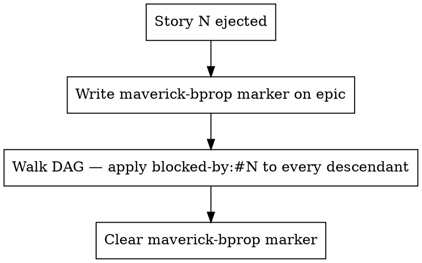

**Depends on:** mav-durability-on-gh

# Block Propagation

When an agent-code-reviewer ejects a PR for human handling, every downstream
story that depended on it is now **transitively broken**. This skill defines
how to label them, cancel their in-flight work, and resume cleanly if the
propagation itself is interrupted mid-flight.

## Why this matters

Without propagation, downstream stories happily continue branching off and
stacking on top of a broken base. They produce PRs that either cannot merge
(build fails) or merge into a broken tree. The `blocked-by:#N` label is the
mechanism that stops every instance from trying.

## Marker-write-walk-clear protocol

Block propagation runs in three steps, and each step is durable on GitHub so
the walk can resume after a crash:



### Step 1 — write the marker

Before labelling any issue, write a `maverick-bprop` marker on the epic
issue naming the ejected story and every descendant that must be blocked.
The marker says: *a block walk is in progress; if you find this, resume it*.

Payload shape:

```json
{
  "ejected": "142",
  "descendants": ["150", "160", "161"],
  "labelled": [],
  "started_at": "2026-04-23T10:20:00Z"
}
```

### Step 2 — walk the DAG

For each descendant, in any order:

1. Read the issue's current labels with `gh issue view <id> --json labels`.
2. If `blocked-by:#<ejected>` is already present, **skip** (idempotent re-run).
3. Otherwise:
   - Apply the label: `gh issue edit <id> --add-label "blocked-by:#<ejected>"`
   - Post a block comment explaining what's blocked and by what.
   - Update `maverick-state` on the epic: set that story to `blocked`.
4. Append the story id to `labelled` in the `maverick-bprop` payload.

The protocol is **idempotent**: every step re-checks state before acting, so
an interrupted walk can be re-entered from Step 1 and will resume where it
left off without re-labelling or re-commenting.

### Step 3 — clear the marker

Once every descendant in the payload is in `labelled`, delete the
`maverick-bprop` comment. The epic issue is now quiescent.

## Cancelling in-flight subagents

A block is useless if a subagent is already deep into a now-blocked story —
it will push a PR against a broken base. As part of the walk:

1. Check `.maverick/worktrees/` for any worktree whose branch name refers to
   a story now in the blocked set.
2. For each such worktree: stop the subagent, release its claim
   (see `mav-multi-instance-coordination`), **do not push** its work.
3. Delete the worktree — resuming a blocked story later will rebuild from
   develop/main anyway.

Do not attempt to salvage in-progress work. The base is broken; the work
cannot be preserved usefully.

## Block-on-entry checks

Three places must re-check the block state at entry so a late-arriving block
unblocks cleanly:

| Location | Check | Behaviour on block |
| --- | --- | --- |
| Cold-start target resolution | Target has `blocked-by:#N`? | Abort cleanly — report to user |
| Wave selection | Story has `blocked-by:#N`? | Exclude from wave |
| Per-story re-verify (just before coding) | Story gained `blocked-by:#N` since wave start? | Abort story; release claim |

The per-story re-verify catches the race where a block is applied *after*
a wave started but *before* every subagent has picked up its story.

## Unblock semantics

A story is "unblocked" when **any** of these is true:

- The ejected PR has been merged (the human fixed and merged it).
- The `blocked-by:#N` label has been removed manually by a human.
- The ejected issue has been closed and the human added a follow-up
  resolution note.

Maverick itself does **not** auto-unblock. Unblocking requires a human
decision because the original ejection was explicitly delegated to a
human. Wave selection re-reads the `blocked-by` label each time, so a
human-removed label will let the story run on the next wave-selection pass.

## Rules

- **Never silently ignore a block.** If you see `blocked-by:#N` on your target,
  abort and report — don't modify the issue, don't push, don't claim.
- **Never remove a `blocked-by:#N` label from inside the workflow.** Only a
  human may remove it. Maverick only *applies* and *reads*.
- **Always re-check at entry.** Don't trust cached block state from the
  start of a run — another instance may have applied or removed a label since.
- **Idempotent throughout.** Every step in the walk checks current state
  before writing. Re-running the walk end-to-end is safe.

<!-- maverick-plugin-version: 2.0.1-dev -->
