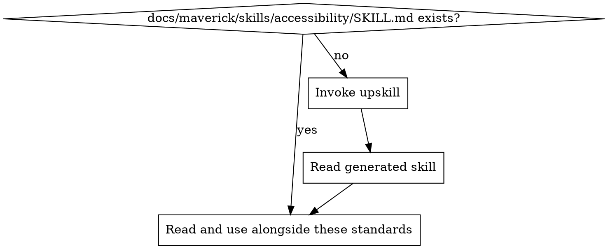

# Accessibility Standards

Ensure user-facing interfaces are usable by everyone, including people who rely on assistive technology. WCAG 2.1 AA is the baseline, not the ceiling.

## Principles

1. **WCAG 2.1 AA as baseline** --- all user-facing interfaces must meet WCAG 2.1 Level AA success criteria
2. **Semantic HTML first** --- use native HTML elements before reaching for ARIA; a `<button>` is always better than a `<div role="button">`
3. **Keyboard navigable** --- every interactive element must be operable with a keyboard alone
4. **Inclusive by default** --- accessibility is not a feature to add later; it is a requirement from the start
5. **Test with real assistive technology** --- automated tools catch ~30% of issues; manual testing with screen readers and keyboard navigation catches the rest

## Scope

These standards apply to:

- **Web applications** with user-facing UI (HTML, React, Vue, Angular, Svelte, etc.)
- **Mobile applications** with user-facing UI (React Native, Flutter, native iOS/Android)

These standards do **NOT** apply to:

- Command-line interfaces (CLIs)
- REST/GraphQL APIs and backend services
- Batch processing jobs, workers, and daemons
- Internal build tools and scripts

If a project has no user-facing interface, this skill can be skipped entirely.

## Project Implementation Lookup

Before applying these standards, load the project-specific accessibility implementation:



1. Check for `docs/maverick/skills/accessibility/SKILL.md`
2. If missing, invoke the `do-upskill` skill with:
   - topic: accessibility
   - scan hints:
     - dependencies: axe-core, @axe-core/react, eslint-plugin-jsx-a11y, pa11y, lighthouse, react-aria, @testing-library/jest-dom, @reach/ui
     - grep: `aria-|role=|alt=|tabIndex|tabindex|sr-only|visually-hidden|a11y|accessible`
     - files: `**/*.a11y.*`, `**/*accessibility*`, `**/.axe*`
3. Read the project skill and apply these best practices in the context of the project's specific technology

## Semantic HTML

Use native HTML elements for their intended purpose. Native elements provide built-in keyboard handling, focus management, and screen reader semantics for free.

### Prefer Native Elements Over ARIA

| Bad | Good | Why |
| --- | ---- | --- |
| `<div role="button" tabindex="0" onclick="...">` | `<button onclick="...">` | Native keyboard and focus support |
| `<span role="link">` | `<a href="...">` | Native navigation semantics |
| `<div role="checkbox">` | `<input type="checkbox">` | Native form behaviour |
| `<div role="heading" aria-level="2">` | `<h2>` | Native document outline |
| `<div role="list"><div role="listitem">` | `<ul><li>` | Native list semantics |

### Document Structure

- Use heading levels (`<h1>` through `<h6>`) in logical order --- do not skip levels
- Use landmark elements: `<header>`, `<nav>`, `<main>`, `<aside>`, `<footer>`
- Use `<section>` and `<article>` to group related content
- Every page has exactly one `<main>` element
- Every page has a descriptive `<title>`

### ARIA Rules

When ARIA is necessary (custom widgets with no native equivalent):

1. **No ARIA is better than bad ARIA** --- incorrect ARIA is worse than no ARIA at all
2. **Do not override native semantics** --- never put `role="button"` on an `<a>` element
3. **All interactive ARIA elements must be keyboard operable** --- if you add `role="tab"`, you must implement arrow key navigation
4. **Use `aria-label` or `aria-labelledby` for elements without visible text**
5. **Use `aria-describedby` for supplementary descriptions**

## Keyboard Navigation

### Requirements

- **All interactive elements reachable via Tab** --- buttons, links, inputs, selects, custom controls
- **Logical tab order** --- follows the visual reading order (left-to-right, top-to-bottom for LTR languages)
- **Visible focus indicators** --- every focusable element has a visible focus style; never use `outline: none` without a replacement
- **No keyboard traps** --- the user can always Tab away from any element (except modal dialogs, which trap focus intentionally)
- **Standard key bindings** --- Enter/Space activates buttons, Escape closes modals/dropdowns, arrow keys navigate within composite widgets

### Focus Indicator Style

```css
/* BAD: Removes focus indicator entirely */
*:focus {
  outline: none;
}

/* GOOD: Custom focus indicator that meets contrast requirements */
*:focus-visible {
  outline: 2px solid #1a73e8;
  outline-offset: 2px;
}
```

Focus indicators must have a contrast ratio of at least 3:1 against the surrounding background.

## Colour and Contrast

### Contrast Ratios (WCAG 2.1 AA)

| Element | Minimum Ratio | Example |
| ------- | ------------- | ------- |
| Normal text (< 18pt / < 14pt bold) | 4.5:1 | Body copy, labels, error messages |
| Large text (>= 18pt / >= 14pt bold) | 3:1 | Headings, large UI text |
| UI components and graphical objects | 3:1 | Buttons borders, form field borders, icons |

### Colour Rules

- **Never use colour alone to convey information** --- pair colour with text, icons, or patterns (e.g., red error text also has an error icon and descriptive message)
- **Error states** use colour + icon + text, not just a red border
- **Links** in body text are distinguishable from surrounding text by more than just colour (underline or bold)
- **Charts and graphs** use patterns or labels in addition to colour

## Images and Media

### Images

- **Informative images** must have descriptive `alt` text: `alt="Bar chart showing Q3 revenue up 15%"`
- **Decorative images** use empty alt: `alt=""` (not omitted --- omitting `alt` entirely is an error)
- **Complex images** (charts, diagrams) need both `alt` text and a longer description (via `aria-describedby` or adjacent text)
- **Icons that convey meaning** need `alt` or `aria-label`; purely decorative icons use `aria-hidden="true"`

### Video and Audio

- **Video** must have captions (synchronised text alternatives for dialogue and sound effects)
- **Audio** must have transcripts
- **Auto-playing media** is prohibited --- users must explicitly start playback
- **Provide controls** for pause, stop, and volume

## Forms

### Labels and Inputs

- **Every input has a visible label** --- use `<label for="...">` associated with the input's `id`
- **Placeholder text is not a label** --- placeholders disappear on input and have insufficient contrast
- **Required fields** are indicated visually and programmatically: `aria-required="true"` or `required`
- **Group related inputs** with `<fieldset>` and `<legend>` (e.g., radio button groups, address fields)

### Error Messages

- **Errors are associated with their inputs** via `aria-describedby` or `aria-errormessage`
- **Error messages are specific** --- "Email address must include an @ symbol" not "Invalid input"
- **Errors are announced** --- use `aria-live="polite"` or `role="alert"` for dynamically displayed errors
- **Do not rely on colour alone** to indicate errors --- include an icon and descriptive text

### Form Example

```html
<!-- GOOD: Accessible form field with error -->
<div>
  <label for="email">Email address</label>
  <input
    id="email"
    type="email"
    aria-required="true"
    aria-invalid="true"
    aria-describedby="email-error"
  />
  <p id="email-error" role="alert">
    Email address must include an @ symbol.
  </p>
</div>

<!-- BAD: No label, placeholder-only, no error association -->
<div>
  <input type="email" placeholder="Email" />
  <p style="color: red;">Invalid</p>
</div>
```

## Dynamic Content

### Focus Management

- **Modals** trap focus within the dialog and return focus to the trigger element on close
- **Single-page applications (SPAs)** manage focus on route changes --- move focus to the new page content or a heading
- **Dynamically added content** (toast notifications, inline validation, search results) is announced to screen readers

### Live Regions

Use ARIA live regions to announce dynamic updates:

```html
<!-- Status messages (non-urgent) -->
<div aria-live="polite" aria-atomic="true">
  3 results found
</div>

<!-- Urgent alerts -->
<div role="alert">
  Session expires in 2 minutes.
</div>
```

- `aria-live="polite"` --- announces when the screen reader is idle (search results, status updates)
- `aria-live="assertive"` or `role="alert"` --- interrupts the current announcement (errors, urgent warnings)
- Do not overuse live regions --- too many announcements overwhelm screen reader users

## Automated Testing in CI

Integrate accessibility testing into the CI pipeline to catch regressions automatically.

### Recommended Tools

| Tool | Type | Integration |
| ---- | ---- | ----------- |
| axe-core | Automated rule engine | Jest, Cypress, Playwright, Storybook |
| Lighthouse | Audit suite | CI via lighthouse-ci |
| pa11y | Automated testing | CI via pa11y-ci |
| eslint-plugin-jsx-a11y | Static analysis | ESLint (React projects) |

### CI Integration

```yaml
# Example: axe-core in a test suite
- name: Run accessibility tests
  run: npm test -- --grep "a11y"

# Example: Lighthouse CI
- name: Lighthouse accessibility audit
  run: lhci autorun --collect.settings.onlyCategories=accessibility
```

### What Automated Tools Catch

- Missing alt text
- Missing form labels
- Insufficient colour contrast
- Missing document language (`<html lang="en">`)
- Duplicate IDs
- Invalid ARIA attributes

### What Automated Tools Miss

- Logical tab order
- Meaningful alt text (tools check presence, not quality)
- Screen reader experience and announcement order
- Keyboard trap issues in complex widgets
- Focus management in SPAs and modals

## Manual Testing Checklist

Automated tools are necessary but not sufficient. Perform these manual checks:

### Keyboard-Only Testing

- [ ] Navigate the entire page using only Tab, Shift+Tab, Enter, Space, Escape, and arrow keys
- [ ] Every interactive element is reachable and operable
- [ ] Focus order matches the visual layout
- [ ] Focus indicator is visible on every focusable element
- [ ] No keyboard traps (except intentional modal focus trapping)

### Screen Reader Testing

- [ ] Test with at least one screen reader (VoiceOver on macOS, NVDA on Windows, TalkBack on Android)
- [ ] All images have appropriate alt text (informative or empty for decorative)
- [ ] Form fields announce their labels and error states
- [ ] Headings create a logical document outline
- [ ] Dynamic content updates are announced
- [ ] Modals announce their title and trap focus

### Zoom and Reflow

- [ ] Content is usable at 200% zoom
- [ ] No horizontal scrolling at 320px viewport width (reflow)
- [ ] Text resizes without loss of content or functionality

## Detecting Accessibility Issues in Code Review

When reviewing code for user-facing interfaces, flag these patterns:

| Pattern | Issue | Fix |
| ------- | ----- | --- |
| `<div onclick="...">` | Non-semantic interactive element | Use `<button>` or `<a>` |
| `outline: none` without replacement | Invisible focus indicator | Add `focus-visible` style |
| `` without `alt` attribute | Missing text alternative | Add descriptive `alt` or `alt=""` for decorative |
| `<input>` without associated `<label>` | Unlabelled form field | Add `<label for="...">` |
| Colour alone indicates state | Inaccessible to colour-blind users | Add icon, text, or pattern |
| `tabindex` value > 0 | Breaks natural tab order | Use `tabindex="0"` or `-1` only |
| `aria-hidden="true"` on focusable element | Hidden but still keyboard-reachable | Remove from tab order or remove `aria-hidden` |
| Auto-playing video or audio | Disruptive, not user-initiated | Require explicit play action |
| Placeholder used as label | Label disappears on input, poor contrast | Add a visible `<label>` |
| Missing `lang` attribute on `<html>` | Screen reader uses wrong language | Add `<html lang="en">` (or appropriate language) |
| Custom widget without keyboard handling | Inoperable for keyboard users | Implement full keyboard interaction pattern |
| Error shown only by colour change | Screen readers cannot detect colour | Add text message and `aria-describedby` |

<!-- maverick-plugin-version: 2.0.3-dev -->
