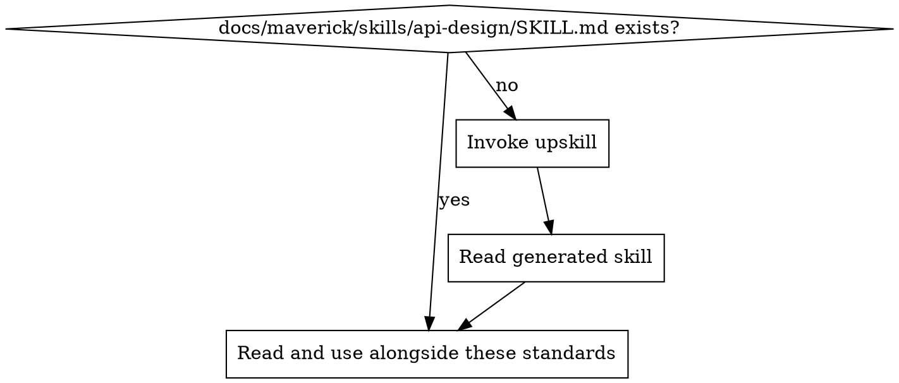

# API Design Standards

Ensure all APIs are consistent, predictable, well-documented, and backwards compatible by default. Applies to REST, GraphQL, and any other API surface.

## Principles

1. **Consistent naming** — use the same casing, pluralisation, and terminology across every endpoint and field
2. **Predictable behaviour** — identical inputs produce identical outputs; side effects are explicit and documented
3. **Backwards compatible by default** — additions are safe, removals and changes require a versioning strategy
4. **Documented as code** — API documentation is generated from source (OpenAPI, GraphQL introspection), not maintained separately
5. **Validate at the boundary** — never trust client input; validate and sanitise at the API layer before processing

## Project Implementation Lookup

Before applying these standards, load the project-specific API design implementation:



1. Check for `docs/maverick/skills/api-design/SKILL.md`
2. If missing, invoke the `do-upskill` skill with:
   - topic: api-design
   - scan hints:
     - dependencies: express, fastify, flask, django-rest-framework, spring-boot, gin, actix-web, apollo-server, graphql-yoga
     - grep: `@app\.route|@router\.|app\.get\(|app\.post\(|@RestController|@Query|@Mutation|openapi|swagger`
     - files: `**/routes.*`, `**/controllers/**`, `**/resolvers/**`, `**/openapi.*`, `**/swagger.*`
3. Read the project skill and apply these best practices in the context of the project's specific technology

## REST Conventions

### Resource Naming

- Use **plural nouns** for collections: `/users`, `/orders`, `/invoices`
- Use **kebab-case** for multi-word resources: `/line-items`, `/payment-methods`
- Nest resources to express ownership: `/users/{userId}/orders`
- Avoid verbs in paths — use HTTP methods to express actions
- Keep nesting shallow — maximum two levels deep (`/users/{id}/orders`, not `/users/{id}/orders/{orderId}/items/{itemId}/details`)

### HTTP Methods

| Method   | Purpose                  | Idempotent | Safe | Example                      |
| -------- | ------------------------ | ---------- | ---- | ---------------------------- |
| `GET`    | Read resource(s)         | Yes        | Yes  | `GET /users/123`             |
| `POST`   | Create resource          | No         | No   | `POST /users`                |
| `PUT`    | Full replacement         | Yes        | No   | `PUT /users/123`             |
| `PATCH`  | Partial update           | Yes*       | No   | `PATCH /users/123`           |
| `DELETE` | Remove resource          | Yes        | No   | `DELETE /users/123`          |

*`PATCH` is idempotent when using merge-patch semantics. Document which patch format you use.

### Status Codes

Use the correct status code category:

| Range | Meaning       | Common Codes                                                                 |
| ----- | ------------- | ---------------------------------------------------------------------------- |
| 2xx   | Success       | `200 OK`, `201 Created`, `204 No Content`                                   |
| 3xx   | Redirection   | `301 Moved Permanently`, `304 Not Modified`                                  |
| 4xx   | Client error  | `400 Bad Request`, `401 Unauthorized`, `403 Forbidden`, `404 Not Found`, `409 Conflict`, `422 Unprocessable Entity`, `429 Too Many Requests` |
| 5xx   | Server error  | `500 Internal Server Error`, `502 Bad Gateway`, `503 Service Unavailable`    |

Rules:
- `POST` that creates a resource returns `201` with a `Location` header
- `DELETE` returns `204` on success (no body)
- Never return `200` for an error — use the appropriate 4xx/5xx code
- Return `404` for resources that do not exist, not an empty `200`
- Return `409` for conflicts (duplicate creation, concurrent modification)

## GraphQL Conventions

### Schema Design

- Use **PascalCase** for types: `User`, `OrderItem`
- Use **camelCase** for fields and arguments: `firstName`, `createdAt`
- Suffix input types with `Input`: `CreateUserInput`, `UpdateOrderInput`
- Suffix connection types with `Connection` and edge types with `Edge` for relay-style pagination
- Make fields non-nullable by default — use nullable only when absence is a valid state

### Query Complexity

- Implement query depth limiting to prevent nested query attacks
- Set maximum query complexity scores
- Use persisted queries in production where possible
- Implement DataLoader or equivalent for N+1 query prevention

## Versioning Strategy

Pick one approach per project and apply it consistently:

| Strategy        | Format              | When to use                                       |
| --------------- | ------------------- | ------------------------------------------------- |
| URL path        | `/v1/users`         | Public APIs, clear separation, easy to route       |
| Accept header   | `Accept: application/vnd.api.v2+json` | Internal APIs, content negotiation preferred |

Rules:
- Increment the version only for breaking changes
- Support at minimum the current and previous version simultaneously
- Document a deprecation timeline and communicate it to consumers
- Never remove a version without advance notice and migration support

## Error Response Format

All API errors must use a consistent structure:

```json
{
  "error": {
    "code": "VALIDATION_FAILED",
    "message": "The request body contains invalid fields.",
    "details": [
      {
        "field": "email",
        "reason": "Must be a valid email address."
      }
    ],
    "correlationId": "req-abc-123"
  }
}
```

Rules:
- `code` is a machine-readable string constant (not an HTTP status code)
- `message` is a human-readable description safe to show to end users
- `details` is an optional array with field-level or sub-error context
- `correlationId` is a request trace identifier for debugging
- Never expose stack traces, internal paths, or implementation details in error responses

## Pagination Patterns

### Cursor-Based Pagination (preferred)

Use for large, frequently changing datasets:

```json
{
  "data": [...],
  "pagination": {
    "nextCursor": "eyJpZCI6MTAwfQ==",
    "hasMore": true
  }
}
```

- Encode cursors as opaque strings (base64-encoded IDs or timestamps)
- Accept `cursor` and `limit` query parameters
- Default `limit` to a sensible value (e.g., 20) with a documented maximum

### Offset-Based Pagination

Use only for small, stable datasets or when random page access is required:

```json
{
  "data": [...],
  "pagination": {
    "page": 2,
    "pageSize": 20,
    "totalCount": 157,
    "totalPages": 8
  }
}
```

- Accept `page` and `pageSize` query parameters
- Include `totalCount` and `totalPages` in the response
- Be aware of performance degradation at high offsets

## Rate Limiting and Throttling

- Implement rate limiting on all public API endpoints
- Return `429 Too Many Requests` when the limit is exceeded
- Include rate limit headers in every response:

```
X-RateLimit-Limit: 1000
X-RateLimit-Remaining: 742
X-RateLimit-Reset: 1704067200
Retry-After: 30
```

- Use sliding window or token bucket algorithms
- Apply different limits per authentication tier (anonymous, authenticated, premium)
- Document rate limits in the API documentation

## API Documentation as Code

- **REST**: maintain an OpenAPI/Swagger specification that is generated from or validated against the source code
- **GraphQL**: enable introspection in non-production environments; generate schema documentation from the schema itself
- Documentation must be versioned alongside the code — never maintain a separate wiki or document that drifts
- Include request/response examples for every endpoint
- Document authentication requirements, rate limits, and error codes

## Input Validation at Boundary

All input validation must happen at the API boundary before business logic executes. See `mav-bp-application-security` for comprehensive input validation and sanitisation standards.

Key rules:
- Validate request body schema (required fields, types, formats)
- Validate path and query parameters (type coercion, allowed values)
- Reject unexpected fields — do not silently ignore them
- Enforce size limits on request bodies and individual fields
- Sanitise string inputs to prevent injection attacks

## Idempotency for Write Operations

- All `PUT` and `DELETE` operations must be idempotent by design
- For `POST` operations that must be idempotent (e.g., payment creation), require an `Idempotency-Key` header
- Store idempotency keys with their responses and return the cached response on replay
- Set a time-to-live on idempotency keys (e.g., 24 hours)
- Document which endpoints support idempotency keys

## Backwards Compatibility Contracts

### Safe Changes (non-breaking)

- Adding a new optional field to a response
- Adding a new endpoint
- Adding a new optional query parameter
- Adding a new enum value (if clients handle unknown values gracefully)

### Breaking Changes (require version bump)

- Removing or renaming a field
- Changing a field's type
- Making an optional field required
- Changing the URL structure of an existing endpoint
- Changing the semantics of an existing field
- Removing an endpoint

### Deprecation Process

1. Mark the field/endpoint as deprecated in the API spec and documentation
2. Add a `Deprecation` or `Sunset` header to responses
3. Log usage of deprecated features to track migration progress
4. Communicate a removal timeline to consumers
5. Remove only after the deprecation period has elapsed and usage is zero

## Detecting API Issues in Code Review

When reviewing code, flag these patterns:

| Pattern                                            | Issue                              | Fix                                                    |
| -------------------------------------------------- | ---------------------------------- | ------------------------------------------------------ |
| Verbs in URL paths (`/getUser`, `/createOrder`)    | REST anti-pattern                  | Use nouns with HTTP methods                            |
| `200 OK` returned for error conditions             | Incorrect status code              | Use appropriate 4xx/5xx codes                          |
| No input validation on request handlers            | Security and data integrity risk   | Validate at the boundary                               |
| Stack traces or internal paths in error responses  | Information disclosure             | Use standard error format, log details server-side     |
| Inconsistent field naming (camelCase vs snake_case)| Breaks predictability              | Pick one convention and apply everywhere               |
| Missing pagination on list endpoints               | Performance risk at scale          | Add cursor or offset pagination                        |
| Breaking change without version bump               | Backwards compatibility violation  | Bump version or make the change additive               |
| No rate limiting on public endpoints               | Abuse and availability risk        | Implement rate limiting with appropriate headers       |
| No idempotency on payment/financial endpoints      | Duplicate processing risk          | Require idempotency keys                               |
| API docs maintained separately from code           | Documentation drift                | Generate docs from source (OpenAPI, introspection)     |

<!-- maverick-plugin-version: 3.3.3-dev -->
