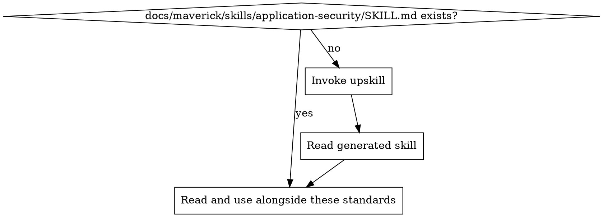

# Application Security Standards

Ensure all code is written with security as a first-class concern. Security is not an afterthought or a bolt-on — it is a design constraint that influences every decision from architecture to individual lines of code.

## Principles

1. **Defence in depth** — never rely on a single layer of protection. Validate at the boundary, enforce in the logic, and verify in the data layer.
2. **Secure by default** — defaults must be safe. Insecure behaviour should require explicit opt-in, not opt-out.
3. **Least privilege** — every component, service account, and user role should have the minimum permissions necessary to function.
4. **Fail securely** — when errors occur, deny access rather than granting it. Never expose internal details in error responses.
5. **Never trust input** — all data crossing a trust boundary is untrusted, whether from users, APIs, databases, or internal services.
6. **Keep secrets out of code** — credentials, tokens, and keys must never appear in source code, configuration files checked into version control, or logs.

## Project Implementation Lookup

Before applying these standards, load the project-specific security implementation:

1. Check for `docs/maverick/skills/application-security/SKILL.md`
2. If missing, invoke the `do-upskill` skill with:
   - topic: application-security
   - scan hints:
     - dependencies: helmet, csurf, cors, bcrypt, argon2, jsonwebtoken, passport, express-rate-limit, django-security, spring-security, owasp-java-encoder
     - grep: `csrf|xss|sanitize|escape|helmet|cors|bcrypt|argon2|hashPassword|validateInput|parameterized|prepared[Ss]tatement|rateLimi|Content-Security-Policy|X-Frame-Options`
     - files: `**/security*.*`, `**/auth*.*`, `**/middleware*.*`, `**/sanitize*.*`, `**/validate*.*`, `**/.env.example`
3. Read the project skill and apply these best practices in the context of the project's specific technology

## OWASP Top 10 Awareness

Every developer and reviewer must be familiar with the current OWASP Top 10. When writing or reviewing code, actively consider whether any of these risks apply:

| #  | Risk                                        | Key mitigation                                                      |
| -- | ------------------------------------------- | ------------------------------------------------------------------- |
| 1  | Broken Access Control                       | Enforce authorisation on every endpoint; deny by default            |
| 2  | Cryptographic Failures                      | Use strong algorithms (AES-256, RSA-2048+); never roll your own     |
| 3  | Injection                                   | Parameterised queries; input validation; output encoding            |
| 4  | Insecure Design                             | Threat modelling; secure design patterns; abuse case analysis       |
| 5  | Security Misconfiguration                   | Harden defaults; remove unused features; automate configuration     |
| 6  | Vulnerable and Outdated Components          | Dependency scanning; regular updates; monitor advisories            |
| 7  | Identification and Authentication Failures  | MFA; strong password policies; session management; rate limiting    |
| 8  | Software and Data Integrity Failures        | Verify signatures; integrity checks on CI/CD; secure deserialization |
| 9  | Security Logging and Monitoring Failures    | Log security events; detect and alert on suspicious activity        |
| 10 | Server-Side Request Forgery (SSRF)          | Allowlist outbound destinations; validate and sanitise URLs         |

## Input Validation and Output Encoding

### Input Validation

Validate all input at the trust boundary before it enters business logic:

- **Allowlist over denylist** — define what is acceptable rather than trying to block what is dangerous
- **Validate type, length, range, and format** — reject anything outside expected parameters
- **Validate on the server** — client-side validation is a UX convenience, not a security control
- **Reject unexpected fields** — strip or reject properties not defined in the schema
- **Canonicalise before validation** — normalise encoding (Unicode, URL encoding, HTML entities) before applying validation rules

### Output Encoding

Encode all output based on the context where it will be rendered:

| Context          | Encoding                                              |
| ---------------- | ----------------------------------------------------- |
| HTML body        | HTML entity encoding (`<` becomes `&lt;`)             |
| HTML attributes  | Attribute encoding; always quote attribute values      |
| JavaScript       | JavaScript hex encoding                               |
| URL parameters   | Percent/URL encoding                                  |
| CSS              | CSS hex encoding                                      |
| SQL              | Parameterised queries (not encoding — see Injection)  |
| JSON             | JSON serialisation via standard library                |

## Injection Prevention

### SQL Injection

- **Always use parameterised queries or prepared statements** — never concatenate user input into SQL strings
- **Use ORM query builders** — they parameterise by default, but verify raw query escapes
- **Avoid dynamic table or column names from user input** — if necessary, validate against an allowlist
- **Apply least privilege to database accounts** — application accounts should not have DDL or admin privileges

### Cross-Site Scripting (XSS)

- **Encode output contextually** — see Output Encoding above
- **Use framework auto-escaping** — React JSX, Angular templates, Django templates, and Jinja2 auto-escape by default. Do not disable this.
- **Sanitise HTML when rich text is required** — use a trusted sanitiser library (DOMPurify, bleach, OWASP Java HTML Sanitizer)
- **Never use `innerHTML`, `dangerouslySetInnerHTML`, or `v-html`** without sanitisation
- **Set `HttpOnly` and `Secure` flags on cookies** — prevent JavaScript access to session tokens

### Cross-Site Request Forgery (CSRF)

- **Use anti-CSRF tokens** — synchroniser tokens or double-submit cookies on all state-changing requests
- **Verify `Origin` and `Referer` headers** as a defence-in-depth measure
- **Use `SameSite` cookie attribute** — set to `Strict` or `Lax` depending on requirements
- **Framework CSRF protection** — enable and do not disable built-in CSRF middleware (Django CSRF, Spring CSRF, csurf)

### Other Injection Types

- **Command injection** — never pass user input to shell commands. Use language-native APIs instead of `exec`/`system`/`subprocess` with shell=True. If unavoidable, use allowlists and strict escaping.
- **LDAP injection** — use parameterised LDAP queries; escape special characters
- **Template injection** — never pass user input as template source. Use sandboxed template engines.
- **XML External Entity (XXE)** — disable external entity processing in XML parsers. Prefer JSON.
- **Path traversal** — validate and canonicalise file paths; reject `../` sequences; use a safe base directory

## Authentication and Authorisation

### Authentication

- **Never store plaintext passwords** — use adaptive hashing: bcrypt, scrypt, or Argon2id with appropriate work factors
- **Enforce strong password policies** — minimum length (12+ characters), check against breached password lists
- **Implement account lockout or rate limiting** — protect against brute-force attacks
- **Use multi-factor authentication (MFA)** for privileged or sensitive operations
- **Session management** — generate cryptographically random session IDs, regenerate after login, set appropriate expiry, invalidate on logout
- **Use established authentication libraries** — do not implement authentication protocols from scratch

### Authorisation

- **Deny by default** — if no rule grants access, deny it
- **Check authorisation on every request** — never rely solely on UI hiding or client-side checks
- **Use role-based or attribute-based access control** — centralise permission logic
- **Validate object-level access** — ensure users can only access resources they own or are explicitly granted (prevent IDOR)
- **Log authorisation failures** — these may indicate an attack

## Secrets Management

### Hard Rules

- **No secrets in source code** — never commit passwords, API keys, tokens, private keys, or connection strings
- **No secrets in environment files committed to version control** — `.env` files must be in `.gitignore`
- **No secrets in logs** — mask or redact sensitive values before logging
- **No secrets in error messages** — error responses must not leak credentials or internal configuration
- **No secrets in Docker images** — use build-time secrets or runtime injection, not `ENV` or `COPY`

### Best Practices

- **Use a secrets manager or vault** — AWS Secrets Manager, HashiCorp Vault, Azure Key Vault, GCP Secret Manager, or similar
- **Inject secrets at runtime** — via environment variables from the orchestrator, not from files in the repository
- **Rotate secrets regularly** — automate rotation where possible
- **Scope secrets narrowly** — each service gets only the secrets it needs
- **Use `.env.example` as a template** — document required variables without values; never include actual secrets

### Secrets Detection in Commits

Prevent secrets from entering the repository:

- **Pre-commit hooks** — run secret scanning before every commit using tools such as git-secrets, gitleaks, or trufflehog
- **CI pipeline scanning** — scan every PR and push for leaked secrets as a CI gate
- **If a secret is committed** — rotate it immediately. Removing it from git history is insufficient because it may have been cloned or cached.

## Security Headers and CSP (Web Applications)

Set security headers on all HTTP responses. These are defence-in-depth measures that mitigate entire classes of attacks:

| Header                        | Recommended Value                               | Purpose                                      |
| ----------------------------- | ----------------------------------------------- | -------------------------------------------- |
| `Content-Security-Policy`     | Strict policy tailored to the application       | Mitigate XSS and data injection              |
| `Strict-Transport-Security`   | `max-age=63072000; includeSubDomains; preload`  | Enforce HTTPS                                |
| `X-Content-Type-Options`      | `nosniff`                                       | Prevent MIME-type sniffing                    |
| `X-Frame-Options`             | `DENY` or `SAMEORIGIN`                          | Prevent clickjacking                         |
| `Referrer-Policy`             | `strict-origin-when-cross-origin`               | Control referrer leakage                     |
| `Permissions-Policy`          | Restrict unused browser features                | Limit API access (camera, microphone, etc.)  |
| `X-XSS-Protection`           | `0` (disable — CSP is the modern replacement)   | Avoid buggy legacy XSS filter                |
| `Cache-Control`               | `no-store` on sensitive responses               | Prevent caching of sensitive data            |

### Content Security Policy (CSP)

- **Start strict, loosen only when necessary** — begin with `default-src 'self'` and add specific sources as needed
- **Avoid `unsafe-inline` and `unsafe-eval`** — these negate most of CSP's XSS protection. Use nonces or hashes instead.
- **Use `report-uri` or `report-to`** — collect violation reports to detect issues and attacks
- **Deploy in report-only mode first** — use `Content-Security-Policy-Report-Only` to test before enforcing

## SAST and DAST in CI Pipelines

Integrate automated security testing into the CI/CD pipeline:

### Static Application Security Testing (SAST)

- **Run on every PR** — SAST tools analyse source code for vulnerabilities without executing it
- **Tool categories** — Semgrep, SonarQube, CodeQL, Checkmarx, Snyk Code, Bandit (Python), Brakeman (Ruby), SpotBugs + FindSecBugs (Java)
- **Treat critical/high findings as build-breaking** — do not merge PRs with unresolved high-severity findings
- **Tune rules to reduce false positives** — a noisy scanner gets ignored

### Dynamic Application Security Testing (DAST)

- **Run against staging/preview environments** — DAST tools test running applications by sending crafted requests
- **Tool categories** — OWASP ZAP, Burp Suite, Nuclei, Nikto
- **Schedule regular scans** — at minimum on every deployment to staging
- **Integrate findings into issue tracking** — do not let DAST results be ignored

### Dependency Vulnerability Scanning

- **Scan dependencies on every build** — use tools such as Dependabot, Snyk, Trivy, Grype, or npm audit
- **Fail the build on critical/high vulnerabilities** — with an established process for exceptions
- **Monitor continuously** — new vulnerabilities are disclosed after code is deployed
- **See the mav-bp-dependency-management skill** for full dependency management guidance

## Secure Defaults

Always prefer the secure option unless there is a documented, reviewed reason to deviate:

- **HTTPS everywhere** — all communication over TLS 1.2+. Never allow plaintext HTTP in production.
- **Parameterised queries** — default query method in every data access layer
- **Least privilege** — database accounts, IAM roles, service accounts, and file permissions should be as restrictive as possible
- **Encrypted at rest** — enable encryption for databases, object storage, and backups
- **Encrypted in transit** — TLS for all service-to-service communication
- **Secure cookie flags** — `Secure`, `HttpOnly`, `SameSite` on all session and authentication cookies
- **Disable directory listing** — web servers should not expose directory contents
- **Remove default credentials** — change or disable default admin accounts and passwords
- **Disable debug mode in production** — debug endpoints, stack traces, and verbose errors must be off

## Sensitive Data Handling

- **Classify data** — know which fields are PII, financial, health, or otherwise sensitive
- **Minimise collection** — do not collect data you do not need
- **Mask in logs** — redact or hash sensitive fields before logging (see mav-bp-logging)
- **Encrypt sensitive fields** — field-level encryption for highly sensitive data at rest
- **Secure deletion** — when data must be deleted, ensure it is actually removed (not soft-deleted indefinitely)
- **Access controls on data** — sensitive data should require explicit authorisation to access, even for internal services

## API Security

- **Authenticate all API endpoints** — unless explicitly designed to be public
- **Use standard token formats** — JWT, OAuth 2.0, API keys with appropriate scoping
- **Validate JWT signatures** — always verify the signature, issuer, audience, and expiration
- **Rate limit API endpoints** — protect against abuse and denial-of-service
- **Validate request bodies** — enforce schemas; reject unexpected or oversized payloads
- **Do not expose internal IDs unnecessarily** — use opaque identifiers where possible
- **Version APIs** — to allow security fixes without breaking clients
- **See the mav-bp-api-design skill** for full API design guidance

## Detecting Security Issues in Code Review

| Pattern                                                  | Issue                        | Fix                                                          |
| -------------------------------------------------------- | ---------------------------- | ------------------------------------------------------------ |
| User input concatenated into SQL query                   | SQL injection                | Use parameterised queries or prepared statements             |
| `innerHTML`, `dangerouslySetInnerHTML`, or `v-html` used | XSS vulnerability            | Use framework auto-escaping; sanitise with DOMPurify/bleach  |
| Hardcoded password, API key, or token in source          | Leaked secret                | Move to secrets manager; add pre-commit scanning             |
| `eval()`, `exec()`, or `Function()` with user input      | Code injection               | Remove eval; use safe alternatives                           |
| Password stored as plaintext or with MD5/SHA1            | Weak credential storage      | Use bcrypt, scrypt, or Argon2id                              |
| CSRF protection disabled or missing                      | Cross-site request forgery   | Enable framework CSRF middleware; add anti-CSRF tokens       |
| Missing authorisation check on endpoint                  | Broken access control        | Add authorisation middleware; check on every request         |
| `shell=True` or `os.system()` with user input            | Command injection            | Use subprocess with argument list; avoid shell execution     |
| Sensitive data in log output                             | Information leakage          | Mask or redact before logging                                |
| `.env` file committed to repository                      | Secret exposure              | Add to `.gitignore`; rotate exposed secrets                  |
| HTTP used instead of HTTPS                               | Man-in-the-middle risk       | Enforce TLS everywhere                                       |
| JWT signature not verified                               | Authentication bypass        | Always verify signature, issuer, audience, and expiry        |
| XML parser with external entities enabled                | XXE attack                   | Disable external entity processing; prefer JSON              |
| Missing rate limiting on login/auth endpoints            | Brute-force vulnerability    | Add rate limiting; implement account lockout                 |
| Wildcard CORS (`Access-Control-Allow-Origin: *`)         | Overly permissive CORS       | Restrict to specific allowed origins                         |
| Debug mode or verbose errors enabled in production       | Information disclosure       | Disable debug mode; return generic error messages            |
| File path constructed from user input without validation | Path traversal               | Canonicalise and validate against a safe base directory      |
| Deserialisation of untrusted data                        | Remote code execution        | Avoid deserialising untrusted input; use safe formats (JSON) |
| Missing `HttpOnly`/`Secure` flags on session cookies     | Session hijacking            | Set `HttpOnly`, `Secure`, and `SameSite` on all auth cookies |

<!-- maverick-plugin-version: 1.0.2-dev -->
