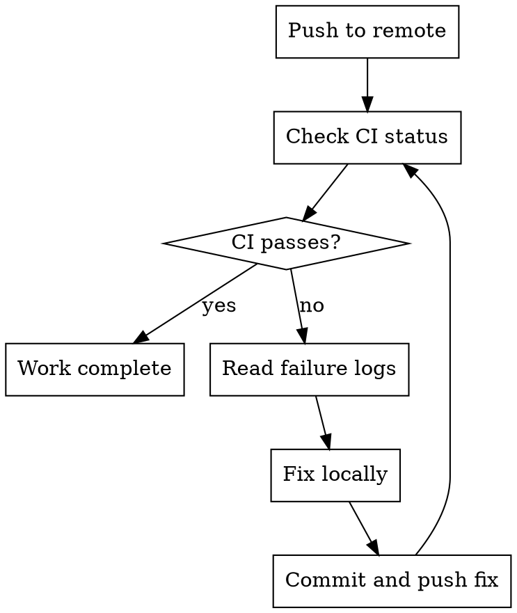

# CI Awareness — Bitbucket Pipelines

After pushing, monitor Bitbucket Pipelines and do not declare work complete until CI passes. This skill implements the platform-specific behaviours defined in the `mav-bp-cicd` skill.

## Principles

1. **Monitor CI after push** — check Bitbucket Pipelines status and wait for results
2. **Respect existing pipelines** — work within existing CI/CD workflows, never modify them without explicit instruction
3. **Deploy is human-gated** — never trigger production deployments autonomously

## Check CI Status

```bash
# List recent pipelines for the current repository
curl -s -u "$BITBUCKET_USERNAME:$BITBUCKET_APP_PASSWORD" \
  "https://api.bitbucket.org/2.0/repositories/$BITBUCKET_WORKSPACE/$BITBUCKET_REPO_SLUG/pipelines/?sort=-created_on&pagelen=5" \
  | python3 -m json.tool

# View a specific pipeline's steps and status
curl -s -u "$BITBUCKET_USERNAME:$BITBUCKET_APP_PASSWORD" \
  "https://api.bitbucket.org/2.0/repositories/$BITBUCKET_WORKSPACE/$BITBUCKET_REPO_SLUG/pipelines/$PIPELINE_UUID/steps/" \
  | python3 -m json.tool

# View logs for a specific step
curl -s -u "$BITBUCKET_USERNAME:$BITBUCKET_APP_PASSWORD" \
  "https://api.bitbucket.org/2.0/repositories/$BITBUCKET_WORKSPACE/$BITBUCKET_REPO_SLUG/pipelines/$PIPELINE_UUID/steps/$STEP_UUID/log" \

# If Bitbucket CLI (bb) is available
bb pipelines list
bb pipelines get <pipeline-uuid>
```

## Process After Push



1. After pushing, check the Bitbucket Pipelines status via the API or CLI
2. If CI passes — work is complete
3. If CI fails:
   - Read the failure logs for the failed step
   - Fix the issue locally
   - Run local verification again (see mav-local-verification skill)
   - Commit the fix and push
   - Monitor CI again
4. Do not declare work complete until CI passes

## Common CI Failures Not Caught Locally

| CI failure | Why it wasn't caught locally | Fix |
|---|---|---|
| Different Node/Python version | CI uses a specific version | Check `bitbucket-pipelines.yml` image for version, use matching local version |
| Missing environment variable | CI has different env | Check pipeline and repository variables in Bitbucket settings |
| Docker memory limit exceeded | Pipelines steps have a 4 GB (or 8 GB for double-size) memory limit | Optimise build to reduce memory usage, or use `size: 2x` for the step |
| Step size limit exceeded | Build steps have a maximum execution time of 120 minutes | Split long-running steps or optimise build performance |
| Platform-specific issue | CI runs on Linux Docker containers, local may differ | Investigate platform-specific code paths |
| Dependency resolution | Lock file out of date | Run `npm ci` / `pip install` and commit lock file |
| Parallel test interference | Tests pass serially but fail in parallel | Fix test isolation |
| Docker-in-Docker issues | Pipelines uses Docker to run steps | Use Bitbucket-provided Docker service or adjust `docker` settings in pipeline config |

## Boundaries

### Never Do Without Explicit Instruction

- Modify `bitbucket-pipelines.yml`
- Add, remove, or change pipeline steps or scripts
- Modify deployment configurations
- Change repository or deployment variables in Bitbucket settings
- Disable or skip pipeline triggers (e.g., `[skip ci]` in commit messages)
- Trigger deployment pipelines or release workflows

### Always Do

- Monitor CI status after pushing
- Fix CI failures before declaring work complete
- Report CI failures clearly if you cannot fix them

<!-- maverick-plugin-version: 3.2.0 -->
