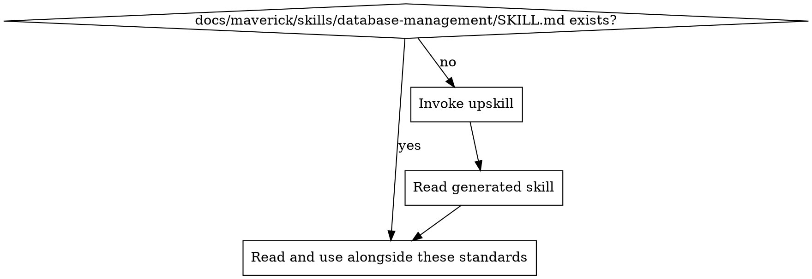

# Database & Data Management Standards

Ensure all database interactions are safe, reproducible, and well-managed. Covers schema migrations, backup strategy, data lifecycle, index management, and connection pooling.

## Principles

1. **Migrations are versioned and reproducible** — every schema change is a migration file checked into version control, producing the same result on every environment
2. **Forward-only in production** — never roll back a production migration manually; write a new forward migration to undo changes
3. **Every migration is reversible** — each migration must include an up and a down operation, even if the down is only used in development
4. **No manual schema changes** — all schema modifications go through the migration pipeline; never run ad-hoc DDL against any shared environment
5. **Data isolation between environments** — development, staging, and production databases are completely separate; never share a database across environments

## Project Implementation Lookup

Before applying these standards, load the project-specific database management implementation:



1. Check for `docs/maverick/skills/database-management/SKILL.md`
2. If missing, invoke the `do-upskill` skill with:
   - topic: database-management
   - scan hints:
     - dependencies: prisma, typeorm, sequelize, knex, drizzle, sqlalchemy, alembic, django, flyway, liquibase, diesel, sqlx, gorm, ecto
     - grep: `migration|migrate|createTable|addColumn|Schema\.create|db\.execute|pool\.query|connectionString|DATABASE_URL`
     - files: `**/migrations/**`, `**/db/**`, `**/database/**`, `**/schema.*`, `**/knexfile.*`, `**/prisma/schema.prisma`
3. Read the project skill and apply these best practices in the context of the project's specific technology

## Schema Migrations

### Migration File Structure

Every migration must be a versioned file with a sequential or timestamp-based identifier:

```
migrations/
  001_create_users_table.sql
  002_add_email_index.sql
  003_create_orders_table.sql
```

Or with timestamps:

```
migrations/
  20240115100000_create_users_table.sql
  20240116143000_add_email_index.sql
  20240117091500_create_orders_table.sql
```

### Migration Rules

- Each migration file contains both **up** (apply) and **down** (revert) operations
- Migrations run in order and are tracked in a migration history table
- Never edit a migration that has already been applied to a shared environment — write a new migration instead
- Test migrations against a copy of production data before deploying
- Migrations must be idempotent where possible (use `IF NOT EXISTS`, `IF EXISTS` guards)

### Migration Tooling by Ecosystem

| Ecosystem   | Tool                          | Notes                                          |
| ----------- | ----------------------------- | ---------------------------------------------- |
| Node.js     | Prisma Migrate, Knex, TypeORM | Use the project's chosen ORM migration system  |
| Python      | Alembic, Django Migrations    | Auto-generate from models, review before apply |
| Java/Kotlin | Flyway, Liquibase             | SQL-based or XML/YAML changelogs               |
| Go          | golang-migrate, goose         | Plain SQL migrations                           |
| Ruby        | Active Record Migrations      | Ruby DSL with reversible blocks                |
| Rust        | Diesel, sqlx                  | Compile-time checked SQL                       |

### Dangerous Migration Patterns

Avoid these patterns in production migrations:

| Pattern                           | Risk                              | Safe Alternative                                         |
| --------------------------------- | --------------------------------- | -------------------------------------------------------- |
| `DROP COLUMN` immediately         | Breaks running application code   | Deploy code that stops reading the column first          |
| `ALTER COLUMN` change type        | Locks table, may lose data        | Add new column, backfill, switch reads, drop old column  |
| `RENAME COLUMN`                   | Breaks running queries            | Add new column, backfill, update code, drop old column   |
| Large `UPDATE` in migration       | Locks table for extended period   | Backfill in batches outside the migration                |
| `NOT NULL` on existing column     | Fails if any rows have null       | Backfill nulls first, then add constraint                |

## Backup and Restore

### Backup Strategy

- Automate database backups on a defined schedule (daily minimum, hourly for critical systems)
- Store backups in a separate location from the database (different region, different account)
- Encrypt backups at rest and in transit
- Retain backups according to the data retention policy (e.g., daily for 30 days, weekly for 90 days, monthly for 1 year)
- Include both full and incremental backups where the database supports it

### Testing Restores

- Test restore procedures on a regular schedule (monthly minimum)
- Document the restore procedure with exact commands and expected duration
- Measure and record Recovery Time Objective (RTO) and Recovery Point Objective (RPO)
- Automate restore testing where possible — a backup that has never been restored is not a backup

### Documented Procedures

Maintain a runbook that covers:
- How to trigger a manual backup
- How to restore to a specific point in time
- How to restore to a new environment (for disaster recovery)
- Who has access to perform restores
- Expected time for each operation

## Data Retention and Archival

- Define a retention policy for every table or data category
- Implement soft deletes where business rules require audit trails
- Archive old data to cold storage (e.g., S3, GCS) rather than keeping it in the primary database
- Schedule automated archival jobs that move data past its retention window
- Ensure archived data remains queryable if business needs require it
- Document retention periods and archival procedures

## Index Strategy

### Rules

- **Do not add indexes speculatively** — index only columns that appear in `WHERE`, `JOIN`, `ORDER BY`, and `GROUP BY` clauses of actual queries
- **Ensure every production query has appropriate indexes** — review query plans for table scans on large tables
- **Composite indexes should follow the left-prefix rule** — order columns from most selective to least selective
- **Monitor index usage** — remove unused indexes, as they slow down writes
- **Avoid over-indexing** — each index adds overhead to every `INSERT`, `UPDATE`, and `DELETE`

### Index Review Checklist

| Check                                    | Action                                                   |
| ---------------------------------------- | -------------------------------------------------------- |
| New query without index coverage         | Add index or verify table is small enough for scan       |
| New index on a high-write table          | Measure write performance impact before deploying        |
| Composite index with low-selectivity lead| Reorder columns for better selectivity                   |
| Duplicate or overlapping indexes         | Remove the redundant index                               |
| Index on a boolean or low-cardinality column | Usually not useful — verify with query plan            |

## Connection Pooling and Resource Management

- Use connection pooling for all database access — never open a new connection per request
- Set pool size based on the application's concurrency and the database's maximum connections
- Configure connection timeouts and idle timeouts to prevent leaked connections
- Monitor pool utilisation and alert on exhaustion
- Use read replicas for read-heavy workloads where available

### Common Pool Configuration

| Setting              | Guideline                                                      |
| -------------------- | -------------------------------------------------------------- |
| `min` pool size      | 2-5 connections for low-traffic services                       |
| `max` pool size      | Start with `(CPU cores * 2) + disk spindles`, tune from there  |
| `idleTimeout`        | 10-30 seconds — release unused connections back to the pool    |
| `connectionTimeout`  | 5-10 seconds — fail fast if pool is exhausted                  |
| `maxLifetime`        | 30 minutes — rotate connections to handle DNS/IP changes       |

## Seed Data

- Provide seed data scripts for development and test environments
- Seed data must be clearly separated from production data and migration scripts
- Seed scripts must be idempotent — running them multiple times produces the same result
- Include realistic but synthetic data (never copy production data into seed files)
- Document how to run seed scripts in the project's README or contributing guide

## Environment Isolation

- **Never share a database between environments** — development, staging, and production each have their own database instance
- **Never connect to production from a local machine** — use bastion hosts or admin tools with audit logging for production access
- **Never copy production data to development** — use seed data or anonymised snapshots
- **Use environment-specific connection strings** — stored in environment variables or secrets management, never hardcoded
- **Apply migrations to each environment independently** — same migration files, separate execution

## Detecting Database Issues in Code Review

When reviewing code, flag these patterns:

| Pattern                                            | Issue                              | Fix                                                    |
| -------------------------------------------------- | ---------------------------------- | ------------------------------------------------------ |
| Raw SQL without parameterised queries              | SQL injection risk                 | Use parameterised queries or ORM                       |
| Manual schema change (ad-hoc DDL)                  | Unreproducible, untracked change   | Create a migration file                                |
| Editing an already-applied migration               | Breaks migration history           | Write a new migration                                  |
| No index on columns used in WHERE/JOIN             | Performance degradation at scale   | Add appropriate index                                  |
| Opening connection per request (no pooling)        | Connection exhaustion              | Use connection pool                                    |
| Hardcoded connection string                        | Security risk, environment coupling| Use environment variables or secrets manager            |
| Missing down migration                             | Cannot revert in development       | Add reversible down operation                          |
| Production data in seed files                      | Data leak, privacy violation       | Use synthetic data only                                |
| `DROP TABLE` or `DROP COLUMN` without staged rollout| Breaks running application        | Stage the change: remove code references first         |
| No transaction wrapping for multi-step migration   | Partial application on failure     | Wrap in transaction where the database supports it     |

<!-- maverick-plugin-version: 3.3.2 -->
