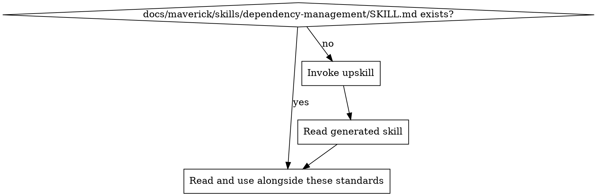

# Dependency Management Standards

Ensure every project's dependencies are intentional, pinned, secure, and actively maintained. Dependencies are an attack surface and a maintenance burden — treat them accordingly.

## Principles

1. **Lock everything** — lock files are the single source of truth for what runs in production. They must be committed and reviewed.
2. **Pin for reproducibility** — exact versions in lock files, deliberate ranges in manifests. Builds must be deterministic.
3. **Scan continuously** — vulnerability scanning runs in CI on every PR and on a regular schedule. No known critical vulnerabilities ship.
4. **Minimise surface area** — every dependency is a liability. Do not add packages for trivial functionality that can be written in a few lines.
5. **Update proactively** — dependencies rot. Automated update tooling and a regular review cadence prevent drift from becoming a crisis.
6. **Know your transitive tree** — you own everything in your dependency tree, not just your direct dependencies. Audit the full graph.

## Lock Files

Lock files guarantee deterministic builds. Without them, the same manifest can produce different installs on different machines or at different times.

### Rules

- **Always commit lock files** — `package-lock.json`, `yarn.lock`, `pnpm-lock.yaml`, `uv.lock`, `poetry.lock`, `Pipfile.lock`, `Cargo.lock`, `go.sum`, `Gemfile.lock`, `composer.lock`
- **Review lock file changes** — large diffs in lock files during a PR that only changes one dependency may indicate unexpected transitive additions. Inspect them.
- **Use the lock file for installs** — `npm ci` (not `npm install`), `uv sync --locked`, `pip install --require-hashes`, `bundle install --frozen`. CI and production must install from the lock, not resolve fresh.
- **Never manually edit lock files** — they are generated artefacts. If the lock is wrong, fix the manifest and regenerate.

### Ecosystem Lock File Reference

| Ecosystem | Manifest | Lock file | Frozen install command |
| --------- | -------- | --------- | --------------------- |
| Node (npm) | `package.json` | `package-lock.json` | `npm ci` |
| Node (yarn) | `package.json` | `yarn.lock` | `yarn install --frozen-lockfile` |
| Node (pnpm) | `package.json` | `pnpm-lock.yaml` | `pnpm install --frozen-lockfile` |
| Python (uv) | `pyproject.toml` | `uv.lock` | `uv sync --locked` |
| Python (poetry) | `pyproject.toml` | `poetry.lock` | `poetry install --no-update` |
| Python (pip) | `requirements.txt` | `requirements.txt` (pinned) | `pip install -r requirements.txt --require-hashes` |
| Rust | `Cargo.toml` | `Cargo.lock` | `cargo install --locked` |
| Go | `go.mod` | `go.sum` | `go mod download` |
| Ruby | `Gemfile` | `Gemfile.lock` | `bundle install --frozen` |
| PHP | `composer.json` | `composer.lock` | `composer install --no-dev` |

## Version Pinning Strategy

### Manifests vs Lock Files

- **Manifests** (e.g., `package.json`, `pyproject.toml`) — use ranges for libraries, exact versions for applications
  - Libraries: allow compatible ranges (`^1.2.0`, `>=1.2,<2`) so consumers can resolve their own tree
  - Applications: prefer tighter ranges or exact pins to reduce surprise upgrades
- **Lock files** — always contain exact resolved versions. This is where determinism lives.

### Pinning Guidelines

- Pin major versions at minimum — never allow automatic major bumps (`*`, `latest`)
- For security-critical dependencies (auth libraries, crypto), prefer exact pins in the manifest
- For development tooling (linters, formatters, test frameworks), ranges are acceptable since they do not ship to production
- When in doubt, pin tighter. Loosening is easy; debugging a surprise upgrade is not.

## Vulnerability Scanning

### CI Integration

Every CI pipeline must include a dependency vulnerability scan that:

1. Runs on every pull request
2. Runs on a scheduled cadence (daily or weekly) against the default branch
3. Fails the build on critical or high severity vulnerabilities
4. Reports findings as PR comments or check annotations

### Scanning Tools by Ecosystem

| Ecosystem | Built-in / native | Third-party |
| --------- | ----------------- | ----------- |
| Node | `npm audit` | Snyk, Socket, Trivy |
| Python | `pip-audit`, `safety` | Snyk, Trivy |
| Rust | `cargo audit` | Trivy |
| Go | `govulncheck` | Snyk, Trivy |
| Ruby | `bundler-audit` | Snyk, Trivy |
| Java/Kotlin | OWASP Dependency-Check | Snyk, Trivy |
| Multi-language | — | Trivy, Snyk, Grype, Dependabot alerts |

### Handling Findings

- **Critical/High** — fix immediately or apply a mitigation. These block merges.
- **Medium** — fix within the current sprint or iteration. Track in issue backlog.
- **Low/Informational** — evaluate and fix during regular dependency updates. May be suppressed with documented justification.
- **False positives** — suppress with a comment explaining why, and revisit periodically.

## License Compliance

### Risks

- **Copyleft licenses** (GPL, AGPL, LGPL) — may require you to release your own source code under the same license. This is a legal risk for proprietary software.
- **Network copyleft** (AGPL) — triggered by network use, not just distribution. Particularly dangerous for SaaS.
- **No license** — code with no license is fully copyrighted by default. You have no rights to use it.

### Rules

- **Know the license of every direct dependency** — check before adding, not after shipping
- **Audit transitive dependencies** — a permissive direct dependency can pull in a copyleft transitive dependency
- **Maintain an allow-list** — define which licenses are acceptable for your project (typically: MIT, Apache-2.0, BSD-2-Clause, BSD-3-Clause, ISC, 0BSD, Unlicense)
- **Block or flag unknown licenses** — if a dependency's license cannot be determined, investigate before using it
- **Automate license checks in CI** — use tooling to scan and enforce the allow-list on every PR

### License Scanning Tools

| Tool | Ecosystems | Notes |
| ---- | ---------- | ----- |
| `license-checker` (npm) | Node | Checks installed packages against an allow/deny list |
| `licensecheck` (Go) | Go | Scans Go module dependencies |
| `cargo-deny` | Rust | License + vulnerability + duplicate checking |
| FOSSA | Multi-language | Commercial, comprehensive compliance platform |
| Trivy | Multi-language | Includes license scanning alongside vulnerabilities |
| ScanCode | Multi-language | Open-source, detailed license detection |

## Update Strategy

### Automated Update Tooling

Use automated dependency update tooling to create PRs for outdated dependencies:

- Configure the tool to group updates logically (e.g., all patch updates in one PR, each major update separately)
- Set a regular schedule (weekly for patches, monthly review for minors/majors)
- Auto-merge patch updates that pass CI (if your test coverage supports this confidence)
- Require manual review for major version bumps

### Update Cadence

| Update type | Frequency | Review level |
| ----------- | --------- | ------------ |
| Patch (security) | Immediately when disclosed | Fast-track merge after CI passes |
| Patch (non-security) | Weekly, batched | Auto-merge if CI passes |
| Minor | Weekly or biweekly | Review changelog, merge if CI passes |
| Major | Monthly review | Read migration guide, test thoroughly, manual merge |

### When Updating Dependencies

1. Read the changelog or release notes — understand what changed
2. Run the full test suite — not just unit tests, include integration tests
3. Check for breaking changes in APIs you consume
4. Update one major dependency at a time — never batch major bumps
5. Verify lock file changes match expectations — no unexpected transitive additions or removals

## Minimal Dependency Principle

Not every problem needs a package. Dependencies carry costs: maintenance, security surface, supply chain risk, bundle size, and licensing obligations.

### Do Not Add a Package For

- **Simple utility functions** — `leftPad`, `isOdd`, `flattenArray`. Write them yourself.
- **Single-use wrappers** — a package that wraps one API call or one standard library function
- **Formatting or string manipulation** — unless the logic is genuinely complex (e.g., internationalisation)
- **Functionality already in the standard library** — check what your language provides before reaching for a package

### Do Add a Package For

- **Complex, well-tested logic** — cryptography, date-time handling with timezone support, parsing (HTML, Markdown, CSV)
- **Protocol implementations** — HTTP clients, WebSocket libraries, database drivers
- **Security-sensitive operations** — auth, encryption, token validation. Do not roll your own.
- **Ecosystem standards** — frameworks, testing libraries, linters. Fighting the ecosystem is worse than the dependency cost.

### Evaluating a New Dependency

Before adding a dependency, check:

1. **Maintenance status** — when was the last release? Are issues triaged? Is there more than one maintainer?
2. **Download/usage volume** — is it widely adopted in the ecosystem?
3. **Transitive dependency count** — does it pull in dozens of sub-dependencies?
4. **Bundle size impact** — for frontend packages, check the size contribution
5. **License** — is it compatible with your project?
6. **Alternatives** — can you achieve this with the standard library or an existing dependency?

## Transitive Dependency Awareness

You are responsible for every package in your dependency tree, not just the ones you explicitly added.

### Rules

- **Audit the full tree periodically** — use `npm ls`, `uv tree`, `cargo tree`, `go mod graph`, `pipdeptree`, `bundle viz` to inspect the resolved graph
- **Watch for duplicate packages** — multiple versions of the same package inflate bundle size and can cause subtle bugs
- **Investigate unexpected additions** — if a lock file diff adds packages you did not expect, trace them back to their source
- **Prefer dependencies with fewer transitive dependencies** — between two equivalent packages, choose the one with the shallower tree

## Abandoned Package Detection

Dependencies with no active maintenance are a ticking time bomb — no security patches, no compatibility updates, no bug fixes.

### Warning Signs

- No commits or releases in 12+ months
- Open issues and PRs with no maintainer response
- Deprecated notices in the registry (npm, PyPI, crates.io)
- Single maintainer with no succession plan
- Archived repository

### Response

- **If an alternative exists** — plan migration to an actively maintained package
- **If no alternative exists** — fork the package into your organisation, apply critical fixes yourself, and track upstream for revival
- **If the functionality is simple** — replace the dependency with an internal implementation

## Project Implementation Lookup

Before applying these standards, load the project-specific dependency management implementation:

1. Check for `docs/maverick/skills/dependency-management/SKILL.md`
2. If missing, invoke the `do-upskill` skill with:
   - topic: dependency-management
   - scan hints:
     - dependencies: npm, yarn, pnpm, uv, poetry, pip, cargo, bundler, composer
     - grep: `"dependencies"|"devDependencies"|requires-python|tool\.poetry|Cargo\.toml|\[dependencies\]`
     - files: `package-lock.json`, `yarn.lock`, `pnpm-lock.yaml`, `uv.lock`, `poetry.lock`, `Cargo.lock`, `go.sum`, `Gemfile.lock`, `composer.lock`, `.npmrc`, `.nvmrc`
3. Read the project skill and apply these best practices in the context of the project's specific technology

## Detecting Dependency Issues in Code Review

| Pattern | Issue | Fix |
| ------- | ----- | --- |
| Lock file not committed | Non-deterministic builds | Commit the lock file, use frozen install in CI |
| Lock file manually edited | Corrupted dependency resolution | Regenerate from manifest |
| New dependency for trivial functionality | Unnecessary surface area | Inline the logic or use standard library |
| Dependency with no license or copyleft license | Legal risk | Replace with a permissively licensed alternative |
| Major version bump buried in a large PR | Breaking changes may be missed | Isolate major bumps into dedicated PRs |
| `*` or `latest` in version specifiers | Unpredictable builds | Pin to a specific range |
| No vulnerability scanning in CI | Known CVEs may ship | Add `npm audit` / `pip-audit` / equivalent to pipeline |
| Dependency with no recent releases (12+ months) | Abandoned package risk | Evaluate alternatives or plan a fork |
| Large transitive dependency addition | Unexpected supply chain expansion | Investigate and consider lighter alternatives |
| `--force` or `--legacy-peer-deps` in install commands | Masking resolution conflicts | Fix the underlying version conflict |

<!-- maverick-plugin-version: 3.3.4 -->
