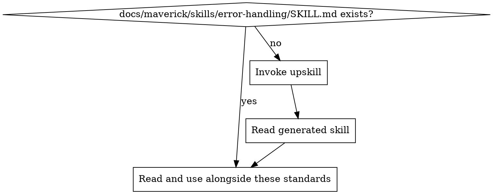
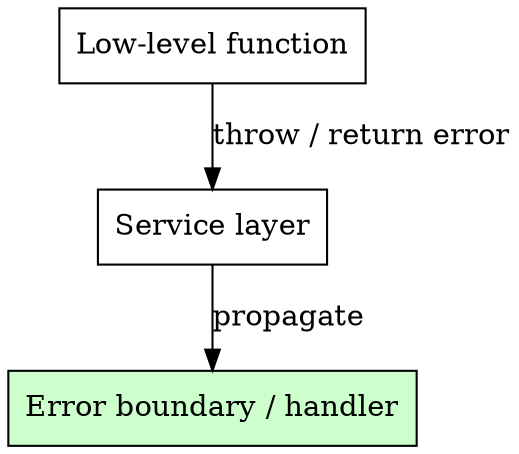
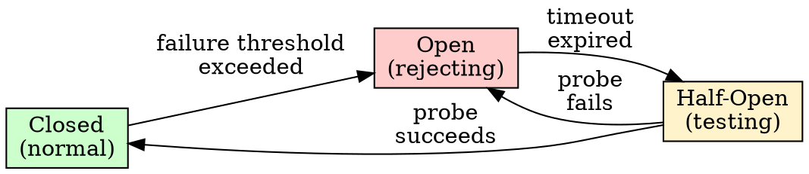

# Error Handling Standards

Ensure all error handling is intentional, typed, and resilient. Errors should be caught where they can be acted on, propagated where they cannot, and never swallowed silently.

## Principles

1. **Fail fast on unrecoverable errors** — do not attempt to recover from corruption, configuration failures, or programming errors. Crash immediately with a clear message.
2. **Handle at the right level** — catch errors where you have enough context to respond meaningfully. Do not catch at every layer.
3. **Use typed errors** — define error types with structured metadata, not generic strings or bare exceptions.
4. **Never swallow silently** — every `catch` block must either handle, log, or re-throw. An empty `catch` is a bug.
5. **Separate client vs server errors** — client errors (bad input, not found) and server errors (crashes, dependency failures) have different semantics and different handling paths.

## Project Implementation Lookup

Before applying these standards, load the project-specific error handling implementation:



1. Check for `docs/maverick/skills/error-handling/SKILL.md`
2. If missing, invoke the `do-upskill` skill with:
   - topic: error-handling
   - scan hints:
     - dependencies: neverthrow, ts-results, effect, result, anyhow, thiserror
     - grep: `catch\s*\(|\.catch\(|except\s|rescue\s|AppError|HttpException|CustomError|BaseError|ErrorBoundary`
     - files: `**/error*.*`, `**/exception*.*`, `**/errors/**`
3. Read the project skill and apply these best practices in the context of the project's specific technology

## Error Propagation

Catch where you can act, propagate where you cannot. Errors should bubble up to the nearest boundary that has enough context to respond.



### Do

- **Throw or return errors** from low-level functions (database queries, HTTP calls, file I/O) without catching
- **Catch at service boundaries** where you can map errors to appropriate responses (e.g., HTTP status codes)
- **Catch at the outermost handler** (global error handler, error middleware) as the last safety net

### Do Not

- **Catch and re-throw without adding value** — if you are not adding context or transforming the error, let it propagate
- **Catch at every layer** — this leads to duplicate logging and lost stack traces
- **Catch to return `null` or a default** — unless the caller explicitly expects it and the failure is recoverable

## Typed and Structured Errors

Define error types with structured metadata. Do not throw raw strings, generic `Error` objects, or untyped exceptions.

### Error Structure

Every application error should carry:

| Field     | Purpose                                   | Example                                     |
| --------- | ----------------------------------------- | ------------------------------------------- |
| `type`    | Machine-readable error classification     | `VALIDATION_ERROR`, `NOT_FOUND`, `CONFLICT` |
| `message` | Human-readable description                | `User with email already exists`            |
| `context` | Structured metadata for diagnosis         | `{ "email": "masked", "userId": "u-123" }` |
| `cause`   | Original error (for chained/wrapped errors) | The underlying database or network error    |

### Examples

```typescript
// GOOD: Typed error with context
class AppError extends Error {
  constructor(
    public readonly type: string,
    message: string,
    public readonly context?: Record<string, unknown>,
    public readonly cause?: Error
  ) {
    super(message);
  }
}

throw new AppError("VALIDATION_ERROR", "Email already registered", {
  field: "email",
});
```

```python
# GOOD: Typed exception with context
class AppError(Exception):
    def __init__(self, error_type: str, message: str, context: dict | None = None):
        super().__init__(message)
        self.error_type = error_type
        self.context = context or {}

raise AppError("NOT_FOUND", "Order not found", {"order_id": order_id})
```

```
// BAD: Generic string
throw new Error("something went wrong");

// BAD: Bare string
raise "failed"
```

## Retry with Exponential Backoff

Transient failures (network timeouts, rate limits, temporary unavailability) should be retried with exponential backoff. Permanent failures (bad input, not found, auth errors) must not be retried.

### Retry Rules

| Rule                      | Detail                                                        |
| ------------------------- | ------------------------------------------------------------- |
| **Max retries**           | 3 attempts (1 initial + 2 retries) unless configured otherwise |
| **Backoff**               | Exponential: `base * 2^attempt` (e.g., 100ms, 200ms, 400ms) |
| **Jitter**                | Add random jitter to prevent thundering herd                  |
| **Retryable errors only** | Network timeouts, 429, 502, 503, 504. Never retry 400, 401, 403, 404 |
| **Idempotency**           | Only retry operations that are safe to repeat                 |

### What NOT to Retry

- Client errors (4xx except 429) — the request is wrong, retrying will not help
- Authentication/authorisation failures — retrying will not fix credentials
- Validation errors — the input needs to change
- Non-idempotent operations without idempotency keys — retrying may cause duplicates

## Circuit Breaker Pattern

When a dependency is failing repeatedly, stop sending requests to it. This prevents cascading failures and gives the dependency time to recover.

### Circuit States



| State       | Behaviour                                                            |
| ----------- | -------------------------------------------------------------------- |
| **Closed**  | Requests pass through normally. Failures are counted.                |
| **Open**    | Requests are rejected immediately without calling the dependency.    |
| **Half-Open** | A single probe request is allowed through to test if the dependency has recovered. |

### When to Use

- External API calls (payment providers, third-party services)
- Database connections under load
- Any dependency where repeated failures indicate an outage rather than individual request problems

### When NOT to Use

- Local function calls
- Operations that must always attempt (e.g., writing an audit log)
- Dependencies with built-in retry/failover

## Graceful Degradation

When a non-critical dependency fails, degrade the feature rather than crashing the entire application.

### Examples

| Failing dependency        | Full feature              | Degraded behaviour                        |
| ------------------------- | ------------------------- | ----------------------------------------- |
| Recommendation service    | Personalised suggestions  | Show popular/default items                |
| Avatar service            | User profile pictures     | Show placeholder avatar                   |
| Analytics service         | Real-time metrics         | Queue events for later, continue normally |
| Search service            | Full-text search          | Fall back to basic filtering              |
| Notification service      | Push notifications        | Queue for retry, do not block the action  |

### Rules

- **Critical path must not depend on non-critical services** — a checkout flow must not fail because the recommendation service is down
- **Degrade visibly** — if a feature is degraded, communicate it to the user (e.g., "Recommendations are temporarily unavailable")
- **Monitor degradation** — log and alert when features are operating in degraded mode

## Error Boundaries

For frontend applications, use error boundaries to prevent a failure in one component from crashing the entire application.

### Rules

- **Wrap major UI sections** — each independently meaningful section (sidebar, main content, widgets) should have its own error boundary
- **Show fallback UI** — display a user-friendly message, not a blank screen or raw error
- **Report the error** — send the error to the reporting service (see mav-bp-logging)
- **Allow recovery** — provide a way to retry or navigate away (e.g., "Something went wrong. Try refreshing.")

### Framework Patterns

- **React**: `componentDidCatch` / `ErrorBoundary` component
- **Vue**: `errorCaptured` hook / `onErrorCaptured` composition API
- **Angular**: `ErrorHandler` class
- **Svelte**: `<svelte:boundary>` (Svelte 5+) or `handleError` hook

## Never Expose Internals to End Users

Error responses sent to clients must never include implementation details.

### Never Expose

- Stack traces
- SQL queries or database error messages
- File paths or server directory structures
- Internal service names or IP addresses
- Framework/library version numbers
- Raw exception messages from dependencies

### Do Expose

- A human-readable error message describing what went wrong from the user's perspective
- A machine-readable error code or type for programmatic handling
- A request/correlation ID so support can look up the full error in logs

### Example

```json
// GOOD: Safe client response
{
  "error": {
    "type": "VALIDATION_ERROR",
    "message": "The email address is not valid.",
    "requestId": "req-abc-123"
  }
}

// BAD: Leaking internals
{
  "error": "QueryFailedError: relation \"users\" does not exist",
  "stack": "Error: QueryFailedError\n    at /app/src/db/connection.ts:42:11..."
}
```

## Client Errors vs Server Errors

Distinguish between errors caused by the client (bad input, missing resource) and errors caused by the server (crashes, dependency failures). They have different handling paths.

| Aspect           | Client error (4xx)                          | Server error (5xx)                           |
| ---------------- | ------------------------------------------- | -------------------------------------------- |
| **Cause**        | Invalid request from the caller             | Failure in the server or its dependencies    |
| **Retryable**    | No (unless the client fixes the request)    | Possibly (transient failures may recover)    |
| **Log level**    | `warn` (expected, but worth tracking volume) | `error` (unexpected, requires investigation) |
| **Alert**        | No (unless volume spikes unusually)         | Yes (if persistent or above threshold)       |
| **User message** | Specific ("Email is required")              | Generic ("Something went wrong")             |

## Relationship to Logging and Alerting

Error handling, logging, and alerting are complementary:

| Concern          | Role                                                      | Skill                           |
| ---------------- | --------------------------------------------------------- | ------------------------------- |
| Error handling   | Decide what to do with the error (retry, degrade, crash)  | This skill                      |
| Logging          | Record the error with context for investigation           | mav-bp-logging     |
| Alerting         | Notify operations when critical errors demand attention   | mav-bp-alerting    |

**Flow**: Error occurs -> Error handling decides the response -> Logging records it -> Alerting notifies (if critical).

## Detecting Error Handling Issues in Code Review

| Pattern                                             | Issue                          | Fix                                               |
| --------------------------------------------------- | ------------------------------ | ------------------------------------------------- |
| Empty `catch` block                                 | Silently swallowed error       | Handle, log, or re-throw                          |
| `catch (err) { return null }`                       | Lost error context             | Propagate the error or handle explicitly           |
| `throw new Error("failed")`                         | Untyped, no context            | Use typed error with structured metadata           |
| Retrying on 400/401/403                             | Retrying permanent failures    | Only retry transient errors (429, 5xx, timeouts)   |
| No retry on external HTTP calls                     | Fragile to transient failures  | Add retry with exponential backoff                 |
| Stack trace in API response                         | Leaking internals              | Return safe error with request ID only             |
| `catch` at every layer in the call stack            | Duplicate handling/logging     | Catch at the boundary, propagate elsewhere         |
| Feature crashes app when dependency is down         | No graceful degradation        | Degrade the feature, keep the app running          |
| No error boundary around UI sections                | Single component crashes page  | Wrap sections in error boundaries with fallback UI |
| Generic error message for all failures              | Poor user experience           | Distinguish client vs server errors                |

<!-- maverick-plugin-version: 3.3.2 -->
