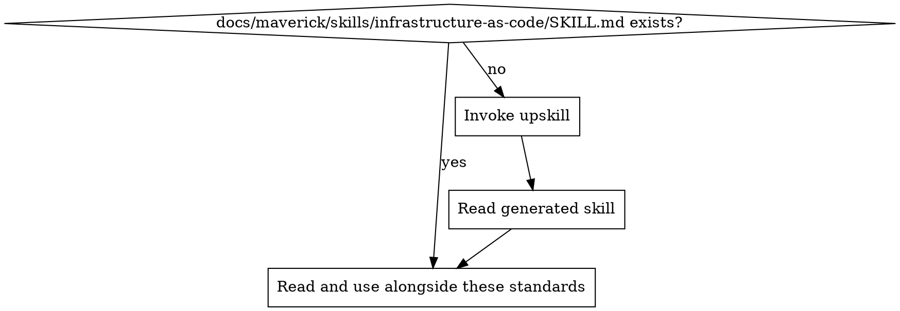
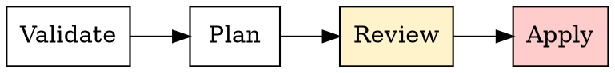

# Infrastructure as Code Standards

Ensure all infrastructure is defined, versioned, and reproducible from code. Manual provisioning is a last resort, and when unavoidable it must be documented in a runbook.

## Principles

1. **All infrastructure reproducible from code/config** -- every resource should be declaratively defined so that environments can be created, destroyed, and recreated without manual steps
2. **Immutable infrastructure** -- replace, don't patch. Deploy new instances from updated definitions rather than mutating running resources in place
3. **Environment parity** -- dev, staging, and production are generated from the same templates with environment-specific parameters
4. **Secrets never in IaC files** -- credentials, tokens, and keys must never appear in infrastructure definitions. Reference external secret stores instead
5. **IaC versioned with application code** -- infrastructure definitions live in the same repository (or a linked repository) and follow the same review and merge process as application code

## Project Implementation Lookup

Before applying these standards, load the project-specific infrastructure-as-code implementation:

1. Check for `docs/maverick/skills/infrastructure-as-code/SKILL.md`
2. If missing, invoke the `do-upskill` skill with:
   - topic: infrastructure-as-code
   - scan hints:
     - dependencies: terraform, pulumi, aws-cdk, cloudformation, bicep, ansible, helm, kustomize
     - grep: `resource\s|module\s|provider\s|stack|template|playbook|Chart\.yaml`
     - files: `**/*.tf`, `**/*.tfvars`, `**/cdk.json`, `**/template.yaml`, `**/cloudformation*.*`, `**/ansible*.*`, `**/helm/**`, `**/pulumi*.*`
3. Read the project skill and apply these best practices in the context of the project's specific technology

## IaC Tool Categories

Infrastructure as Code tools fall into three broad categories. The choice depends on what layer of the stack you are managing:

| Category                  | Purpose                                        | Examples                                         |
| ------------------------- | ---------------------------------------------- | ------------------------------------------------ |
| **Provisioning**          | Create and manage cloud resources              | Terraform, Pulumi, AWS CDK, CloudFormation, Bicep |
| **Configuration management** | Configure software on existing machines      | Ansible, Chef, Puppet, Salt                      |
| **Container orchestration** | Define and deploy containerised workloads     | Kubernetes manifests, Helm charts, Kustomize, Docker Compose |

### Key Guidance

- Use **one** provisioning tool per project. Do not mix Terraform and CloudFormation for the same resources.
- Configuration management tools are separate from provisioning -- they operate after resources exist.
- Container orchestration definitions are IaC too -- apply the same versioning and review standards.

## Environment Parity

All environments must be generated from the same templates. Differences between environments are expressed as parameters, not as separate template copies.

| Principle                    | Correct approach                                  | Anti-pattern                              |
| ---------------------------- | ------------------------------------------------- | ----------------------------------------- |
| Same templates               | One set of definitions, parameterised per env     | Separate `prod.tf` and `staging.tf` files |
| Environment-specific values  | Variable files, parameter stores, or env configs  | Hard-coded values in resource definitions |
| Drift detection              | Regular plan/diff runs to detect manual changes   | Assuming deployed state matches code      |
| Promotion flow               | Deploy to dev first, then staging, then prod      | Deploying directly to production          |

## State Management

IaC tools that maintain state (e.g., Terraform state files, Pulumi state) require careful handling:

1. **Remote state storage** -- store state in a shared, durable backend (e.g., cloud object storage with locking), never in local files committed to the repository
2. **State locking** -- ensure only one operation modifies state at a time to prevent corruption
3. **State isolation** -- separate state per environment to prevent accidental cross-environment changes
4. **No manual state edits** -- never hand-edit state files. Use the tool's built-in state manipulation commands when necessary
5. **State file sensitivity** -- state files may contain secrets. Treat them as sensitive and restrict access

## Secrets in IaC

Credentials, API keys, certificates, and other secrets must never appear in IaC definitions or variable files:

| Do                                                 | Do not                                              |
| -------------------------------------------------- | --------------------------------------------------- |
| Reference secrets from a secret manager or vault   | Hard-code secrets in `.tf`, `.yaml`, or `.json` files |
| Use dynamic secret injection at deploy time        | Commit `.tfvars` or parameter files containing secrets |
| Mark secret outputs as sensitive in the IaC tool   | Print secrets in plan/apply output                  |
| Rotate secrets independently of infrastructure     | Tie secret rotation to infrastructure redeployment  |

## IaC in CI/CD Pipeline

Infrastructure changes must follow a plan-review-apply workflow:

| Stage        | Purpose                                                    | Automation level        |
| ------------ | ---------------------------------------------------------- | ----------------------- |
| **Validate** | Syntax checking, linting, security scanning of IaC files   | Fully automated         |
| **Plan**     | Generate an execution plan showing what will change         | Fully automated         |
| **Review**   | Human reviews the plan output, especially for destructive changes | Human required    |
| **Apply**    | Execute the plan to create/modify/destroy resources        | Automated after approval |

### Key Rules

- **Never auto-apply** destructive changes (resource deletion, replacement) without human review
- **Post plan output** to the pull request for visibility
- **Separate apply permissions** -- the CI service account that runs apply should have limited, audited access
- **Tag resources** with the commit SHA or version that created them for traceability

## Runbook Fallback

When IaC is not possible -- because the platform does not support it, the tool lacks a provider, or the operation is a one-time manual step -- **document all manual steps in a runbook**.

### When to Write a Runbook

- The platform has no API or IaC provider (e.g., some SaaS admin consoles)
- A one-time migration step that will not be repeated
- Emergency break-glass procedures that bypass normal automation
- Steps that require interactive UI workflows with no CLI equivalent

### What a Runbook Must Contain

| Section          | Contents                                                                 |
| ---------------- | ------------------------------------------------------------------------ |
| **Title**        | Clear name for the procedure                                             |
| **Prerequisites** | Required access, tools, permissions, and environment context            |
| **Steps**        | Numbered, explicit instructions. Include screenshots or URLs where helpful. Each step must be independently verifiable. |
| **Verification** | How to confirm each step succeeded and the overall procedure is complete |
| **Rollback**     | How to undo the changes if something goes wrong                         |
| **Owner**        | Who maintains this runbook and when it was last reviewed                 |
| **Automation goal** | Whether and when this procedure should be replaced by IaC            |

### Key Rules

- Store runbooks alongside IaC definitions (e.g., `docs/runbooks/` or `infra/runbooks/`)
- Review runbooks with the same rigour as code
- Every runbook should state whether the manual process is temporary or permanent
- Revisit runbooks periodically -- if a provider has added IaC support, migrate away from the manual steps

## Detecting IaC Issues in Code Review

| Pattern                                        | Issue                          | Fix                                                  |
| ---------------------------------------------- | ------------------------------ | ---------------------------------------------------- |
| Hard-coded secret in IaC file                  | Secret exposure                | Move to secret manager, reference dynamically        |
| Copy-pasted templates per environment          | Environment drift risk         | Parameterise a single template                       |
| State file committed to repository             | State corruption risk          | Move to remote backend with locking                  |
| No plan step in CI pipeline                    | Blind apply                    | Add plan stage, require review before apply          |
| Manual infrastructure change with no runbook   | Undocumented, unreproducible   | Write a runbook or convert to IaC                    |
| Resources with no tags or labels               | Untrackable resources          | Add standard tags (service, environment, owner, SHA) |
| Destructive changes auto-applied               | Accidental data loss           | Require human approval for destroy/replace actions   |
| Mixed IaC tools for the same resource layer    | Conflicting state management   | Standardise on one tool per layer                    |

<!-- maverick-plugin-version: 3.3.7-dev -->
