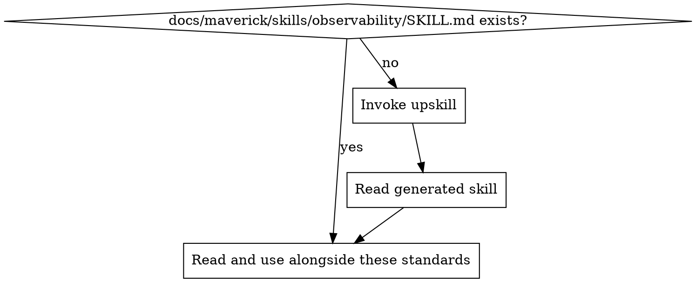

# Observability Standards

Ensure all deployed services are observable -- problems are detected, diagnosed, and correlated across system boundaries. Observability is not just monitoring; it is the ability to understand internal system state from external outputs.

## Principles

1. **Three pillars: logs, metrics, traces** -- a fully observable system produces structured logs, quantitative metrics, and distributed traces. Each pillar serves a different diagnostic purpose.
2. **Measure what matters** -- instrument the signals that reflect user experience and system health, not every internal detail
3. **Correlation across signals** -- logs, metrics, and traces must share identifiers (request IDs, trace IDs) so that a spike in a metric can be traced to specific requests and their logs
4. **Observe from the outside** -- health checks, synthetic probes, and SLI measurements tell you what users experience, not just what the system reports about itself

## Project Implementation Lookup

Before applying these standards, load the project-specific observability implementation:

1. Check for `docs/maverick/skills/observability/SKILL.md`
2. If missing, invoke the `do-upskill` skill with:
   - topic: observability
   - scan hints:
     - dependencies: opentelemetry, prometheus, datadog, newrelic, grafana, jaeger, zipkin, @opentelemetry/sdk-node, prom-client, micrometer
     - grep: `meter|tracer|span|histogram|counter|gauge|HealthCheck|readiness|liveness|SLO|SLI`
     - files: `**/metrics*.*`, `**/tracing*.*`, `**/telemetry*.*`, `**/health*.*`, `**/observability*.*`, `**/instrumentation*.*`
3. Read the project skill and apply these best practices in the context of the project's specific technology

## Relationship to Other Skills

Observability is a composite discipline. Two of the three pillars are covered by dedicated skills:

| Pillar      | Covered by                                | This skill's role                              |
| ----------- | ----------------------------------------- | ---------------------------------------------- |
| **Logs**    | mav-bp-logging               | Defer to the logging skill for log standards   |
| **Metrics** | This skill                                | Defines metric collection and instrumentation  |
| **Traces**  | This skill                                | Defines distributed tracing standards          |
| **Alerts**  | mav-bp-alerting              | Defer to the alerting skill for notification   |

This skill focuses on metrics, tracing, health checks, SLIs/SLOs, and dashboards. It assumes the logging and alerting skills are applied alongside it.

## Metrics

Metrics are numeric measurements collected over time. They answer "how much" and "how fast" questions.

### Metric Categories

| Category              | What it measures                          | Examples                                          |
| --------------------- | ----------------------------------------- | ------------------------------------------------- |
| **Application metrics** | Business logic and request processing   | Request count, error count, response time, queue depth |
| **Business metrics**    | Domain-level outcomes                   | Orders placed, sign-ups completed, payments processed |
| **Resource metrics**    | Infrastructure utilisation              | CPU usage, memory usage, disk I/O, network throughput |

### RED Method (Request-driven services)

For services that handle requests, track these three signals:

| Signal      | What it measures          | Example metric                     |
| ----------- | ------------------------- | ---------------------------------- |
| **Rate**    | Requests per second       | `http_requests_total`              |
| **Errors**  | Failed requests per second | `http_errors_total`               |
| **Duration** | Time per request          | `http_request_duration_seconds`   |

### USE Method (Resource-oriented components)

For infrastructure components (databases, queues, caches), track:

| Signal          | What it measures                    | Example metric                     |
| --------------- | ----------------------------------- | ---------------------------------- |
| **Utilisation** | Percentage of resource capacity used | `cpu_utilisation_percent`         |
| **Saturation**  | Degree of queuing or contention     | `thread_pool_queue_depth`         |
| **Errors**      | Error events from the resource      | `db_connection_errors_total`      |

### Key Guidance

- Use a standard metrics library (e.g., OpenTelemetry, Micrometer, prom-client) -- do not build custom metric collection
- Name metrics consistently: `<namespace>_<name>_<unit>` (e.g., `http_request_duration_seconds`)
- Use appropriate metric types: counters for totals, gauges for current values, histograms for distributions
- Label metrics with dimensions that aid filtering (service, endpoint, status code) but avoid high-cardinality labels (user IDs, request IDs)

## Distributed Tracing

Traces follow a single request as it crosses service boundaries. They answer "where did the time go" and "which service failed."

### Core Concepts

| Concept           | Definition                                                         |
| ----------------- | ------------------------------------------------------------------ |
| **Trace**         | End-to-end record of a request across all services it touches      |
| **Span**          | A single unit of work within a trace (e.g., an HTTP call, a DB query) |
| **Trace ID**      | Unique identifier shared by all spans in a trace                   |
| **Span context**  | Propagated metadata (trace ID, span ID, flags) passed between services |
| **Correlation ID** | Application-level identifier linking logs, metrics, and traces    |

### Standards

1. **Use OpenTelemetry** as the instrumentation standard. It is vendor-neutral and widely supported across languages and platforms.
2. **Propagate context automatically** -- use framework middleware or interceptors to inject and extract trace context on all outbound and inbound calls
3. **Instrument at boundaries** -- HTTP handlers, RPC endpoints, message consumers, database calls. Do not trace every internal function.
4. **Include span attributes** -- service name, operation name, status code, error flag. These enable filtering and root-cause analysis.
5. **Sample appropriately** -- trace 100% in development and staging; use probabilistic or adaptive sampling in production to control cost and volume

### Correlation Across Pillars

The trace ID must appear in:

- **Log entries** -- so that a log line can be linked back to the trace that produced it
- **Metric exemplars** -- so that a metric spike can be connected to a specific trace
- **Error reports** -- so that an exception can be viewed in the context of its full request path

## Health Checks

Health checks expose the current state of a service to orchestrators, load balancers, and monitoring systems.

### Health Check Types

| Type         | Question it answers                    | Failure consequence                          |
| ------------ | -------------------------------------- | -------------------------------------------- |
| **Liveness** | Is the process running and not stuck?  | Orchestrator restarts the instance           |
| **Readiness** | Can the service handle requests?      | Load balancer stops sending traffic          |
| **Startup**  | Has the service finished initialising? | Orchestrator waits before checking liveness  |

### Implementation Rules

1. **Liveness checks must be lightweight** -- return 200 if the process is alive. Do not check dependencies; a slow database should not cause a restart loop.
2. **Readiness checks verify dependencies** -- database connectivity, cache availability, required config loaded. Return 503 if not ready.
3. **Startup checks have a generous timeout** -- allow for migrations, cache warming, and connection pool initialisation before liveness checks begin.
4. **Expose health endpoints on a standard path** -- `/health`, `/healthz`, or `/ready` are common conventions. Do not require authentication.
5. **Return structured responses** -- include status per dependency for readiness checks so operators can see which dependency is the problem.

## SLIs and SLOs

Service Level Indicators (SLIs) and Service Level Objectives (SLOs) define what "healthy" means and measure against targets.

### Definitions

| Term    | Definition                                                           | Example                                          |
| ------- | -------------------------------------------------------------------- | ------------------------------------------------ |
| **SLI** | A quantitative measure of a specific aspect of service quality       | Proportion of requests completing in under 200ms |
| **SLO** | A target value or range for an SLI over a time window                | 99.5% of requests complete in under 200ms over 30 days |
| **Error budget** | The allowed amount of SLO violation before action is required | 0.5% of requests may exceed 200ms per 30-day window |

### Common SLIs

| SLI                | Measurement                                               |
| ------------------ | --------------------------------------------------------- |
| **Availability**   | Proportion of successful (non-5xx) responses              |
| **Latency**        | Proportion of requests faster than a threshold            |
| **Throughput**     | Requests processed per unit of time                       |
| **Correctness**    | Proportion of responses that return the right data        |

### Key Guidance

- Define SLOs **before** building dashboards and alerts -- SLOs determine what to measure and when to alert
- Base SLOs on **user-facing behaviour**, not internal metrics. Users care about response time and errors, not CPU usage.
- Use **error budgets** to balance reliability and velocity. When the budget is healthy, ship faster. When it is exhausted, focus on reliability.
- Review and adjust SLOs quarterly -- they are not set-and-forget

## Dashboards

Dashboards provide at-a-glance visibility into service health. They are not replacements for alerting but support investigation and awareness.

### Key Service Dashboard

Every deployed service should have a dashboard showing the **four golden signals**:

| Signal      | What it shows                          | Typical visualisation         |
| ----------- | -------------------------------------- | ----------------------------- |
| **Latency** | Response time distribution             | Histogram or heatmap          |
| **Traffic** | Request volume                         | Time-series line graph        |
| **Errors**  | Error rate or error count              | Time-series with threshold line |
| **Saturation** | Resource utilisation and queue depth | Gauge or time-series          |

### Dashboard Principles

1. **One dashboard per service** -- avoid sprawling dashboards that cover everything. Start with the golden signals.
2. **SLO burn-rate panels** -- show how quickly the error budget is being consumed. This is the most actionable panel.
3. **Time-range consistency** -- default to a window that matches your SLO period (e.g., 30 days) with drill-down capability
4. **No vanity metrics** -- every panel must answer a question an operator would actually ask. Remove panels nobody looks at.
5. **Link to traces and logs** -- dashboard panels should link to the tracing UI and log explorer for the relevant time range and service

## Detecting Observability Issues in Code Review

| Pattern                                          | Issue                           | Fix                                                        |
| ------------------------------------------------ | ------------------------------- | ---------------------------------------------------------- |
| Service with no metrics instrumentation          | Blind to performance issues     | Add RED/USE metrics using a standard library               |
| No trace context propagation on outbound calls   | Broken traces                   | Add middleware/interceptor for automatic context propagation |
| Health endpoint checks all dependencies for liveness | Cascading restarts          | Liveness: process only. Readiness: check dependencies.     |
| High-cardinality metric labels (user ID, request ID) | Metric explosion, cost growth | Use trace IDs in logs/traces, not in metric labels         |
| No correlation ID in log entries                 | Cannot link logs to traces      | Include trace ID in structured log context                 |
| SLO defined but not measured                     | False confidence in reliability | Instrument the SLI and track against the target            |
| Dashboard with no link to traces or logs         | Slow investigation              | Add drill-down links from dashboard panels                 |
| Custom metric collection instead of standard library | Maintenance burden, incompatibility | Migrate to OpenTelemetry or equivalent             |

<!-- maverick-plugin-version: 0.5.8-dev -->
