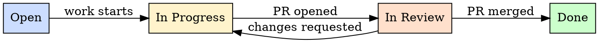

# Task Tracking Standards

Ensure all code changes are traceable to tracked tasks, all tasks live in an external system of record, and task status reflects reality at all times.

## Principles

1. **All projects must use external task tracking** --- tasks live in a shared, visible system, not in someone's head or a local file
2. **Every code change traces to a task or issue** --- commits and PRs reference the task that authorised the work
3. **Tasks have clear acceptance criteria** --- before work begins, the definition of done is written down
4. **Task status reflects reality** --- if work is in progress, the task says so; if work is blocked, the task says so
5. **Single source of truth** --- one system holds the canonical task list; duplicates across systems cause drift

## External Task Tracking Is REQUIRED

Every project must use a shared, external task tracking system. Acceptable systems include:

| System | Notes |
| ------ | ----- |
| GitHub Issues | Native to GitHub repos; preferred for open-source and GitHub-hosted projects |
| Jira | Common in enterprise environments |
| Linear | Modern issue tracker with good API support |
| Azure Boards | Native to Azure DevOps ecosystems |
| GitLab Issues | Native to GitLab-hosted projects |
| Shortcut | Formerly Clubhouse; used by some product teams |

### What Is NOT Acceptable as the Primary System

- Local text files (TODO.txt, notes.md)
- Personal note-taking apps (Notion pages used solo, Apple Notes, sticky notes)
- Spreadsheets not shared with the team
- Slack threads or email chains
- Comments in code without a corresponding tracked issue

Local notes and scratchpads are fine as personal aids, but the **authoritative task** must exist in the external system.

## Issue Hygiene

Every task or issue in the tracking system must meet minimum quality standards.

### Required Fields

- **Clear title** --- describes the deliverable, not the activity. "Add CSV export to reports page" not "Work on reports"
- **Acceptance criteria** --- concrete, verifiable conditions that define when the task is done
- **Priority** --- explicit priority level so the team can sequence work
- **Labels or tags** --- categorise by type (bug, feature, chore, tech-debt) and area (frontend, backend, infra)

### Good vs Bad Task Titles

| Bad | Good |
| --- | ---- |
| Fix the bug | Fix null pointer in payment callback handler |
| Update tests | Add unit tests for discount calculation edge cases |
| Refactor code | Extract shared validation logic into reusable module |
| Work on API | Implement GET /api/v2/invoices endpoint |
| UI stuff | Add loading skeleton to dashboard widgets |

### Acceptance Criteria Format

Acceptance criteria should be concrete and verifiable:

```
- [ ] CSV export button appears on the reports page
- [ ] Clicking export downloads a file with all visible rows
- [ ] File includes column headers matching the table
- [ ] Empty state shows a message instead of downloading an empty file
- [ ] Export respects active filters
```

## Traceability

### Commits Reference Tasks

Every commit message should reference the task it relates to:

```
feat: add CSV export to reports page (#42)
fix: handle null callback payload (#108)
chore: upgrade webpack to v5 (#91)
```

### PRs Reference Tasks

Every pull request must reference the task or issue it addresses:

- Use closing keywords where supported: `Closes #42`, `Fixes #108`
- Link the issue in the PR description if closing keywords are not available
- For partial work, reference without closing: `Part of #42`

### Tasks Link to Their PRs

When a PR is opened for a task, the task should link back to the PR. Most systems do this automatically when closing keywords are used. If not, add the PR link to the task manually.

## Workflow Integration

For GitHub-specific issue patterns --- reading, commenting, branching, and PR creation --- refer to `mav-github-issue-workflow`.

The task tracking standards in this skill are system-agnostic. The GitHub issue workflow skill provides concrete implementation patterns for GitHub-hosted projects.

## Task Lifecycle



| State | Meaning | Entry Condition |
| ----- | ------- | --------------- |
| Open | Work has not started | Task is created and prioritised |
| In Progress | Someone is actively working on it | Developer picks up the task and creates a branch |
| In Review | Code is written and awaiting review | PR is opened and linked to the task |
| Done | Work is merged and verified | PR is merged and acceptance criteria are met |

Update task status when transitions happen. A task sitting in "In Progress" for weeks with no commits is a signal that something is wrong.

## What Makes a Good Task

### Single Deliverable

A task should produce one identifiable result: a feature, a fix, a refactoring, a document. If a task requires multiple unrelated changes across unrelated areas, split it.

### Clear Acceptance Criteria

Before starting work, the definition of done is written in the task. This is not optional. Acceptance criteria prevent scope creep and make review objective.

### Appropriately Sized

- **Too small**: "Rename variable from x to y" --- this is a commit, not a task
- **Too large**: "Build the entire authentication system" --- this is an epic, not a task
- **Right size**: "Implement password reset flow with email verification" --- completable in a day or two, has clear boundaries

### Self-Contained Context

A task should contain or link to enough context that someone unfamiliar with the history can understand what needs to be done and why. Avoid tasks that only make sense if you were in the meeting where they were discussed.

## Detecting Task Tracking Issues

When reviewing workflow and project management practices, flag these patterns:

| Pattern | Issue | Fix |
| ------- | ----- | --- |
| Commits with no issue reference | Untracked work | Require issue references in commit messages |
| PR with no linked issue | Work not authorised or tracked | Create the issue retroactively; enforce going forward |
| Tasks with no acceptance criteria | Ambiguous definition of done | Add acceptance criteria before starting work |
| Tasks open for weeks with no activity | Stale or blocked work | Update status, reassign, or close |
| Multiple tasks for the same change | Duplicate tracking | Consolidate into one task, close duplicates |
| Task title is vague | Impossible to prioritise or review | Rewrite with a specific deliverable |
| Local TODO list used instead of tracker | Invisible work | Move tasks to the external system |
| Task marked done but PR not merged | Status does not reflect reality | Update status to match actual state |

<!-- maverick-plugin-version: 3.0.1-dev -->
