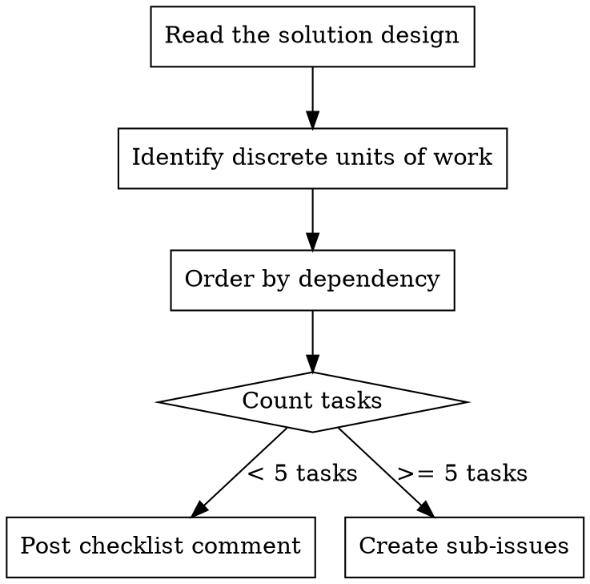

# Create Tasks

Decompose a solution design into discrete, independently implementable tasks. Each task is small enough to be implemented, verified, and committed in a single focused effort.

## Principles

1. **Each task is independently implementable** — it can be completed without waiting for other tasks (unless an explicit dependency exists)
2. **Each task is independently committable** — it leaves the codebase in a working state
3. **Each task is small and discrete** — a title and 1-2 sentence description is enough to act on
4. **Tasks are ordered by dependency** — later tasks build on earlier ones
5. **The sum of all tasks satisfies the design** — nothing is missing, nothing is extra

## Process



### 1. Identify Discrete Units of Work

From the solution design's "Areas Affected" and "Approach", identify natural task boundaries:

- A new file or module
- A modification to an existing function or component
- A new test suite or test additions
- A configuration or infrastructure change
- A database migration

Each task should touch a small, cohesive set of files. If a task feels like it needs a paragraph to describe, it is too big — split it.

### 2. Order by Dependency

Arrange tasks so each builds on the previous:

- Data models before business logic
- Business logic before API endpoints
- API endpoints before UI integration
- Implementation before tests (or tests first if using TDD)

### 3. Choose Output Format

The output format depends on the number of tasks:

#### Less than 5 tasks: Checklist Comment

Post a single comment on the issue with a checkbox list:

```markdown
## Tasks

- [ ] **<imperative title>** — <1-2 sentence description>
- [ ] **<imperative title>** — <1-2 sentence description>
- [ ] **<imperative title>** — <1-2 sentence description>
```

Each task is checked off as it is completed. Progress is tracked by updating the comment.

#### 5 or more tasks: Sub-Issues

Create GitHub sub-issues linked to the parent issue. Each sub-issue contains:

- A clear, imperative title
- A 1-2 sentence description of what to implement
- A reference to the parent issue for context

```bash
gh issue create \
  --title "<imperative title>" \
  --body "$(cat <<'EOF'
<1-2 sentence description of what to implement>

Parent: #<parent-issue>
EOF
)"
```

Post a summary comment on the parent issue listing all sub-issues with their execution order:

```markdown
## Tasks

| # | Issue | Title | Depends On |
|---|-------|-------|------------|
| 1 | #101 | <title> | — |
| 2 | #102 | <title> | — |
| 3 | #103 | <title> | #101 |

**Execution order:** #101, #102 → #103
```

Sub-issues that have no dependency between them can be worked on in any order. Use the `Depends On` column only when one task genuinely requires another to be completed first.

## Task Sizing

### Right Size

- **1-3 files** touched per task
- **Single concern** — does one logical thing
- **Self-evident** — the title and a short description are enough to implement it without further context (the solution design provides the broader context)

### Too Large

- "Update the API layer" — which endpoints? Split by endpoint or concern.
- "Add tests" — for what? Split by component under test.
- "Refactor the module" — what specifically? Split by function or concern.

### Too Small

- "Add import statement" — combine with the task that uses the import.
- "Create empty file" — combine with the task that adds content.
- "Update a single config line" — combine with related changes.

## Validation

Before the task list is considered complete:

- [ ] Every acceptance criterion from the issue is addressed by at least one task
- [ ] No task is so vague that it requires a design of its own
- [ ] Dependencies between tasks are minimal and explicitly stated
- [ ] The sum of all tasks fully implements the solution design

<!-- maverick-plugin-version: 2.0.2 -->
