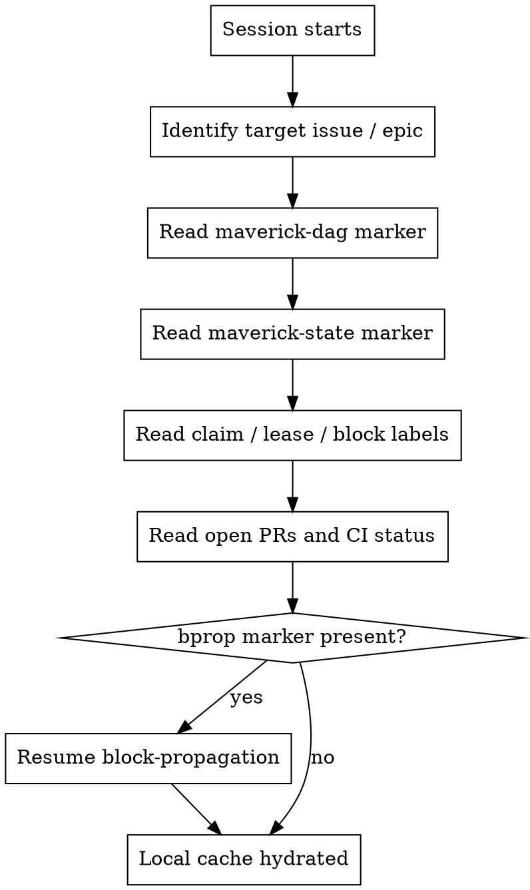
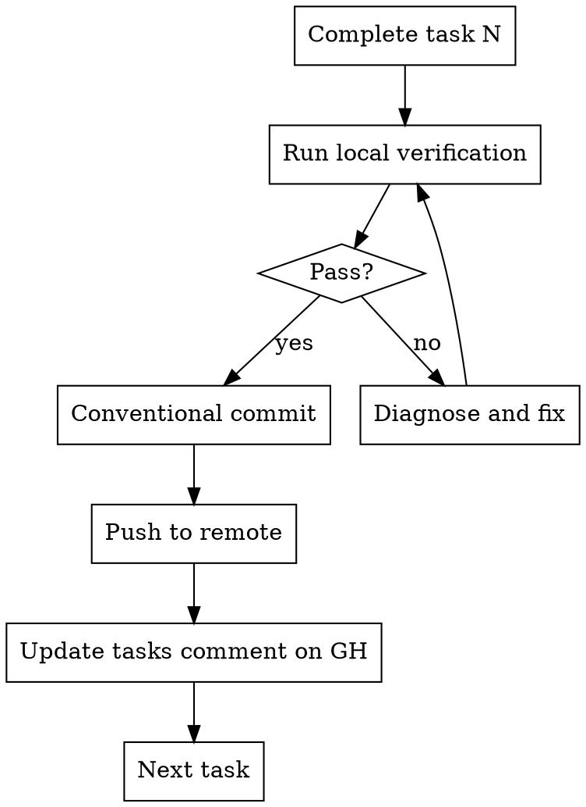

# Durability on GitHub

Maverick runs on many machines concurrently. Any one of them can die without
notice. The only way to make the workflow crash-safe is to treat **GitHub as
the source of truth** and treat local files as a derivable cache.

## Principle

Every piece of state that another Maverick instance might need to resume your
work **must be on GitHub before you move to the next step**. If the only copy
of a piece of state is in your local filesystem, losing it loses the run.

## Markers — the durable state surface

Maverick persists workflow state to GitHub as fenced JSON code blocks inside
issue comments. Each block is tagged with a kind-specific language marker
so another instance can find and parse it reliably.

| Marker | Lives on | Purpose |
| --- | --- | --- |
| `maverick-dag` | epic issue | Machine-readable DAG of stories and their deps |
| `maverick-state` | epic issue | Rolling epic-state snapshot (merged / in_flight / blocked / ejected) |
| `maverick-claim` | each claimed issue | Atomic claim record (instance-id, host, scope) |
| `maverick-lease` | each claimed issue | Heartbeat lease (expiry timestamp, refreshed periodically) |
| `maverick-bprop` | epic issue | Block-propagation in-flight marker (resume if present) |

A marker looks like this inside a comment body:

```text
```maverick-state
{
  "epic": 123,
  "stories": {"140": "merged", "142": "in_flight"},
  "updated_at": "2026-04-23T10:15:00Z"
}
```
```

The canonical read/write surface is `uv run maverick gh-state …` (backed by
`src/maverick/gh_state.py`). Skills should call the CLI; they should not
re-implement marker parsing.

## Cold-start hydration

At the top of every run, assume your local filesystem is stale or empty and
rebuild context from GitHub:



### What to read

| What | Where | Why |
| --- | --- | --- |
| DAG | `maverick-dag` on epic | Know who depends on whom |
| Epic state | `maverick-state` on epic | Know merged / in-flight / blocked |
| Claims | `claude-in-progress` label + `maverick-claim` comment | Know who is working on what |
| Leases | `maverick-lease` comment | Know if a holder is alive or crashed |
| Blocks | `blocked-by:#N` label | Know downstream story is broken |
| PRs | `gh pr list --json number,state,headRefName` | Know merge state |
| CI | `gh pr checks` | Know green status |

### What to ignore on disk

Treat the local files below as **hints** — always reconcile against GitHub
before acting on them:

- `.claude/issue-state.json` — single-issue working state (WP single-issue cache)
- `.claude/epic-state.json` — epic-state cache (mirror of `maverick-state`)
- `.maverick/worktrees/<branch>/` — worktree checkouts

If any of these disagrees with GitHub, GitHub wins. Overwrite the local copy.

## Marker write protocol

Rules for writing markers so that two instances writing at nearly the same
time cannot corrupt each other:

1. **Read-after-write.** Every marker write re-reads the comment after writing.
   If the re-read shows a conflicting payload from another instance, apply the
   loser-aborts rule from `mav-multi-instance-coordination`.
2. **Upsert, don't append.** Use `upsert_marker` — it updates the latest
   marker of the given kind in-place. Posting a new marker on every state
   change floods the issue and makes parsing ambiguous.
3. **Small payloads only.** Markers are not logs. Keep them to the minimum
   needed for another instance to reconstruct decisions.
4. **Refresh `maverick-state` on every transition.** Every time a story moves
   between merged / in-flight / blocked / ejected, update the marker. Never
   batch state transitions.
5. **Timestamp everything.** Every marker payload carries an `updated_at`
   ISO-8601 UTC timestamp so stale markers can be detected.

## Push-per-task

Commit and push **after every task**, not at the end of the story. Rationale:

- A crash after task N leaves tasks 1..N durable on the remote.
- A takeover instance can fetch the branch from origin and resume at task N+1.
- CI feedback arrives incrementally rather than at the end of the story.

The cost is *N* CI runs instead of 1. Accept it unless the repo's CI is
specifically configured to skip draft pushes. If CI cost becomes a problem,
either mark the PR draft until the final task or use path-scoped triggers.

### Pattern



## Worktree recreate-from-remote

If you lose a local worktree (disk failure, manual cleanup, takeover from
another machine) and the branch is on the remote, recreate without losing
work:

```bash
git fetch origin $BRANCH
git worktree add .maverick/worktrees/$BRANCH_DIR $BRANCH
```

This is safe because push-per-task means `origin/$BRANCH` already carries
every completed task up to the crash point. Resume from the next
unchecked task in the tasks comment.

## What NOT to persist durably

Keep these strictly local:

- Transient verification output (lint reports, test logs)
- Subagent scratch files
- Cached clones of other repos

If a piece of state is regenerable within one task, don't mirror it to GitHub.
The markers are a narrow coordination surface, not a storage layer.

<!-- maverick-plugin-version: 2.0.2-dev -->
