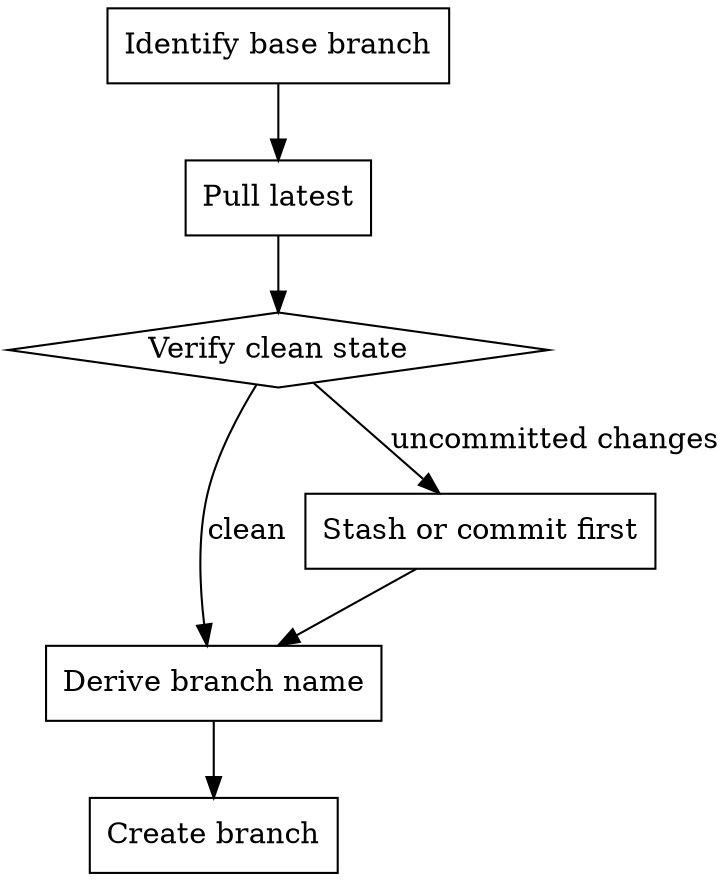
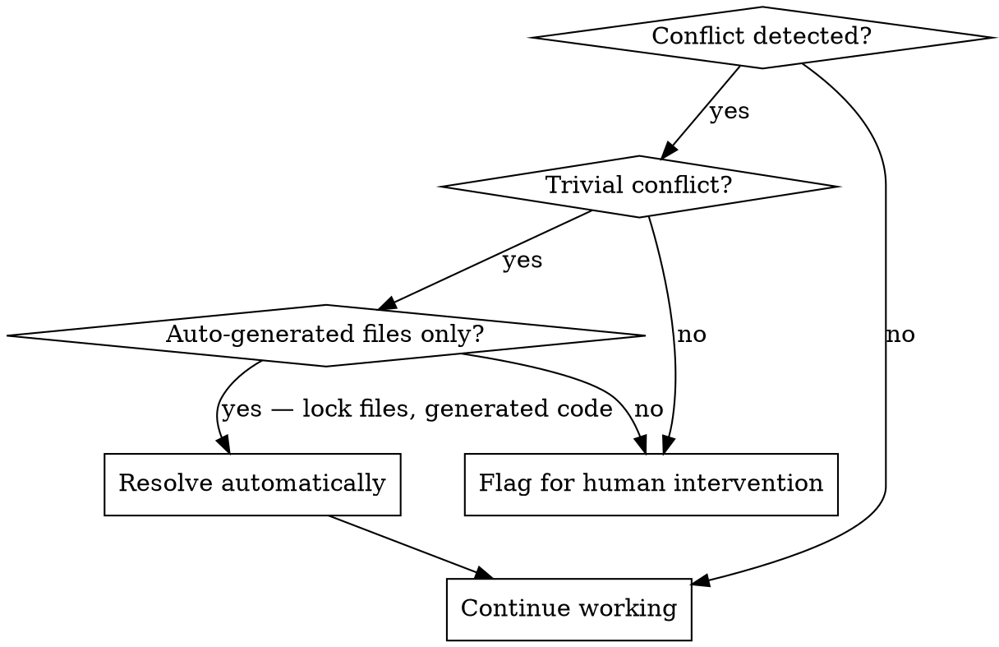

# Git Workflow

A trunk-based strategy for all development work. This skill defines how branches, commits, and merges are managed.

## Remote Repository Requirement

A configured remote repository is **mandatory**. Local-only git is a hard fail — all projects must push to a remote hosting service (GitHub, GitLab, Bitbucket, Azure Repos, etc.).

### Validation

Before starting any work, verify a remote exists:

```bash
git remote -v
```

If no remote is configured:
1. **Stop work** — do not proceed with feature branches, commits, or PRs
2. **Notify the user** — report that no remote repository is configured and that this is a hard requirement
3. **Do not create a remote autonomously** — the user must set up the remote repository and configure the origin

A project with no remote cannot use protected branches, pull requests, or CI/CD — all of which are foundational to this workflow.

## Worktrees — required for multi-story workflows

Maverick's multi-story workflows (`do-epic`) run each story in
its own git worktree under `.maverick/worktrees/`. This keeps in-flight
stories isolated from each other and from the main checkout.

### Worktree precondition

Before entering `do-epic` (or any flow that relies on
worktrees), verify the capability:

```bash
uv run maverick worktree list
```

If this fails, the workflow aborts with a hard error. Worktrees require:

- A non-shallow clone (`git rev-parse --is-shallow-repository` returns
  `false`). Shallow clones cannot create new worktrees.
- A git version that supports `git worktree add` (2.15+).
- Filesystem write access under `.maverick/worktrees/`.

### Worktree lifecycle

One worktree per story, created off the resolved base branch:

```bash
uv run maverick worktree create <branch> [--base <base-branch>]
```

On every exit path — merge, eject, abort — destroy the worktree:

```bash
uv run maverick worktree destroy <path>
```

Leaving stale worktrees inflates disk usage and confuses future
`worktree list` reads. The only reason to keep a worktree after exit is
if a PR was ejected and the human may want to inspect the in-flight
state — note the path in the eject comment.

### Stacked branches

If a story depends on a sibling story whose PR is still open, stack per
`mav-stacked-prs`. The worktree is created off the sibling
branch instead of the default branch. The retarget guard in
`mav-stacked-prs` handles the sibling merging.

## Branch Strategy

```
stable (what end users clone; CI-managed; fast-forwarded to the latest release tag)
main (trunk — carries -dev between releases; tagged at each release)
  ├── feat/42-add-export
  ├── fix/57-login-crash
  ├── chore/63-update-deps
  └── release/<version> (short-lived; exists only long enough to cut a release)
```

### Branch Roles

| Branch | Purpose | Who commits | Protected |
|---|---|---|---|
| `stable` | What end users install — always points at the most recent release tag | Fast-forwarded by `release-finalize.yml` only; never by humans | Yes (CI-only) |
| `main` | Trunk — carries the current `-dev` version between releases; tagged at each release | Merge from feature/fix/release branches via PR only | Yes |
| Feature/fix/chore branches | Active development | Claude Code and developers | No |
| `release/<version>` | Short-lived release prep — bumps version, updates CHANGELOG | Created by `scripts/release.sh` | No |

### Rules

- **Never commit directly to `main` or `stable`**. All changes reach `main` via pull request; `stable` is moved exclusively by CI.
- **All work happens on short-lived branches** created from `main` and PR'd back to `main`.
- **One branch per issue/task**. Do not combine unrelated work on a single branch.
- **Release branches are ephemeral**. Created by the release script, deleted after the release PR merges.
- **Always pass `--base main`** explicitly when creating PRs via `gh pr create` — the repository's default branch is `stable`, so omitting `--base` would target the wrong branch.

## Branch Naming

Format: `<type>/<issue-number>-<short-description>`

### Deriving the Type

Infer from issue labels, title, or the nature of the work:

| Label or keyword | Branch prefix |
|---|---|
| `bug`, `fix`, `defect` | `fix/` |
| `feature`, `enhancement` | `feat/` |
| `docs`, `documentation` | `docs/` |
| `refactor`, `tech-debt` | `refactor/` |
| `chore`, `maintenance`, `deps` | `chore/` |
| `test`, `testing` | `test/` |
| Default (when unclear) | `feat/` |

### Deriving the Description

- Use 2-4 lowercase words separated by hyphens
- Describe the outcome, not the method
- Keep it short — branch names appear in logs and PRs

**Good:** `feat/42-add-rubric-export`, `fix/57-prevent-login-crash`
**Bad:** `feature/issue-42-implement-the-new-rubric-export-feature-for-teachers`

## Creating a Branch



### Identify the Base Branch

The base branch is the repository's default branch — typically `main`. To confirm:

```bash
gh repo view --json defaultBranchRef -q '.defaultBranchRef.name'
```

- If the default branch is `main` — branch from `main`
- If the project still uses a legacy integration branch (e.g., `develop`) — branch from that and ask the user whether to adopt trunk-based
- If uncertain — ask the user

### Create the Branch

```bash
git checkout $BASE_BRANCH && git pull origin $BASE_BRANCH && git checkout -b $BRANCH_NAME
```

## Conventional Commits

All commits must follow the [Conventional Commits](https://www.conventionalcommits.org/) specification.

### Format

```
<type>(<optional scope>): <description> (#<issue-number>)
```

### Types

| Type | When to use |
|---|---|
| `feat` | New feature or functionality |
| `fix` | Bug fix |
| `docs` | Documentation only |
| `refactor` | Code change that neither fixes a bug nor adds a feature |
| `test` | Adding or updating tests |
| `chore` | Build process, dependencies, tooling |
| `style` | Formatting, whitespace (no logic change) |
| `perf` | Performance improvement |
| `ci` | CI/CD configuration changes |

### Rules

- **Always reference the issue number** in the commit message: `(#42)`
- **Use imperative mood**: "add export" not "added export" or "adds export"
- **Keep the first line under 72 characters**
- **One logical change per commit** — do not batch unrelated changes

### Examples

```
feat: add rubric export endpoint (#42)
fix: prevent crash when rubric is empty (#57)
test: add integration tests for grading service (#42)
refactor: extract token cost calculation into utility (#63)
chore: update vitest to v3.1 (#71)
```

### Push cadence — after every task

Commit and push **after every task**, not only at end of story. This
makes work durable across machine death: a takeover instance can fetch
the branch from origin and resume at the next unchecked task. See
`mav-durability-on-gh` for the rationale and the worked
pattern.

### Multi-line Commits

For commits that need more context:

```
feat: add rubric export endpoint (#42)

Adds a new GET /api/assessments/:id/export endpoint that returns
the assessment rubric as a downloadable CSV file. Includes proper
content-type headers and filename disposition.
```

## Merge Conflicts



### When to Resolve Automatically

Only resolve conflicts in **auto-generated files** where the resolution is unambiguous:
- Lock files (`package-lock.json`, `pnpm-lock.yaml`, `yarn.lock`) — regenerate with `pnpm install` / `npm install`
- Generated type files — regenerate with the appropriate codegen command

### When to Flag for Human Intervention

Flag all other conflicts for human review. Report clearly:
- Which files have conflicts
- What the conflicting changes are (both sides)
- Why the conflict likely occurred (e.g., "both branches modified the grading calculation")

```bash
# Show conflicting files
git diff --name-only --diff-filter=U

# Show the conflict markers in a specific file
git diff -- path/to/file.ts
```

**Never:**
- Silently resolve conflicts in application code
- Choose "ours" or "theirs" without understanding the intent of both sides
- Delete one side of a conflict to make it go away

## Branch Cleanup

After a pull request is merged, clean up the feature branch.

### Local Cleanup

```bash
# Switch back to the base branch
git checkout $BASE_BRANCH && git pull origin $BASE_BRANCH

# Delete the local feature branch
git branch -d $BRANCH_NAME
```

Use `-d` (not `-D`) — this will refuse to delete if the branch has unmerged changes, which is a safety check.

### Remote Cleanup

GitHub can be configured to auto-delete branches after PR merge. If not:

```bash
git push origin --delete $BRANCH_NAME
```

### Bulk Cleanup of Merged Branches

For cleaning up stale local branches that have been merged:

```bash
# List merged branches (excluding main)
git branch --merged $BASE_BRANCH | grep -vE '^\*|main'

# Delete them
git branch --merged $BASE_BRANCH | grep -vE '^\*|main' | xargs git branch -d
```

## Pulling Updates

When your feature branch falls behind the base branch:

```bash
# Preferred: rebase onto latest base (clean history)
git fetch origin && git rebase origin/$BASE_BRANCH

# Alternative: merge base into feature (preserves history)
git fetch origin && git merge origin/$BASE_BRANCH
```

Use rebase for branches with only your own commits. Use merge if the branch has been shared or has a complex history. If uncertain, ask the user.

## Pre-Flight Checks

Before any branch operation, verify the working tree is clean:

```bash
git status --porcelain
```

If there are uncommitted changes:
- **Commit them** if they are part of the current work
- **Stash them** if they are unrelated: `git stash push -m "WIP: description"`
- **Ask the user** if you are unsure what to do with them

<!-- maverick-plugin-version: 3.0.2-dev -->
