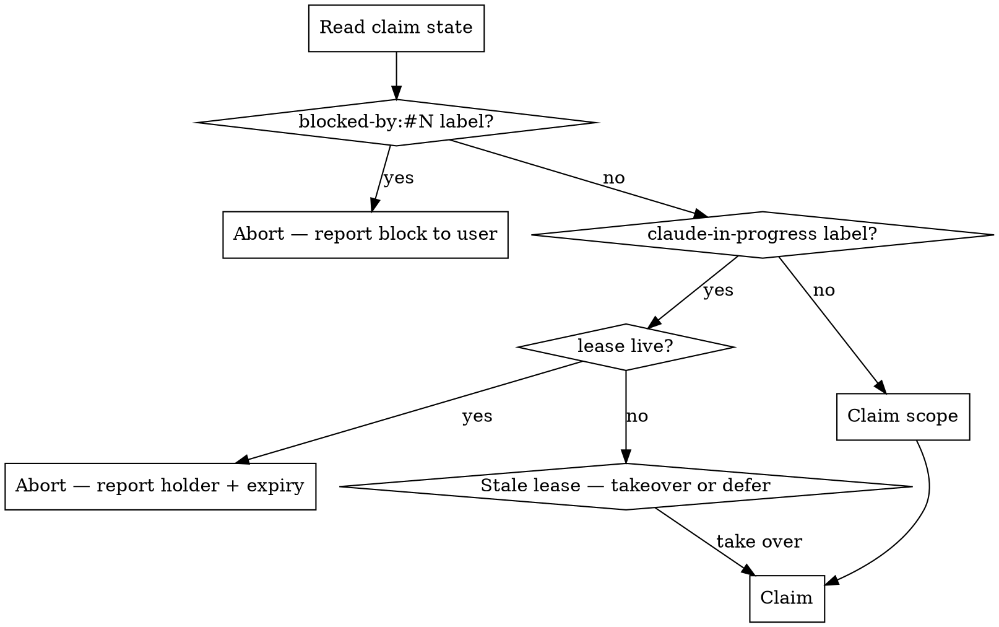

**Depends on:** mav-durability-on-gh, mav-block-propagation

# Multi-Instance Coordination

Several Claude Code instances, on different machines, may be asked to act on
the same issue or epic at the same time. This skill defines how they
coordinate so that:

- Two instances never silently step on the same story.
- A machine dying without notice is detected within ~10 minutes.
- No committed work is lost on takeover.

All coordination state is **on GitHub**. The local filesystem is a cache.

## Entry check — before any work

Every workflow entry point must run the entry check before touching an
issue. The CLI helper `uv run maverick coord read <repo> <issue>` returns
a JSON snapshot; parse it and decide:



### The four exit points

| Exit | When | Action |
| --- | --- | --- |
| Blocked | `blocked-by:#N` label present | Report to user; do not claim, do not modify issue |
| Claimed with live lease | Another instance is active | Report holder id and expiry; do not modify issue |
| Claimed with stale lease | Holder likely crashed | Decide: take over now, or defer |
| Free | No claim or stale/absent lease | Claim and proceed |

## Claim scope

Decide the breadth of the claim before calling `coord claim`:

- **Whole epic** — one instance owns the epic and every child story. Use
  when you intend to run `do-epic` end-to-end.
- **Group of stories** — typically one wave from the epic DAG. Use when a
  separate instance is already working on a different wave.
- **Single story** — use when coming in from `do-issue-solo` for ad-hoc
  single-issue work.

The chosen scope is recorded in the `maverick-claim` payload so other
instances reading the marker can see exactly what you own.

## Atomic claim

The `claim` primitive does four things, in order:

1. Adds the `claude-in-progress` label (idempotent — repeating is safe).
2. Posts a `maverick-claim` marker with this instance's id, host, scope,
   and `claimed_at` timestamp.
3. Writes an initial `maverick-lease` marker with `expires_at` set to
   10 minutes from now.
4. **Re-reads** the claim markers to detect simultaneous claims.

GitHub's API is not strongly ordered, so step 1 alone is insufficient —
two instances can both see "no label" and then both write the label. Step
4 is the race-detection check: if the re-read shows more than one
`maverick-claim` marker with an active instance, the instance with the
**lower id (lexicographic)** wins, and every other instance runs
`release` and aborts.

## Heartbeat

Once claimed, refresh the lease every ~2 minutes:

```bash
uv run maverick coord heartbeat <repo> <issue>
```

The refresh pushes `expires_at` forward by 10 minutes. If two consecutive
heartbeats fail (network flake, transient GitHub error), do **not** keep
working on the assumption you still own the claim — abort and release.

Heartbeat may also raise `ClaimLost` if:

- The `claude-in-progress` label has been removed (another instance took
  over, or a human resolved the claim manually).
- The `maverick-claim` marker now names a different instance.

On `ClaimLost`: stop work immediately, do not push, do not comment
further. Clean up local worktree state and report to the user.

## Release

On completion, eject, or any clean exit:

```bash
uv run maverick coord release <repo> <issue> --reason merged
uv run maverick coord release <repo> <issue> --reason ejected
uv run maverick coord release <repo> <issue> --reason abort
```

This removes the label, writes a lease-released marker, and unassigns the
bot. Always release on every exit path. If an instance dies before
release, the lease expires in ~10 minutes and another instance can take
over.

## Takeover

If you find a claim with a stale lease (holder's last heartbeat > TTL ago),
decide before acting:

- **Take over now** when the work is high priority and the holder's
  crash is obvious (lease expired hours ago, host unresponsive to ping).
- **Defer** when the work can wait — avoids stepping on a holder that's
  merely suspended (laptop asleep, debugging under breakpoint).

To take over:

```bash
uv run maverick coord takeover <repo> <issue>
```

This posts a takeover comment naming the prior instance and then runs
claim with takeover permission. The prior instance's heartbeat will fail
on its next attempt with `ClaimLost`.

## Release-before-exit

Every entry-point skill (do-issue-solo, do-issue-guided, do-epic) must
register a release handler that fires on **every** exit path — success,
eject, abort, crash-caught, user-interrupt. The easiest pattern is a
trap-on-exit wrapper that calls `coord release` for every claim this
instance still holds.

## Rules

- **Never skip the entry check.** Even if you "know" the issue is free,
  the GitHub state may have changed since you last looked.
- **Never extend a lease past TTL silently.** If two heartbeats fail,
  treat the claim as lost — do not assume you still hold it.
- **Never release another instance's claim.** If you're not the holder,
  you cannot remove the label or write a release marker for them.
  (Takeover is the exception, and it posts its own takeover marker.)
- **Lower instance-id wins ties.** Document this in every race-detection
  branch so two instances produce the same decision independently.
- **Always scope claims to the smallest sensible unit.** Claiming an
  entire epic when you only intend to work on one wave blocks other
  instances unnecessarily.

<!-- maverick-plugin-version: 0.5.8-dev -->
