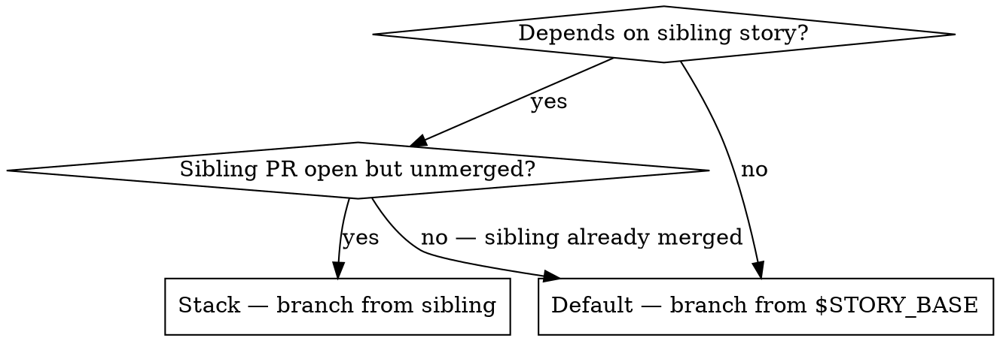
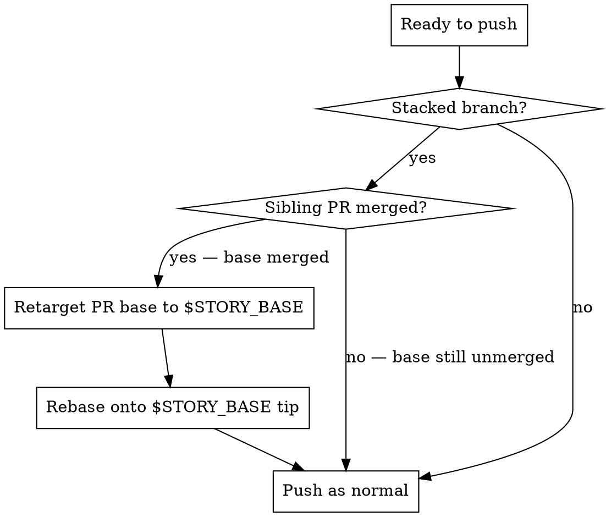

**Depends on:** mav-git-workflow

# Stacked PRs

When story B depends on story A and A's PR isn't merged yet, B branches from
A's branch and opens a PR whose base is `feat/A-…` rather than the story
base branch. This is a **stacked PR**. It lets B progress without waiting
for A to merge, and is essential for throughput inside an epic.

Stacking is safe when it is paired with a **retarget guard** that moves B's
PR base back to the story base as soon as A lands. Without the retarget
guard, a specific merge-order sequence can orphan B's commits — see the
failure mode at the bottom of this document.

Resolve the story base once at the start of any stacking operation:

```bash
STORY_BASE=$(uv run maverick git-workflow story-base)
```

## When to stack, when not to



| Situation | Stack? | Why |
| --- | --- | --- |
| No cross-story deps | No | Default branch is fine |
| Sibling already merged | No | Branch from default — clean base |
| Sibling PR open, you need its code to compile/test | Yes | Stack on the sibling branch |
| Sibling PR open, you only need it logically but don't import | Yes | Stack anyway — guards against logical surprises |
| Sibling PR ejected (labelled `needs-human`) | No — **block instead** | You should have been excluded from the wave |

## Creating a stacked branch

Fetch the sibling branch before branching off it — another instance may have
pushed further commits:

```bash
git fetch origin feat/140-bootstrap-provider
git worktree add .maverick/worktrees/feat__142-admin-guard \
    -b feat/142-admin-guard-bootstrap \
    origin/feat/140-bootstrap-provider
```

The worktree's HEAD is now pinned to A's tip. Work proceeds normally from
there. Push-per-task applies — each commit flows to
`origin/feat/142-admin-guard-bootstrap` as usual.

## Opening the stacked PR

Always pass `--base` explicitly to target the sibling branch:

```bash
gh pr create \
    --base feat/140-bootstrap-provider \
    --head feat/142-admin-guard-bootstrap \
    --title "feat: admin guard (#142)" \
    --body "..."
```

GitHub's PR diff now shows only B's changes — the diff is against A's tip,
not against `main`. This is exactly what the reviewer should see.

## Retarget guard — before every push

**Every push on a stacked branch must check whether the base has merged.**
This is the single rule that prevents orphan-merge incidents.



### The merge-base check

Use the `gh pr view --json state` check for the sibling PR — it handles
both merge-commit and squash-merge cases:

```bash
STORY_BASE=$(uv run maverick git-workflow story-base)
state=$(gh pr view feat/140-bootstrap-provider --json state -q .state)
if [ "$state" = "MERGED" ]; then
    gh pr edit <PR> --base "$STORY_BASE"
    git rebase --onto "origin/$STORY_BASE" origin/feat/140-bootstrap-provider
fi
```

The PR-state check is the authoritative signal. `git merge-base
--is-ancestor` does not work after a squash-merge because the squash
commit carries the content but not the original commit SHAs.

## Rebase after retarget

After retargeting, rebase the branch onto the new base so the PR diff stays
tidy:

```bash
git rebase --onto "origin/$STORY_BASE" origin/feat/140-bootstrap-provider
```

This strips out commits that are already in `$STORY_BASE` (from the
sibling's merge) and replays your commits on top of the current
`$STORY_BASE`.

**If rebase produces conflicts:**
- If the conflict is trivial or auto-generated-file-only, resolve per
  `mav-git-workflow`.
- Otherwise stop and flag for human intervention — do not resolve content
  conflicts blindly during a retarget.

## The failure mode this prevents

Orphan-merge incident (seen in practice; see retro §1.1):

1. B is stacked on A. Both PRs are open and green.
2. The human merges A → story base (squash). A's branch still exists on the
   remote but its commits are no longer the base of anything.
3. 25 seconds later the human merges B → A (not B → story base). GitHub says
   "B merged". The commits of B are fast-forwarded into A's now-orphaned
   branch — **not into the story base**.
4. The story base has A's content but not B's. Discovered much later when
   B's code is "missing in production."

The retarget guard prevents step 3 from being possible: B's base is moved
to the story base the moment A merges, and B's next push either rebases
cleanly or flags a conflict. Either way, B cannot silently merge into an
orphan.

## Rules

- **Check the base state on every push** to a stacked branch. Not at PR
  creation — at every push.
- **Never merge a stacked PR yourself** without running the retarget check
  first, even if CI is green.
- **If in doubt, retarget early.** Retargeting before the sibling merges
  is always safe (the PR base just changes; diff stays the same). Too-late
  retargeting is the one that hurts.
- **Cross-reference `mav-git-workflow`** for conventional commit
  format, branch naming, and conflict resolution.

<!-- maverick-plugin-version: 3.3.8 -->
