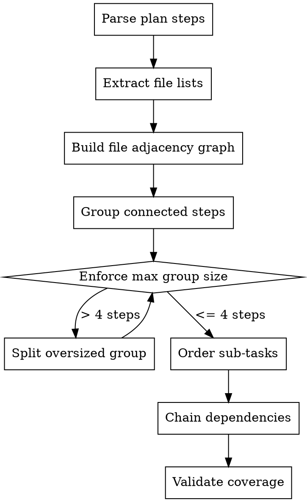

# Task Breakdown

Decomposes a large implementation plan into independently trackable sub-tasks with dependency ordering and file ownership tracking.

## When to Invoke

This skill is called by workflow skills (do-task-solo, do-issue-solo, do-issue-guided) when a plan has more than 8 steps. It is **not** invoked directly by users.

The calling workflow passes control to this skill after the implementation plan is produced and before execution begins.

## Input

| Parameter | Description |
|-----------|-------------|
| `plan_path` | Path to `plan.md` (local mode) or plan comment ID (issue mode) |
| `design_path` | Path to `design.md` or design comment ID (issue mode) |
| `task_id` | Task ID (e.g., `TASK-001` or issue number) |
| `mode` | `local` (do-task-solo) or `issue` (do-issue-solo, do-issue-guided) |

## Grouping Algorithm



### 1. Parse Plan Steps

Read the plan and extract each step. Each step has:
- Step number and title
- `Files:` list
- `Change:` description
- `Verify:` command

### 2. Extract File Lists

For each step, parse the `Files:` line to get the list of files it touches.

### 3. Build File Adjacency Graph

Steps that share one or more files are connected. Two steps are adjacent if their file lists overlap.

### 4. Group Connected Steps into Sub-Tasks

Walk the adjacency graph and group connected steps together:
- Steps sharing files belong to the same sub-task
- Maximum 3-4 steps per sub-task
- Preserve the original step ordering within each sub-task

### 5. Order Sub-Tasks

Order sub-tasks by:
1. **Severity** — critical fixes first (look for keywords: critical, security, type safety)
2. **Dependency** — sub-tasks whose files are depended on by other sub-tasks come first
3. **Original step order** — break ties by the earliest step number in the sub-task

### 6. Chain Dependencies

When two sub-tasks share files, the one that appears earlier in the execution order becomes a dependency of the later one. Set `depends_on` accordingly.

## Local Mode Output (do-task-solo)

Creates the following structure under `.maverick/do-task/<TASK-ID>/`:

```
breakdown.json          # Sub-task manifest (committed)
sub-tasks/
  ST-001/
    plan.md             # Scoped plan (subset of parent steps)
    state.json          # Sub-task state (gitignored)
  ST-002/
    plan.md
    state.json
  ...
```

### breakdown.json Structure

```json
{
  "task_id": "TASK-001",
  "total_sub_tasks": 6,
  "sub_tasks": [
    {
      "id": "ST-001",
      "title": "Fix critical type safety in openai.ts",
      "status": "pending",
      "files": ["shared/src/node/openai.ts"],
      "depends_on": [],
      "completed_commit": null
    },
    {
      "id": "ST-002",
      "title": "Add error handling to API controllers",
      "status": "pending",
      "files": ["api/src/controllers/auth.ts", "api/src/controllers/user.ts"],
      "depends_on": [],
      "completed_commit": null
    }
  ],
  "execution_order": ["ST-001", "ST-002"],
  "file_ownership": {
    "shared/src/node/openai.ts": ["ST-001"],
    "api/src/controllers/auth.ts": ["ST-002"],
    "api/src/controllers/user.ts": ["ST-002"]
  }
}
```

### Sub-Task plan.md

Each sub-task gets its own `plan.md` containing only the steps assigned to that sub-task, in checkbox format:

```markdown
## Sub-Task ST-001: Fix critical type safety in openai.ts

Parent: TASK-001

- [ ] **Step 1: <original step title>**
  - Files: `shared/src/node/openai.ts`
  - Change: <what this step does>
  - Verify: `<command>`

- [ ] **Step 2: <original step title>**
  - Files: `shared/src/node/openai.ts`
  - Change: <what this step does>
  - Verify: `<command>`
```

### Gitignore

Ensure sub-task state files are gitignored:

```bash
grep -q '.maverick/do-task/*/sub-tasks/*/state.json' .gitignore 2>/dev/null || echo '.maverick/do-task/*/sub-tasks/*/state.json' >> .gitignore
```

## Issue Mode Output (do-issue-solo, do-issue-guided)

In issue mode, the breakdown creates GitHub sub-issues linked to the parent issue:

1. For each sub-task, create a GitHub sub-issue:
   ```bash
   gh issue create \
     --title "ST-NNN: <sub-task title>" \
     --body "Sub-task of #<parent-issue>. See parent issue for full context." \
     --label "sub-task"
   ```

2. Post a breakdown comment on the parent issue with the sub-task manifest:
   ```markdown
   ## Task Breakdown

   This issue has been decomposed into the following sub-tasks:

   | Sub-Task | Title | Dependencies | Status |
   |----------|-------|-------------|--------|
   | #101 | Fix critical type safety | — | pending |
   | #102 | Add error handling | — | pending |
   | #103 | Update API responses | #101 | pending |

   **Execution order:** #101 → #102 → #103
   ```

3. Each sub-issue gets its own plan comment with the scoped steps.

## Validation

After completing the breakdown, verify:

1. **Complete coverage** — every original plan step is assigned to exactly one sub-task. No orphaned steps.
2. **File ownership is complete** — every file mentioned in the plan appears in `file_ownership`.
3. **No circular dependencies** — the `depends_on` graph is a DAG.
4. **Execution order is valid** — respects all `depends_on` constraints.
5. **Sub-task sizes are reasonable** — no sub-task has more than 4 steps.

If validation fails, adjust the grouping and re-validate.

## Rules

- **Do not modify the original plan** — the breakdown is additive. The parent `plan.md` remains unchanged.
- **Preserve step ordering** — steps within a sub-task maintain their original order from the parent plan.
- **Single file ownership** — each file should ideally be owned by one sub-task. When unavoidable, chain the sub-tasks via `depends_on`.
- **Commit the manifest** — `breakdown.json` and sub-task `plan.md` files are committed to version control. Only `state.json` files are gitignored.
