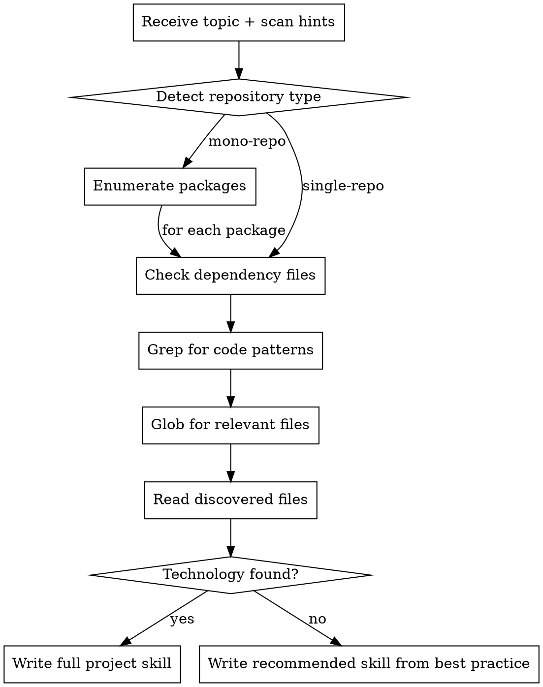
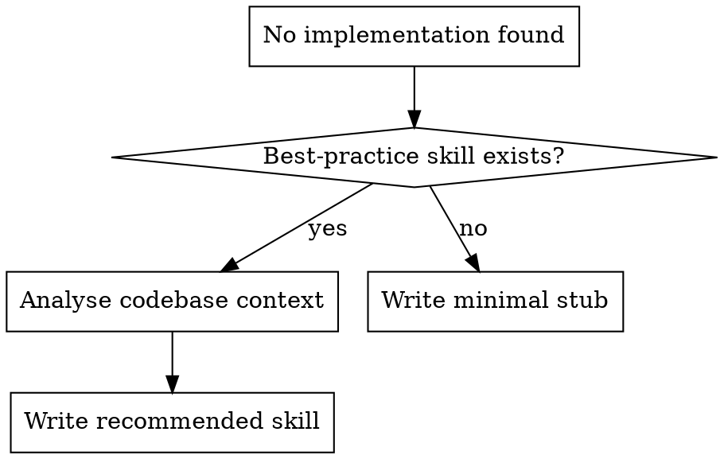

# Generate Project Skills

Scan the current project's codebase for a given topic and produce a project-specific skill file at `docs/maverick/skills/<topic>/SKILL.md`.

**Primary audience: LLMs.** The generated skill is project implementation and usage guidance — what technology is used, how it's configured, and where the code lives. It is NOT best practices (the maverick best-practice skill handles that). Keep it dense, factual, and under 500 lines.

## Invocation

When invoked (via `/upskill` or the Skill tool), **process all topics listed in `skills/upskill/topics.json` without prompting the user**. Do not present a list of choices or ask which topics to generate — iterate through every entry in the JSON array and generate a project skill for each one.

For each topic entry in `topics.json`:

1. Read the `topic`, `prompt`, and `bestPracticeSkill` fields
2. If the best-practice skill file exists, read it for reference
3. Detect repository type (once, cached across all topics — see step 0 below)
4. **Single-repo**: scan the entire repo, write to `docs/maverick/skills/<topic>/SKILL.md`
5. **Mono-repo**: for each package, scope scanning to that package directory and write to `<package>/docs/maverick/skills/<topic>/SKILL.md`. Also scan the repo root for cross-cutting implementations and write those to `docs/maverick/skills/<topic>/SKILL.md`. Cross-cutting topics (see below) always write to root only.

Use subagents or parallel agents to process multiple topics concurrently when possible.

## Input

Each topic entry in `topics.json` provides:

- **topic**: The skill topic name (e.g. "logging", "alerting", "unit-testing")
- **prompt**: Domain-specific guidance for scanning
- **bestPracticeSkill**: Path to the best-practice skill file (used as reference when generating recommended skills)

Additionally, the default scan hints below are used to find code patterns.

## Process



### 0. Detect Repository Type

Determine whether the project is a mono-repo or single-repo. A project is a **mono-repo** if any of the following are present:

- `package.json` with a `workspaces` field
- `pnpm-workspace.yaml`
- `lerna.json`
- `Cargo.toml` with a `[workspace]` section
- `go.work` file
- Multiple `pyproject.toml` files in subdirectories
- `nx.json`
- `rush.json`

If none of these indicators are found, treat the project as a **single-repo**.

Cache this result for the entire invocation — do not re-detect for each topic.

**Package enumeration:** Once a mono-repo is detected, enumerate all packages by reading the workspace configuration:

- **npm/yarn**: read `workspaces` array from root `package.json` (resolve globs)
- **pnpm**: read `packages` list from `pnpm-workspace.yaml`
- **lerna**: read `packages` from `lerna.json`
- **Cargo**: read `members` from `[workspace]` in root `Cargo.toml`
- **Go**: read `use` directives from `go.work`
- **Python**: list subdirectories containing `pyproject.toml`
- **Nx**: read `projects` from `nx.json` or list directories with `project.json`
- **Rush**: read `projects[].projectFolder` from `rush.json`

### 1. Check Dependency Files

Search for topic-related packages in:

- `package.json` (dependencies, devDependencies)
- `pyproject.toml` (dependencies, optional-dependencies)
- `requirements.txt`
- `build.gradle.kts`
- `go.mod`
- `Cargo.toml`

**Mono-repo:** Check dependency files **within each package directory** (e.g. `<package>/package.json`, `<package>/pyproject.toml`), not just at the root. Root-level dependency files are still checked for cross-cutting concerns shared across packages.

### 2. Grep for Code Patterns

Use the scan hints grep patterns to find relevant code. If no scan hints provided, use the defaults for the topic.

### 3. Glob for Relevant Files

Use the scan hints file patterns to find relevant files by name.

### 4. Read Discovered Files

Read the files found in steps 2-3 to understand:

- What technology/library is used
- How it's configured (env vars, config files)
- What patterns the codebase follows
- Where the key files live

### 5. Write the Project Skill

**Single-repo:** Write `SKILL.md` to `docs/maverick/skills/<topic>/SKILL.md` using the Write tool (which creates parent directories automatically). Do NOT use `mkdir` via Bash.

**Mono-repo:** Output path depends on whether the topic is cross-cutting or package-scoped:

- **Cross-cutting topics** → `docs/maverick/skills/<topic>/SKILL.md` at the repo root (scan the entire repo)
- **Package-scoped topics** → `<package>/docs/maverick/skills/<topic>/SKILL.md` for each package (scan scoped to that package directory). If root-level implementations also exist, write a root skill at `docs/maverick/skills/<topic>/SKILL.md` as well.

### Cross-Cutting vs Package-Scoped Topics

- **Cross-cutting** (always root, even in mono-repos): `cicd` — CI/CD is configured once at the repo root and applies to all packages.
- **Package-scoped** (per-package in mono-repos): `logging`, `alerting`, `unit-testing`, `integration-testing`, `linting`, `database` — these vary by package and tech stack.

## Mandatory Output Structure

Every generated project skill MUST use this exact structure:

```
---
title: <Topic> — Project Implementation
topic: <topic-name>
package: <package-name>          # only for package-level skills in mono-repos
last-verified: <YYYY-MM-DD>
---

## Stack

<What technology/library/service is used. Be specific: name, version if detectable.>

## Configuration

<How it's configured: env vars, config files, initialisation patterns. Describe in prose, no code.>

## Patterns

<Established conventions in this codebase. How the team uses this technology.>

## File Locations

<Specific file paths where the relevant code lives.>
```

The `package` field is only included for package-level skills generated in mono-repos. Omit it for root-level and single-repo skills.

## Rules

- **Prose only** — no code examples, config snippets, or CLI commands
- **Facts only** (detected implementations) — describe what exists in the codebase; for recommended skills, describe what should be adopted based on best-practice guidance
- **Under 100 lines** — this is a fact sheet, not documentation
- **All four sections required** — Stack, Configuration, Patterns, File Locations
- **Frontmatter required** — title, topic, last-verified fields mandatory; package field mandatory for package-level skills
- **Write directly** — no user approval needed, file is version-controlled

## When Nothing Is Found

If scanning finds no existing implementation for the topic, generate a **recommended implementation skill** based on the best-practice skill for that topic and the project's codebase.



### With a Best-Practice Skill Available

1. **Read the best-practice skill** for the topic (e.g. `skills/mav-bp-logging/SKILL.md`)
2. **Analyse the codebase context** — identify the language, framework, deployment target (e.g. Node.js + Fastify on AWS Lambda), existing dependencies, and project structure
3. **Generate a recommended implementation** — apply the best-practice guidance to the specific codebase, choosing concrete technologies and patterns that fit the project's stack

Use the same mandatory output structure but with **recommended** content:

```
---
title: <Topic> — Project Implementation
topic: <topic-name>
package: <package-name>          # only for package-level skills in mono-repos
last-verified: <YYYY-MM-DD>
status: recommended
---

## Stack

<Recommended technology/library based on the project's stack and best-practice guidance. Be specific: name the library and explain why it fits this project.>

## Configuration

<Recommended configuration approach based on the project's patterns — env vars, config files, initialisation. Reference the best-practice standards.>

## Patterns

<Recommended usage patterns tailored to this codebase's framework and structure. Describe how the team should use this technology.>

## File Locations

<Recommended file locations following the project's existing directory conventions.>
```

The `status: recommended` frontmatter field distinguishes generated recommendations from skills based on detected implementations. Users can review and edit the generated skill, then remove the `status` field once they've adopted it.

### Without a Best-Practice Skill

If no best-practice skill exists for the topic, write a minimal stub:

```
---
title: <Topic> — Project Implementation
topic: <topic-name>
last-verified: <YYYY-MM-DD>
status: stub
---

## Stack

No <topic> implementation detected. No best-practice skill available to generate recommendations.

## Configuration

N/A

## Patterns

N/A

## File Locations

N/A
```

## Default Scan Hints

When no scan hints are provided by the calling skill, use these defaults:

### logging

- **dependencies**: pino, winston, bunyan, log4js, morgan, structlog, loguru, slog, tracing, log4j, slf4j
- **grep**: `createLogger|getLogger|logger\.|console\.error|LOG_LEVEL|logging\.basicConfig`
- **files**: `**/logger.*`, `**/logging.*`

### alerting

- **dependencies**: @aws-sdk/client-sns, @pagerduty, @opsgenie, nodemailer, sentry, datadog
- **grep**: `sendAlert|publish|PagerDuty|Opsgenie|alertService|notify|Sentry\.capture`
- **files**: `**/alert*.*`, `**/notify*.*`

### testing

- **dependencies**: vitest, jest, mocha, pytest, unittest, junit, rspec, go test
- **grep**: `describe\(|it\(|test\(|expect\(|assert|@Test|func Test`
- **files**: `**/*.test.*`, `**/*.spec.*`, `**/test_*.*`

### cicd

- **dependencies**: N/A (not package-based)
- **grep**: `workflow_dispatch|on:\s+push|pipeline|stage|job|trigger:|pool:|vmImage:`
- **files**: `.github/workflows/*.yml`, `.github/workflows/*.yaml`, `.gitlab-ci.yml`, `azure-pipelines.yml`, `Jenkinsfile`, `.circleci/config.yml`, `buildkite.yml`, `.buildkite/**/*.yml`, `bitbucket-pipelines.yml`, `.travis.yml`, `cloudbuild.yaml`, `appveyor.yml`

### database

- **dependencies**: prisma, drizzle, knex, sequelize, typeorm, sqlalchemy, diesel, gorm
- **grep**: `createConnection|getRepository|prisma\.|db\.|migrate|schema`
- **files**: `**/schema.*`, `**/migration*`, `**/database.*`, `**/db.*`

### linting

- **dependencies**: eslint, prettier, ruff, clippy, golangci-lint, rubocop, stylelint, lint-staged, husky
- **grep**: `eslint|prettier|ruff|lint-staged|formatOnSave|"lint":|"format":`
- **files**: `eslint.config.*`, `.eslintrc*`, `.prettierrc*`, `prettier.config.*`, `ruff.toml`, `.golangci.yml`, `.stylelintrc*`
