# Maverick Workflow Overhaul — Plan

## 1. Purpose

This document captures the new end-to-end Maverick workflow for autonomous development work and the plan to land it inside the Maverick plugin and CLI. The workflow is the result of an iterative review against the retrospective at `temp/retro.md` (epic #123).

The new workflow is designed around four hard requirements:

1. **Multi-instance safe.** Several Claude Code instances on different machines may be asked to act on the same epic, story, or group of stories simultaneously. They must coordinate via durable shared state and never silently step on each other.
2. **Crash-safe on machine death.** If any single machine dies without notice mid-flow, no other machine should be blocked indefinitely and no committed work should be lost. GitHub is the source of truth; local files are a derivable cache.
3. **DAG-aware and wave-scheduled.** Epics are decomposed into stories with explicit dependencies. Stories are grouped into waves and executed in parallel where possible (one git worktree per story, one subagent per worktree).
4. **Binary review outcomes.** The agent code-reviewer either approves a PR (which is then auto-merged) or ejects it for human handling. There is no fix-and-re-review loop. An ejected PR transitively blocks every dependent downstream story.

Some operating preconditions:

- **Worktrees are required.** The legacy global ban on `git worktree` (in user-level `CLAUDE.md`) must be lifted at least for `do-epic` runs. The workflow aborts with a hard failure if worktrees are not available.
- **GitHub is the coordination substrate.** All claim, lease, block, DAG, and epic-state are persisted to GitHub via labels and machine-readable comments. Local state files (`.claude/issue-state.json`, `.claude/epic-state.json`) are caches.
- **A `maverick-bot` GitHub identity** posts approvals, lease comments, and state snapshots — produces an auditable agent-reviewed trail and unblocks auto-merge.

## 2. The new workflow

```mermaid
flowchart TD
    %% ─────────────── Request intake ───────────────
    A[Human makes request]
    B[Written to Claude Code CLI]
    C[Written to GitHub Issue]
    A --> B
    A --> C

    %% ─────────────── Preconditions ───────────────
    B --> PRE
    C --> PRE
    PRE{Git worktrees enabled<br/>and supported in this checkout?}
    PRE -- No --> PREF[Abort with hard failure.<br/>Worktrees are a required capability —<br/>workflow cannot run without them]
    PREF --> P
    PRE -- Yes --> COLD

    %% ─────────────── Cold-start recovery ───────────────
    COLD[**Cold-start recovery — assume local state is empty/stale.**<br/>For the requested target, hydrate local state from GH:<br/>• read DAG from epic's pinned `maverick-dag` JSON comment<br/>• read latest epic-state snapshot from rolling `maverick-state` comment<br/>• read claim/block/lease labels and comments<br/>• read open PRs, branches, and CI status<br/>If a `maverick-bprop:#N` propagation marker exists, **resume** it before continuing.<br/>GH is source of truth — local files are a derivable cache]
    COLD --> CC1

    %% ─────────────── Multi-instance coordination ───────────────
    CC1[Resolve target — issue, group of issues, or epic.<br/>Look up on GH:<br/>• claim state via `claude-in-progress` label, assignee, lease comments<br/>• block state via `blocked-by:#N` label on target + parent epic + siblings]

    CC1 --> CC0{Target carries a<br/>`blocked-by:#N` label?}
    CC0 -- Yes --> CC0A[Abort cleanly.<br/>Report to user: 'blocked by ejected #N — needs human resolution'.<br/>Do not claim, do not modify the issue]
    CC0A --> P
    CC0 -- No --> CC2

    CC2{Already claimed by another<br/>Claude Code instance?}

    CC2 -- Yes — lease still valid --> CC2A[Abort cleanly.<br/>Report to user: 'in progress by instance &lt;id&gt; until &lt;expiry&gt;'.<br/>Do not modify the issue]
    CC2A --> P

    CC2 -- Yes — lease stale<br/>(holder likely crashed) --> CC2B[Decide: take over or defer.<br/>If taking over: post takeover comment naming prior instance,<br/>then continue to claim]

    CC2 -- No --> CC3
    CC2B --> CC3

    CC3{Decide claim scope}
    CC3 -- Whole epic --> CC3A[Scope = epic issue + every child story]
    CC3 -- Group of stories --> CC3B[Scope = selected stories<br/>typically one wave from the epic DAG]
    CC3 -- Single story --> CC3C[Scope = this story only]

    CC3A --> CC4
    CC3B --> CC4
    CC3C --> CC4

    CC4[Atomic claim — for each issue in scope, in one transaction:<br/>• add label `claude-in-progress`<br/>• assign `maverick-bot` with instance-id in comment<br/>• post lease comment: instance-id, host, scope-list, lease-expiry timestamp<br/>Re-read after write to detect simultaneous-claim races — loser aborts]

    CC4 --> CC5[Start lease heartbeat — refresh expiry on each claimed issue<br/>at a short interval — e.g. every 1–2 min —<br/>with short lease TTL — e.g. 5–10 min —<br/>so machine death is detected quickly via stale lease]

    CC5 --> D

    %% ─────────────── Pre-development ───────────────
    D[Evaluated by Claude Code]

    E{Is understood/complete?}
    F{Is source GH?}

    G[Write response to GitHub request issue]
    H[Ask clarifying questions until enough is known to update the GH request issue with clarity]

    I[mav-create-solution-design]
    J[Update Request with Design]
    K[mav-create-tasks]

    L{Should this be an epic or a story?}

    M[Create Epic as GH Issue]
    N[Create multiple stories as GH Issues]

    O[Create 1 Story as GH Issue]

    P([END])

    D --> E
    E -- Yes --> I
    E -- No --> F
    F -- Yes --> G
    G --> RC0[Release claim before exit]
    RC0 --> P
    F -- No --> H
    H --> D
    I --> J
    J --> K
    K --> L
    L -- Yes --> M
    M --> N
    L -- No --> O

    %% ─────────────── Epic planning (DAG + waves) ───────────────
    N --> EP1[Analyse cross-story dependencies<br/>and shared-file collisions<br/>build a DAG.<br/>**Persist full DAG to GH** as machine-readable JSON<br/>in a pinned `maverick-dag` comment on the epic issue<br/>— durable across machine deaths, any instance reads this]
    EP1 --> EP2[Group stories into execution waves<br/>siblings with no shared deps share a wave]
    EP2 --> EP3[Record waves + ordering<br/>in epic task-table comment<br/>— human-readable form, complements the DAG JSON]
    EP3 --> EP4[Initialise epic-state file `.claude/epic-state.json`<br/>tracks merged / in-flight / blocked.<br/>**Mirror to GH** as a rolling `maverick-state` JSON comment<br/>on the epic issue — refreshed on every state transition]
    EP4 --> EP5[If claim scope = whole epic,<br/>extend claim to cover any newly-created child stories]
    EP5 --> Q1([END of pre-development — epic])

    O --> Q2([END of pre-development — story])

    %% ─────────────── Development — wave selection ───────────────
    Q1 --> WS[Read epic-state, select next wave<br/>limited to issues inside current claim scope.<br/>**Exclude any story carrying a `blocked-by:#N` label** —<br/>re-check label state at selection time so a human-resolved<br/>ejection automatically unblocks downstream work]
    WS --> WBLK{Wave still has any unblocked stories?}
    WBLK -- No, fully blocked --> WSKIP[Skip this wave — log blocker.<br/>If all remaining waves are blocked, halt epic processing<br/>and report blockers to user]
    WSKIP --> AO
    WBLK -- Yes --> WTC[For each unblocked story in wave,<br/>create a git worktree off develop]
    WTC --> PD{Parallel subagents allowed?<br/>• user policy permits subagents<br/>• capacity available}

    PD -- Yes --> PAR[Dispatch one subagent per worktree<br/>per-story flow runs concurrently<br/>main session aggregates results]
    PD -- No --> SER[Process worktrees one at a time<br/>per-story flow runs serially]

    Q2 --> SOLOWT[Create a single worktree off develop]
    SOLOWT --> R

    PAR --> R
    SER --> R

    %% ─────────────── Per-story flow ───────────────
    R[Pick story to work on]

    R --> RV{Re-verify claim on this story still held<br/>by this instance and lease not expired?<br/>**AND** no `blocked-by:#N` label on the issue?<br/>— handles late propagation from a sibling ejection}
    RV -- No, claim lost or now blocked --> RVA[Abort this story.<br/>If blocked: do NOT push or comment.<br/>If claim lost: release worktree, log loss reason]
    RVA --> AO

    RV -- Yes --> SC{Depends on a sibling story whose<br/>PR is open but not yet merged?}
    SC -- Yes --> SK[Branch from the sibling branch<br/>stacked PR — set base = sibling branch<br/>per mav-stacked-prs]
    SC -- No --> SB[Branch from develop<br/>per mav-git-workflow]

    SK --> T
    SB --> T

    T[Read next task from checklist or sub-issue]
    T --> U[Implement the change]
    U --> V[Run local verification<br/>lint / typecheck / tests<br/>per mav-local-verification]
    V --> W{Checks pass?}
    W -- No --> X[Diagnose root cause<br/>per mav-systematic-debugging]
    X --> U
    W -- Yes --> Y[Conventional commit referencing issue<br/>**then push immediately to remote** — durability checkpoint per task.<br/>If branch not yet on remote, this is the first push.<br/>Pre-push hook still runs but at single-task scope, not full-story scope]
    Y --> Z[Update tasks comment or close sub-issue<br/>— also durable on GH, survives machine death]
    Z --> AA{More tasks remaining?}
    AA -- Yes --> T
    AA -- No --> AB[Run full verification suite]

    %% ─────────────── Docs, push, CI ───────────────
    AB --> AF{Documentation impacted?}
    AF -- Yes --> AG[Dispatch agent-tech-docs-writer<br/>update mode<br/>commit doc updates to branch]
    AG --> AH[Pre-push verification]
    AF -- No --> AH

    %% Stacked-PR retarget guard
    AH --> SR{Stacked branch?<br/>git merge-base check —<br/>is sibling base now fully in develop?}
    SR -- Yes, base merged --> RT[Retarget PR base to develop<br/>per mav-stacked-prs<br/>prevents orphan-merge incidents]
    SR -- No, still depends on sibling --> AI
    RT --> AI[Push branch to remote]

    AI --> AJ[Monitor CI per mav-bp-cicd]
    AJ --> AK{CI passes?}
    AK -- No --> AL[Read failure logs, fix locally]
    AL --> AH

    AK -- Yes --> AND[Open PR ready-for-review<br/>base = develop or sibling branch<br/>title + body from issue]

    %% ─────────────── Code review — binary outcome ───────────────
    AND --> ACX[**HARD GATE** — Dispatch agent-code-reviewer<br/>against the PR<br/>Stage 1: spec compliance<br/>Stage 2: code quality]
    ACX --> AD{Review approved?}

    %% ─── Eject path: review found issues ───
    AD -- No, issues found --> AEJ[Eject PR for human handling:<br/>• post review summary as PR comment<br/>• request human review on the PR<br/>• apply label `needs-human` to issue and PR<br/>• do NOT attempt to auto-fix]
    AEJ --> AEJR[Release claim on this story<br/>human now owns this PR end-to-end]
    AEJR --> ECJ{Story belongs to an epic?}
    ECJ -- No --> AO

    ECJ -- Yes --> USJ[Update epic-state — this story EJECTED.<br/>Refresh `maverick-state` comment on the epic issue]
    USJ --> BMARK[**Write propagation marker** on the epic issue:<br/>`maverick-bprop:#&lt;ejected-issue&gt;` JSON comment<br/>listing all transitive descendants from the DAG that need blocking.<br/>Marker means: 'block walk in progress — resume if you find this']
    BMARK --> BPROP[**Propagate block to ALL transitive downstream stories** — idempotent.<br/>Walk the DAG from the ejected story to every dependent descendant.<br/>For each — skip those already labelled, safe to re-run:<br/>• apply label `blocked-by:#&lt;ejected-issue&gt;` on GH<br/>• post block comment naming the ejected PR/issue<br/>• update epic-state and refresh `maverick-state` comment]
    BPROP --> BCLEAR[Clear `maverick-bprop:#N` propagation marker<br/>once every descendant is labelled — propagation complete]
    BCLEAR --> BCANCEL[Cancel any in-flight subagents whose story<br/>is now in the blocked set —<br/>release their claims, do NOT push their work]
    BCANCEL --> WW

    %% ─── Approved path: auto-merge ───
    AD -- Yes, no issues --> APV[maverick-bot posts<br/>`gh pr review --approve`<br/>with verdict + timestamp + instance-id —<br/>creates auditable agent-reviewed trail]
    APV --> AMERGE[Auto-merge PR<br/>`gh pr merge --auto --squash`<br/>or merge directly once CI is green]
    AMERGE --> AM[Post completion comment on issue<br/>including code-review verdict + timestamp + instance-id<br/>per mav-github-issue-workflow]

    %% ─────────────── Per-story claim release ───────────────
    AM --> RC1[Release claim on this story:<br/>• remove `claude-in-progress` label<br/>• post lease-released comment with instance-id<br/>• unassign]
    RC1 --> EC{Story belongs to an epic?}

    EC -- No --> AO

    EC -- Yes --> US[Update epic-state — story MERGED.<br/>Refresh `maverick-state` JSON comment on the epic issue<br/>so any instance can read current truth from GH]
    US --> WW{All stories in this wave resolved?<br/>each is either MERGED or EJECTED}
    WW -- No --> R
    WW -- Yes --> WMORE{More waves remain?<br/>and not blocked by EJECTED stories?}
    WMORE -- Yes --> WS
    WMORE -- No --> AO

    %% ─────────────── End-of-run claim cleanup ───────────────
    AO[Release any claims still held<br/>e.g. epic-level claim once all waves complete<br/>stop heartbeat]
    AO --> AOEND([END of development])
```

## 3. Gap analysis — where Maverick is today vs the new workflow

| Capability                                | Today                                                        | New workflow                                                             |
| ----------------------------------------- | ------------------------------------------------------------ | ------------------------------------------------------------------------ |
| Single-issue execution                    | `do-issue-solo`, `do-issue-guided` cover this                | Reused largely as-is, with refactors for push-per-task and binary review |
| Multi-issue (epic) orchestration          | None — manual                                                | New `do-epic` skill with DAG + wave scheduling                           |
| Multi-instance coordination (claim/lease) | None                                                         | New `mav-multi-instance-coordination` skill, GH-label-based              |
| DAG persistence                           | None                                                         | Pinned `maverick-dag` JSON comment on epic issue                         |
| Epic-state durability                     | Local `.claude/issue-state.json` only                        | Local cache + rolling `maverick-state` JSON comment on epic issue        |
| Cold-start recovery                       | `mav-claude-code-recovery` covers single-issue resume only   | Extended to hydrate full epic context from GH                            |
| Block propagation on ejection             | None                                                         | New `mav-block-propagation` skill, idempotent + resumable                |
| Stacked PR support                        | `mav-git-workflow` assumes branches off `develop` only       | New `mav-stacked-prs` skill + retarget guard                             |
| Code review enforcement                   | `agent-code-reviewer` is advisory; often skipped (per retro) | Hard gate; binary verdict; refusal to merge without it                   |
| Auto-merge                                | None — humans merge                                          | `gh pr merge --auto --squash` once review approves                       |
| Eject-to-human path                       | None — review fixes loop forever                             | Single eject step with `needs-human` label, releases claim               |
| Worktrees                                 | Forbidden by user-global `CLAUDE.md`                         | Required; opt-in lifted at least for `do-epic`                           |
| Push cadence                              | One push at end of story (Phase 8 of `do-issue-solo`)        | Push after every task — durability per commit                            |
| Bot-issued PR approvals                   | None                                                         | `maverick-bot` identity posts `gh pr review --approve`                   |

## 4. Work packages

Each work package below is independently shippable. Bracketed labels reference the nodes in the workflow diagram.

### WP1 — Label and comment conventions [foundational]

Establish the GitHub primitives the rest of the plan depends on. Document and enforce uniform names so any Claude Code instance can read another's state.

Labels:

- `maverick-in-progress` — claim marker (CC4)
- `maverick-needs-human` — ejection (AEJ)
- `maverick-blocked-by:#N` — transitive block (BPROP)

Comment markers (all are JSON inside fenced `maverick-…` blocks so they can be parsed reliably):

- `maverick-dag` — pinned DAG JSON on the epic issue (EP1)
- `maverick-state` — rolling epic-state snapshot on the epic issue (EP4, US, USJ)
- `maverick-claim` — atomic claim record on each claimed issue (CC4)
- `maverick-lease` — heartbeat lease record on each claimed issue (CC5)
- `maverick-bprop:#N` — block-propagation in-flight marker (BMARK / BCLEAR)

Deliverables:

- Add a new doc page under `docs/` describing the convention
- Add helper functions in the CLI (`src/maverick/gh_state.py`) for read/write of each marker type — used by all skills/agents that touch state
- Add tests for marker round-trip (parse, write, idempotent re-write)

### WP2 — `mav-multi-instance-coordination` skill [foundational]

New skill at `src/maverick/skills/mav-multi-instance-coordination/`.

Covers:

- Look-up patterns at CC1 (target + parent epic + siblings)
- Atomic-ish claim with read-after-write race detection (CC4)
- Heartbeat protocol with TTL (CC5)
- Stale-lease takeover decision (CC2B)
- Release patterns (RC0, RC1, AO)

Used as a dependency by `do-issue-solo`, `do-issue-guided`, `do-epic`, `do-task-solo` (for the cases where a task maps onto a GH issue).

Add `MAV_MULTI_INSTANCE_COORDINATION = "mav-multi-instance-coordination"` to `src/maverick/names.py` and register in `ALL_SKILL_NAMES`.

### WP3 — `mav-durability-on-gh` skill [foundational]

New skill at `src/maverick/skills/mav-durability-on-gh/`.

Covers:

- Cold-start hydration (COLD) — read DAG, state, claims, blocks, PRs from GH
- Marker write protocol (when to refresh `maverick-state`, etc.)
- Push-per-task pattern (Y) and the rationale
- Worktree recreate-from-remote-branch pattern

This skill is a behavioural standard, like the other `mav-bp-*` skills. Other skills depend on it and quote its sections.

### WP4 — `mav-block-propagation` skill [foundational]

New skill at `src/maverick/skills/mav-block-propagation/`.

Covers:

- Marker-write-walk-clear protocol (BMARK / BPROP / BCLEAR)
- Idempotent label application
- Cancellation of in-flight subagents (BCANCEL)
- Block-on-entry checks at CC0, WS / WBLK, RV
- Unblock semantics: what counts as "human resolved" (PR merged, label removed manually, ejected issue closed)

### WP5 — `mav-stacked-prs` skill [near-foundational]

New skill at `src/maverick/skills/mav-stacked-prs/`.

Covers:

- When to stack (SC) and when to default to develop (SB)
- Setting `--base` correctly when opening a stacked PR
- The retarget pattern (SR / RT) — `git merge-base` check before push
- Rebase-onto-develop when sibling merges as squash

Add to `mav-git-workflow` as a referenced skill.

### WP6 — `do-epic` skill [the centrepiece]

New user-invocable workflow skill at `src/maverick/skills/do-epic/`.

Phases:

1. Coordination + cold-start (depends on WP2, WP3) — claim epic scope or wave scope
2. DAG analysis from the epic's child stories (EP1) — persist machine-readable DAG
3. Wave grouping (EP2) — record in task-table comment (EP3)
4. State init (EP4) — local + GH mirror
5. Wave loop:
   - WS / WBLK select next wave, filter blocked
   - WTC create one worktree per unblocked story
   - PD parallel/serial decision
   - Dispatch — for each story, run the per-story flow (which may itself be `do-issue-solo` invoked as a subagent in the worktree)
   - On ejection from any story: invoke `mav-block-propagation`
6. Termination: all waves resolved or fully blocked

`do-epic` is the entry point. It composes the other skills.

Add `DO_EPIC = "do-epic"` to `src/maverick/names.py`.

### WP7 — refactor `do-issue-solo` [substantial]

Modify `src/maverick/skills/do-issue-solo/body.md.j2`:

- Phase 1 prelude: invoke `mav-multi-instance-coordination` for claim
- Phase 4: branch creation must happen inside a worktree off `develop` (or off a sibling branch via `mav-stacked-prs`)
- Phase 5: after each task commit, **push immediately** — remove the end-of-story-only push assumption
- Phase 6: rewrite — code review now happens against the open PR (not a local diff), and is **binary**. No fix loop. Remove the iterate-until-approved pattern
- New Phase 6a: on review pass, `maverick-bot` approves and `gh pr merge --auto`. On review fail, eject per `mav-block-propagation`'s entry contract
- Phase 9: claim release is now part of the merge or eject paths, not the wrap-up

Mirror equivalent changes into `do-issue-guided` and `do-task-solo` where the patterns apply.

### WP8 — refactor `agent-code-reviewer` [moderate]

Modify `src/maverick/agents/agent-code-reviewer/body.md.j2`:

- Input is now a PR URL, not a local diff
- Reviewer uses `gh pr diff` and posts findings via `gh pr review --comment`
- Verdict is strictly **PASS / FAIL** — no "approved with minor suggestions" middle ground. Anything non-trivial is a FAIL → ejection
- On PASS, return a structured verdict the orchestrator can use to drive `APV` (`maverick-bot`'s `gh pr review --approve`)

This is a behavioural change for callers — they no longer treat the verdict as advisory. Document the new contract clearly.

### WP9 — `mav-git-workflow` updates [minor]

Modify `src/maverick/skills/mav-git-workflow/body.md.j2`:

- Add a worktree-required precondition section that links to WP3
- Cross-reference `mav-stacked-prs` (WP5)
- Note the push-per-task cadence change

### WP10 — policy and config changes [administrative]

- Update user-level `~/.claude/CLAUDE.md` to lift the `git worktree` ban, scoped to Maverick workflows (or globally, with a clear note)
- Add a `worktrees_enabled: true` field to `.maverick/config.json` schema; CLI refuses to run `do-epic` if missing or false - Document the policy change in `CLAUDE.md` at repo root

### WP11 — `maverick-bot` GitHub identity [infra]

Provision a separate GitHub account `maverick-bot` (or a fine-grained PAT under the
user's account that masquerades as a bot for review purposes).

- Plumb a `GH_BOT_TOKEN` environment variable through the CLI and skills
- `maverick-bot` is the only identity allowed to call `gh pr review --approve`
  inside the workflow — protects against accidental self-approval as the human user
- Configure auto-merge defaults on relevant repos (squash, delete branch on merge)

### WP12 — CLI plumbing [moderate]

Add to `src/maverick/`:

- `gh_state.py` — read/write helpers for all marker types (depends on WP1)
- `coordinator.py` — claim / lease / heartbeat primitives (depends on WP2)
- `dag.py` — parse, persist, walk operations (depends on WP6)
- `worktree.py` — create / destroy / list per-story worktrees (depends on WP10)
- `epic_state.py` — local cache + GH mirror, both directions (depends on WP3)

These are imported by the skill bodies via shell calls (`uv run maverick coord claim …`, `uv run maverick dag walk …`).

### WP13 — `mav-claude-code-recovery` extension [minor]

Modify `src/maverick/skills/mav-claude-code-recovery/body.md.j2`:

- Cover crash recovery for epics (currently only single-issue)
- Reference WP3's cold-start procedure
- Add the BPROP-resume case

### WP14 — testing and rollout [continuous]

- Add integration tests under `tests/integration/` exercising the multi-instance coordination layer against a sandbox GH repo
- Add a chaos test: simulate machine death mid-`do-epic` and verify another instance can resume cleanly
- Stage rollout: ship `do-epic` behind a feature flag in the CLI; default to legacy `do-issue-solo` until confident

## 5. Sequencing

Work packages have build dependencies. Suggested order:

1. **Foundations (parallelisable):** WP1 (labels), WP10 (policy), WP11 (bot)
2. **Coordination layer:** WP12 (CLI plumbing) then WP2 (coordination skill) and WP3 (durability skill) and WP4 (block propagation skill) — these three depend on WP12 but are independent of each other
3. **Stacked PRs:** WP5 (independent of everything else)
4. **Code review:** WP8 (refactor agent-code-reviewer)
5. **Per-story refactor:** WP7 (do-issue-solo) — depends on WP2, WP3, WP4, WP5, WP8
6. **Epic orchestrator:** WP6 (do-epic) — depends on WP2, WP3, WP4, WP6, WP7
7. **Polish:** WP9 (git-workflow), WP13 (recovery skill update)
8. **Hardening:** WP14 (tests + chaos), then default-on flip

## 6. Risks and open questions

**Auto-merge to `develop` without human eyes.** The new workflow merges any PR the agent code-reviewer approves. The eject path is the only protection. If the reviewer is too lenient, low-quality code lands. Mitigation: invest heavily in agent-code-reviewer quality (WP8); make ejection cheap and frequent rather than rare; consider a "shadow reviewer" mode where two independent reviewer agents must agree before approval lands during a trust-building period.

**Push-per-task increases CI load.** Each task triggers a CI run. For a 10-task story that's 10 CI runs. Mitigation: configure CI to skip drafts or use path-scoped triggers; measure cost on a representative epic before defaulting on.

**Worktree disk usage.** A wide wave (10 stories in parallel) means 10 worktrees checked out. Disk, IDE indexing, and any per-checkout caches multiply. Mitigation: worktree cleanup must be reliable on every exit path (success, eject, crash); consider a max-concurrent-worktrees cap.

**`maverick-bot` security.** A separate GitHub identity with merge rights is a juicy target. Mitigation: scope tokens minimally (only the repos in scope); rotate regularly; audit `maverick-bot` actions weekly.

**Race conditions in claim.** GitHub's API is not strongly consistent. Two instances claiming the same issue at the same millisecond can both succeed at the label-write step. Mitigation: read-after-write at CC4; if both instances see each other's claim afterward, one (deterministically — e.g. lower instance-id wins) backs off and releases. Document explicitly in WP2.

**Migration path.** Existing in-flight epics will not have `maverick-dag` or `maverick-state` comments. Mitigation: COLD step gracefully handles missing markers by treating the run as a fresh start at whatever phase the issue happens to be in; document a manual "convert this in-flight epic to the new workflow" recipe.

**Backwards compatibility for the "no-worktree" world.** Some users (or some projects) may not be able to enable worktrees. Mitigation: keep `do-issue-solo` viable in non-worktree mode for single-issue work; `do-epic` requires worktrees unconditionally because parallelism without isolation is unsafe.

**Open question — tasks vs sub-issues at story level.** `mav-create-tasks` already splits into checklist (< 5 tasks) or sub-issues (≥ 5). With push-per-task, the sub-issue path becomes more attractive (each sub-issue is a durable atomic unit). Worth revisiting the threshold and the per-task durability story.

**Open question — `do-task-solo` (no GH) compatibility.** The new workflow assumes GitHub as the coordination substrate. `do-task-solo` operates without GH issues. Either: (a) `do-task-solo` is exempt from multi-instance coordination (single-user assumption), or (b) it's deprecated in favour of always creating a GH issue. Needs a decision.

## 7. Net impact

If WP1–WP14 ship:

- Multi-machine concurrent work becomes safe and observable
- Machine death costs ≤ one task's local work + ~5–10 min lease wait (per WP2)
- Wide-wave epics run in roughly 1 / (parallel-width) of the wall-clock time of the previous serial pattern
- Code review becomes enforced rather than advisory
- The orphan-merge incident class (per retro §1.1) is eliminated by `mav-stacked-prs`
- Block propagation eliminates the "downstream story silently broken because its prerequisite was ejected" failure mode

The main cost is CI load (push-per-task) and operational complexity (`maverick-bot` infra, label/marker discipline). Both are addressable.

# Feedback On Plan

## Trunk vs develop

Plan applies to other projects only — leave maverick repo on main workflow.

## PAT

Seperate tokens per agent
